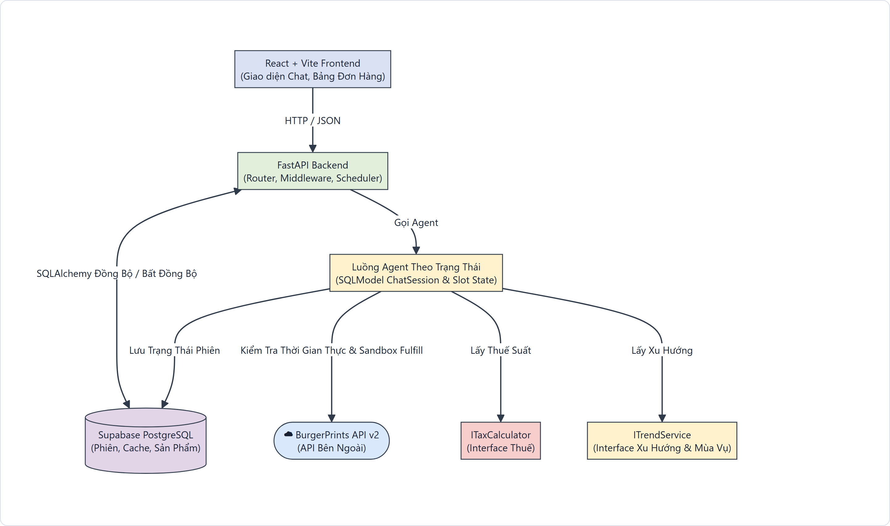
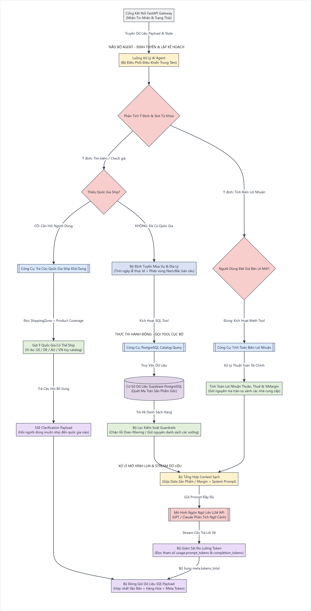

# BurgerPrints POD Catalog Assistant

## 🚀 Overview & Project Scope

BurgerPrints POD Catalog Assistant là hệ thống AI agent hỗ trợ seller ra quyết định fulfillment cho POD catalog: tìm SKU phù hợp, so sánh xưởng, tính landed cost/profit margin, định tuyến market theo mùa vụ và tạo sandbox draft order qua BurgerPrints API khi người dùng xác nhận.

README này là nguồn sự thật production cho kiến trúc và hành vi runtime của dự án. Tài liệu chỉ mô tả hợp đồng vận hành, kiến trúc và hành vi runtime phục vụ triển khai sản phẩm.

Phạm vi chính:

- **Conversational agent:** nhận câu hỏi tự nhiên bằng tiếng Việt/tiếng Anh, phân loại intent, trích xuất slot và duy trì ngữ cảnh `ChatSession`.
- **Catalog decisioning:** truy vấn catalog/cache, lọc theo product type, SKU, quốc gia ship, carrier, thời gian giao, base cost, selling price và margin target.
- **Geo-aware merchandising:** tự chọn hoặc fallback market dựa trên quốc gia, shipping zone, header địa lý và tháng hiện tại của runtime.
- **Cost transparency:** trả về landed cost, shipping fee, tax, profit, margin percent và trạng thái cảnh báo margin.
- **Order safety:** chỉ tạo draft order khi flow đã đủ slot và có xác nhận rõ ràng; PII trong câu trả lời được che trước khi hiển thị.
- **Token telemetry:** backend serialize token usage vào `meta`, frontend hiển thị theo từng lượt và tổng phiên.

## 🏗️ Kiến Trúc Hệ Thống & Luồng Đa Tác Tử

Backend dùng FastAPI, SQLModel, catalog cache và luồng agent theo trạng thái. Khối frontend production trong code hiện tại là `React + Vite Frontend (Giao diện Chat, Bảng Đơn Hàng)`.



### Vòng Lặp Tương Tác Agent Và Tool



Core runtime responsibilities:

| Layer | Responsibility | Production contract |
| --- | --- | --- |
| React UI | Collect prompt, stream assistant output, render cards and checkout state | Never invent catalog data; only renders `data.items`, `params`, `meta` and server flags. |
| Agent route | Owns SSE response shape and session continuity | Final payload includes `answer`, `intent`, `session_id`, `params`, `data`, `meta`. |
| Intent router | Detects language, intent and functional slots | Normalizes market/country/product category before heuristic execution. |
| Geo/seasonal service | Resolves month, country fallback, hemisphere and event context | Uses `datetime.date.today()` when month is absent; falls back only through documented market rules. |
| SQL/catalog search | Ranks product and shipping candidates from cache | Applies product/category filters, shipping availability, carrier and cost constraints. |
| Fallback protection | Prevents fabricated results and stale slot leakage | Returns clarification, nearest alternative or empty-state messaging instead of invented SKUs. |
| Generator layer | Converts resolved data packet into seller-facing response | Uses backend calculation packet as authority for products, factories, fees and SLA. |
| Token module | Serializes usage telemetry | Emits non-negative `tokens_input`, `tokens_output`, `tokens_total` in `meta`. |

## 📅 Global Seasonal & Geo-Aware Logic Matrix

Seasonal suggestions are resolved by `TrendService.get_seasonal_suggestions`. If the request does not include a month, the service uses `datetime.date.today().month`. If the request does not include a country, the API attempts geo headers first, then returns a cold-start matrix anchored on US while still surfacing global selling angles.

Country resolution follows this production order:

1. Use explicit `country` from agent slots or `/agent/suggestions` query when present.
2. If absent, inspect geo headers: `cf-ipcountry`, `x-vercel-ip-country`, `cloudfront-viewer-country`, `x-country-code`.
3. Validate the resolved country against cached `ShippingZone` data.
4. Preserve core supported markets when available: `US`, `DE`, `VN`, `AU`, `NZ`.
5. Fallback unsupported countries through deterministic market rules instead of guessing.

| Input condition | Runtime fallback | Seasonal interpretation | Merchandising constraint |
| --- | --- | --- | --- |
| Empty country / cold start | Anchor to `US` with fallback flag | Month from `date.today()`; default discovery pack spans US school season, southern winter and holiday prep | Suggest broad entry points such as T-Shirts, Hoodies, Ornaments & Gifts. |
| `US` or Canada-like demand | `US` for unsupported `CA` | Northern hemisphere: Jun-Aug Summer, Dec-Feb Winter | Back-to-School, Independence Day, holiday shopping and warm-weather T-Shirt campaigns. |
| EU country without direct zone | `DE` for common EU fallback countries | Northern hemisphere with Western/EU event calendar | Use Germany/EU shipping assumptions only when fallback metadata says so. |
| `VN` | `VN` | `Dry_cool` for Nov-Feb, `Rainy_hot` otherwise | Local holiday calendar and climate-specific products such as Mugs, T-Shirts, Hoodies. |
| `AU`, `NZ`, `ZA`, `BR`, `AR` | Southern hemisphere country or configured fallback | Jun-Aug Winter, Dec-Feb Summer, Mar-May Autumn, Sep-Nov Spring | AU Winter Comfort favors Hoodies/Sweatshirts during northern summer months. |
| Unsupported non-EU country | `US` | Northern hemisphere fallback unless mapped otherwise | Response must disclose fallback through metadata and avoid claiming direct support. |

Target examples enforced by the matrix:

- **US Back-to-School:** August maps to US events and favors T-Shirts/Mugs or practical school-season POD offers.
- **AU Winter Comfort:** June-August maps to southern winter and favors Hoodies/Sweatshirts even when northern markets are in summer.
- **Global discovery:** a cold-start session can surface multi-market prompts without pretending every country has active shipping coverage.

## 📊 Real-Time Token Debugging Module

The backend initializes token metadata with zero values and increments it when parser/generator model calls return usage. The final SSE payload serializes the token state under `meta`:

```json
{
  "meta": {
    "tokens_input": 0,
    "tokens_output": 0,
    "tokens_total": 0
  }
}
```

Production rules:

- `meta.tokens_total` is the canonical per-turn total shown to the frontend.
- `tokens_total = tokens_input + tokens_output` after usage is normalized.
- Missing or unavailable provider usage remains `0`; the payload shape stays stable.
- Streaming generator chunks can include usage, and the backend aggregates usage before the final payload is emitted.
- Guardrail-only or mock-key flows still return a valid `meta` object so the UI does not need a special-case schema.

Frontend behavior:

- `TokenBadge` displays input, output and total token counts beside assistant responses that include `response.meta`.
- The Token Debug view aggregates all assistant turns in the active chat session.
- The visual stack compares input/output share and keeps values non-negative through `tokenMetaOrZero`.
- The drawer/page is observational only; it does not alter agent routing, catalog ranking or order creation.

## Production Runtime Contracts

### API response shape

The chat endpoint streams intermediate status events and ends with a final payload containing:

```json
{
  "answer": "seller-facing response",
  "intent": "recommend",
  "session_id": "stable-session-id",
  "params": {
    "country": "US",
    "target_market": "US",
    "product_type": "T-Shirts"
  },
  "data": {
    "source": "database_cache",
    "match_type": "exact",
    "clarification_required": false,
    "items": [],
    "metadata": {},
    "margin_alert": false,
    "custom_payload": null
  },
  "meta": {
    "tokens_input": 0,
    "tokens_output": 0,
    "tokens_total": 0
  },
  "confirmation_required": false
}
```

### Catalog and fallback behavior

- Exact catalog matches are preferred when product, country, SKU, shipping and price constraints can all be satisfied.
- Nearest alternatives are allowed only when the backend can explain which constraint forced fallback.
- Empty catalog states must remain explicit and must not fabricate SKU, supplier, fee, delivery time or product attributes.
- Category switches purge stale product constraints unless the user explicitly asks to keep prior targets.
- Global availability queries remove stale country/market slots before returning supported shipping countries.

### Order safety

- Draft order creation is gated by required shipping fields, selected SKU, design URL and explicit confirmation.
- PII masking is applied before assistant text is stored/displayed.
- Sandbox state is reported in `data.sandbox` so the UI can describe order state accurately.

## Configuration Surface

Production deployments provide runtime settings through environment variables consumed by backend and frontend builds:

| Variable | Scope | Purpose |
| --- | --- | --- |
| `BURGERPRINTS_API_KEY` | Backend | Authenticates BurgerPrints API calls. |
| `BURGERPRINTS_API_BASE_URL` | Backend | Sets BurgerPrints API origin. |
| `BURGERPRINTS_ENABLE_SANDBOX_CREATE_ORDER` | Backend | Controls whether draft order creation is enabled. |
| `SUPABASE_DB_URL` | Backend | Points SQLModel to the production-compatible catalog/session database. |
| `OPENAI_API_KEY` | Backend | Enables model-backed parser/generator calls when not using mock mode. |
| `VITE_API_BASE_URL` | Frontend | Points the React client to the deployed FastAPI service. |

## Operational Source of Truth

- Backend calculation packets are authoritative for costs, shipping, variants, margin and availability.
- Frontend state is a renderer and workflow surface; it does not recalculate supplier truth.
- Geo/seasonal logic is deterministic and date-aware, with no hidden manual runtime controls.
- Token telemetry is serialized with every final chat payload so usage inspection remains available without changing agent behavior.
