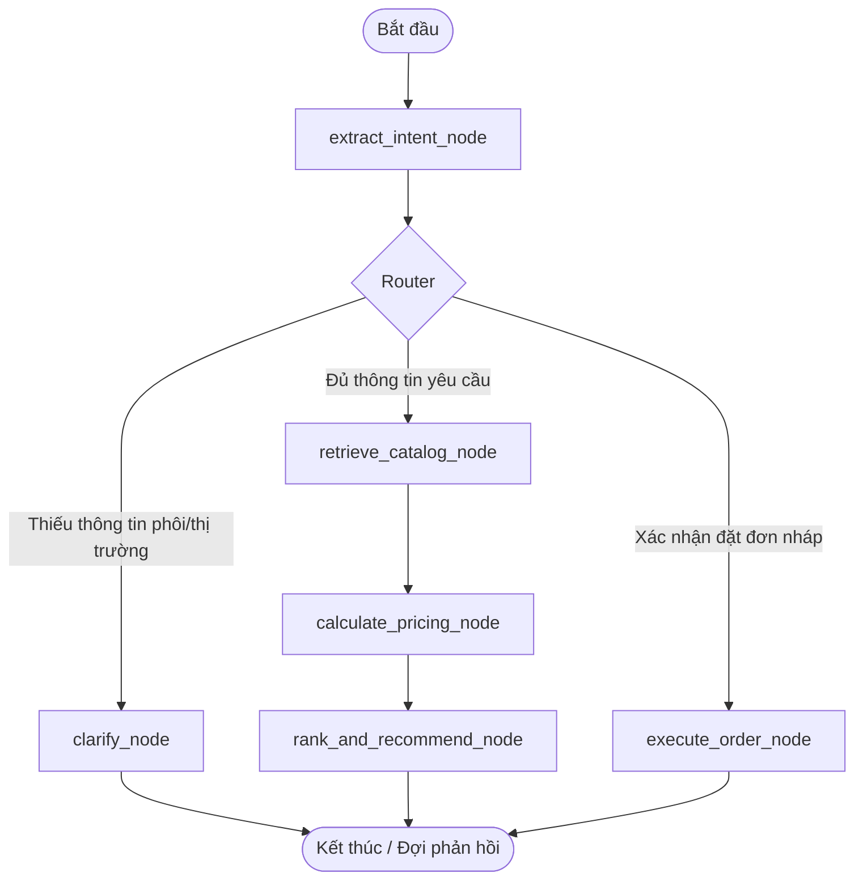

# J4F - BurgerPrintsAgent (POD Catalog & Supply Chain Optimization Assistant)

**BurgerPrints Agent** là hệ thống trợ lý ảo thông minh dạng Agentic AI, được phát triển phục vụ cho các nhà bán hàng Print-on-Demand (POD) trên nền tảng BurgerPrints. Hệ thống giúp tối ưu hóa chuỗi cung ứng, phân tích landed cost chi tiết theo địa lý, so sánh trade-offs giữa các nhà in (xưởng in) và tự động hóa quy trình đẩy đơn hàng từ hội thoại tự nhiên.

---

## 1. Tổng Quan Kỹ Thuật & Kiến Trúc (Technical & Architecture Overview)

Hệ thống kết hợp sức mạnh của **FastAPI (REST Gateway)**, **LangGraph (Stateful Multi-turn Agent)**, và mô hình ngôn ngữ lớn **Gemini 3.1 Flash Lite** cùng cơ sở dữ liệu vector **ChromaDB** để mang lại trải nghiệm tư vấn thông minh, ghi nhớ ngữ cảnh dài hạn và thực thi đơn hàng chính xác.

### 1.1. Sơ đồ Hoạt động của Agent (LangGraph Workflow)

Sử dụng đồ thị LangGraph với checkpointer lưu trữ trạng thái vào SQLite giúp cuộc hội thoại diễn ra liên tục, quản lý trạng thái phức tạp (stateful) và hỗ trợ Human-in-the-loop:



### 1.2. Sơ đồ Luồng Dữ Liệu RAG (Semantic Memory Recall)

Mỗi tin nhắn hội thoại của Seller đều được nhúng (embed) bằng `gemini-embedding-2` và lưu vào ChromaDB. Khi có tin nhắn mới, hệ thống tự động truy vấn ngữ cảnh cũ để điền thông tin còn thiếu (ví dụ: thị trường giao hàng ưa thích, loại phôi áo trước đó):

```
[Seller Chat Input] ──> [Gemini Embedding 2 (3072 dims)] ──> [ChromaDB query]
                                                                  │
[Agent State (NLU)] <─── [Merge Contextual Requirements] <────────┘
```

---

## 2. Các Phân Hệ & Chức Năng Chính (Core Modules)

Hệ thống được chia làm 3 tầng chức năng rõ rệt trong thư mục [Product/](file:///E:/Hackathon2026/J4F/Product):

### 2.1. Phân Hệ AI Agent ([Product/ai/](file:///E:/Hackathon2026/J4F/Product/ai/))
* **LangGraph Agent Workflow (`agent.py`, `nodes.py`, `state.py`)**: Điều phối luồng xử lý hội thoại dựa trên trạng thái.
* **Pricing Engine (`pricing_engine.py`)**: Động cơ tính toán tài chính chi tiết:
  * **Landed Cost**: `Base Cost + Printing Cost + Shipping Fee + Tax (8% cho US, 19% cho EU, 0% cho VN)`.
  * **Suggested Retail Price**: Đề xuất giá bán lẻ tối ưu dựa trên tỷ lệ biên lợi nhuận mục tiêu (`target_margin`).
  * **SLA Delivery Risk**: Chấm điểm rủi ro chậm giao hàng dựa trên khoảng cách địa lý và thời gian xử lý thực tế của xưởng.
* **Semantic Memory RAG (`vector_rag.py`)**: Lưu trữ và tìm kiếm hồi tưởng lịch sử hội thoại dạng ngữ nghĩa sử dụng ChromaDB.
* **BurgerPrints Wrapper (`tools.py`)**: Bộ chuyển đổi tích hợp API chính thức của BurgerPrints (Catalog, Quotes, Orders) kèm cơ chế Mock fallback để demo.

### 2.2. FastAPI Backend Gateway ([Product/backend/](file:///E:/Hackathon2026/J4F/Product/backend/))
* Tích hợp Authentication (Bcrypt password hashing, JWT Access token) bảo mật RESTful.
* Quản lý phiên hội thoại (`conversations`), lịch sử trò chuyện (`messages`) và trạng thái đơn hàng (`order_history`) lưu trữ trong cơ sở dữ liệu SQLite thông qua SQLAlchemy ORM bất đồng bộ.
* Tách biệt tầng API Endpoint (`api/v1/`) và tầng nghiệp vụ điều phối (`services/`).

### 2.3. Glassmorphic React Web App ([Product/frontend/](file:///E:/Hackathon2026/J4F/Product/frontend/))
* Giao diện phong cách Glassmorphism hiện đại (electric blue, neon violet, navy backdrop).
* Tích hợp bảng so sánh đề xuất so sánh trực quan (so sánh Landed Cost, Margin, Shipping SLA) làm nổi bật nhà in tối ưu.
* Tích hợp Order HUD hiển thị thông tin mockup và lên đơn hàng nháp thời gian thực, kích hoạt hiệu ứng Confetti chúc mừng khi đơn hàng được gửi thành công.

---

## 3. Cấu Trúc Thư Mục Dự Án (Project Structure)

```
J4F/
├── Product/                  # Mã nguồn ứng dụng (Source code)
│   ├── ai/                   # Logic AI Agent, RAG & Pricing Engine
│   │   ├── data/             # Cơ sở dữ liệu SQLite & Mock data
│   │   ├── agent.py          # Cấu hình đồ thị LangGraph & Checkpointer
│   │   ├── nodes.py          # Logic các node xử lý của Agent
│   │   ├── pricing_engine.py # Động cơ tính Landed Cost & SLA Risk
│   │   ├── state.py          # Trạng thái dữ liệu của Agent
│   │   ├── tools.py          # Tích hợp API BurgerPrints chính thức
│   │   └── vector_rag.py     # Hồi tưởng ký ức với ChromaDB & Gemini Embeddings
│   ├── backend/              # API Gateway chạy FastAPI
│   │   ├── app/
│   │   │   ├── api/          # Đầu cuối REST (auth, chat, order)
│   │   │   ├── core/         # Cấu hình JWT, bảo mật mật khẩu
│   │   │   ├── db/           # Khởi tạo SQLite, phiên kết nối ORM
│   │   │   ├── models/       # Các bảng dữ liệu (User, Preference, Message, Order)
│   │   │   ├── schemas/      # Kiểm chuẩn Pydantic
│   │   │   └── services/     # Điều phối dữ liệu API & LangGraph
│   │   └── main.py           # FastAPI entrypoint
│   ├── frontend/             # Single Page Application React + Vite + TS
│   ├── tests/                # Bộ kiểm thử tự động (pytest)
│   ├── Dockerfile.backend    # Cài đặt docker cho FastAPI
│   ├── docker-compose.yml    # Docker Compose khởi chạy nhanh
│   └── pyproject.toml        # Quản lý gói Python bằng uv
├── Solution/                 # Tài liệu thiết kế & Slide Hackathon
│   ├── docs/                 # Báo cáo triển khai kỹ thuật chi tiết
│   │   └── implement/        # Báo cáo tối ưu hóa Gemini & bộ test
│   └── slides/               # Slide thuyết trình giải pháp
└── tasks/                    # Quản lý tiến độ phát triển (todo.md, lessons.md)
```

---

## 4. Hướng Dẫn Cấu Hình Môi Trường (Environment Variables)

Tạo file `.env` nằm trong thư mục [Product/](file:///E:/Hackathon2026/J4F/Product) theo cấu trúc dưới đây để liên kết API thực tế:

```env
# FastAPI Configuration
PROJECT_NAME="BurgerPrints Agent"
API_V1_STR="/api/v1"
SECRET_KEY="generate_a_secure_random_string_here_for_jwt_signing"
ACCESS_TOKEN_EXPIRE_MINUTES=10080

# Database Configuration
DATABASE_URL="sqlite+aiosqlite:///../ai/data/sqlite.db"

# API Settings
# Set to 'false' để gọi API BurgerPrints thật, 'true' để chạy demo bằng mock data
USE_MOCK_API=true

# External API Credentials
BURGERPRINTS_API_KEY="your_burgerprints_api_key_here"
GEMINI_API_KEY="your_google_gemini_api_key_here"
```

---

## 5. Hướng Dẫn Setup & Chạy Trực Tiếp (Direct Setup Guide)

Hệ thống khuyến khích sử dụng trình quản lý gói siêu tốc **`uv`** của Python và **`npm`** cho Node.js.

### 5.1. Khởi Chạy Backend (FastAPI Gateway & AI)

1. **Di chuyển vào thư mục Product**:
   ```bash
   cd Product
   ```
2. **Đồng bộ hóa môi trường ảo và cài đặt thư viện**:
   ```bash
   uv sync
   ```
3. **Khởi tạo cơ sở dữ liệu quan hệ SQLite**:
   ```bash
   uv run python backend/app/db/init_db.py
   ```
4. **Chạy server FastAPI phát triển**:
   ```bash
   uv run uvicorn backend.main:app --host 0.0.0.0 --port 8000 --reload
   ```
   *Swagger UI sẽ tự động khởi chạy tại: [http://localhost:8000/docs](http://localhost:8000/docs)*

### 5.2. Khởi Chạy Frontend (React SPA)

1. **Di chuyển vào thư mục frontend**:
   ```bash
   cd Product/frontend
   ```
2. **Cài đặt dependencies**:
   ```bash
   npm install
   ```
3. **Chạy giao diện phát triển**:
   ```bash
   npm run dev
   ```
   *Giao diện người dùng sẽ chạy tại: [http://localhost:5173](http://localhost:5173)*

---

## 6. Khởi Chạy Bằng Docker Compose (Container Deployment)

Để khởi động toàn bộ ứng dụng nhanh chóng bằng Docker:

1. Đảm bảo file `.env` đã được cấu hình trong `Product/`.
2. Chạy lệnh dựng và khởi chạy từ thư mục `Product/`:
   ```bash
   cd Product
   docker-compose up --build
   ```
FastAPI Gateway sẽ tự động lắng nghe ở cổng `8000`, và giao diện tĩnh sẽ được kết nối.

---

## 7. Bộ Kiểm Thử Tự Động (Testing & Quality Assurance)

Hệ thống được phát triển tuân thủ nghiêm ngặt chuẩn kiểm thử chất lượng cao.

Để chạy bộ kiểm thử toàn diện bằng `pytest`:
1. Di chuyển vào thư mục `Product/`.
2. Chạy lệnh kiểm thử sau (đảm bảo đã nạp `PYTHONPATH`):
   ```bash
   $env:PYTHONPATH="."; uv run pytest
   ```
Kết quả kiểm thử thực thi thành công hoàn toàn **13/13 tests passed**:
* Kiểm thử logic giá vốn & rủi ro SLA vận chuyển (`test_pricing.py`).
* Kiểm thử dịch chuyển trạng thái đồ thị LangGraph (`test_agent.py`).
* Kiểm thử bảo mật mã hóa mật khẩu & giải mã khóa JWT (`test_security.py`).
* Kiểm thử tích hợp toàn trình API Gateway hội thoại (`test_api.py`).
