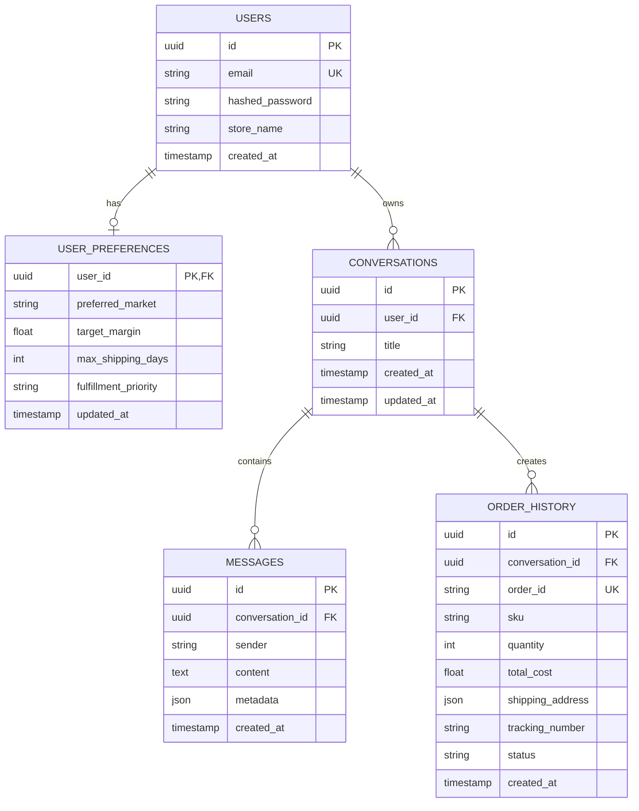

# DATABASE AND VECTOR DATABASE SPECIFICATION: PRINTFLOW AI

Tài liệu này đặc tả kiến trúc lưu trữ dữ liệu, thiết kế Schema cơ sở dữ liệu quan hệ (Relational DB) để quản lý tài khoản người dùng, phiên hội thoại, lịch sử tin nhắn; và thiết kế Vector Database phục vụ tìm kiếm ngữ nghĩa (Semantic Search) danh mục sản phẩm (Catalog RAG).

---

## 1. Cơ Sở Dữ Liệu Quan Hệ (Relational Database Schema)

Để đáp ứng các yêu cầu: Đăng nhập/Đăng ký đơn giản, Lưu lịch sử chat, và Lưu cấu hình ưu tiên (Preferences) của Seller, hệ thống sử dụng **SQLite** (cho môi trường phát triển nhanh/MVP) và sẵn sàng chuyển đổi cấu hình sang **PostgreSQL** trong môi trường production.

### 1.1. Sơ đồ thực thể liên kết (Entity-Relationship Diagram)



### 1.2. Đặc tả các Bảng dữ liệu (Table DDL Specification)

#### A. Bảng `users` (Quản lý tài khoản Seller)
Lưu trữ thông tin định danh và thông tin đăng nhập của người dùng. Mật khẩu được mã hóa bằng thuật toán `bcrypt`.
```sql
CREATE TABLE users (
    id TEXT PRIMARY KEY,                       -- UUID v4
    email TEXT UNIQUE NOT NULL,                -- Thư điện tử (dùng đăng nhập)
    hashed_password TEXT NOT NULL,             -- Mật khẩu đã mã hóa bcrypt
    store_name TEXT,                           -- Tên cửa hàng của seller
    created_at TIMESTAMP DEFAULT CURRENT_TIMESTAMP
);
CREATE INDEX idx_users_email ON users(email);
```

#### B. Bảng `user_preferences` (Bộ nhớ sở thích Seller)
Ghi nhớ các cấu hình tối ưu hóa mặc định của Seller để tự động điền vào State của Agent.
```sql
CREATE TABLE user_preferences (
    user_id TEXT PRIMARY KEY,                  -- FK đến users.id
    preferred_market TEXT DEFAULT 'US',        -- Thị trường ưu tiên (US, EU, VN...)
    target_margin REAL DEFAULT 40.0,           -- Margin mục tiêu (%)
    max_shipping_days INTEGER DEFAULT 7,       -- Số ngày ship tối đa mong muốn
    fulfillment_priority TEXT DEFAULT 'margin',-- Ưu tiên: 'margin' hoặc 'speed'
    updated_at TIMESTAMP DEFAULT CURRENT_TIMESTAMP,
    FOREIGN KEY (user_id) REFERENCES users(id) ON DELETE CASCADE
);
```

#### C. Bảng `conversations` (Quản lý phiên chat)
Tương đương với `thread_id` trong LangGraph. Cho phép phục hồi hoặc xem lại lịch sử.
```sql
CREATE TABLE conversations (
    id TEXT PRIMARY KEY,                       -- UUID v4 (Sử dụng làm thread_id)
    user_id TEXT NOT NULL,                     -- FK đến users.id
    title TEXT NOT NULL,                       -- Tiêu đề chat (tự sinh dựa trên nội dung đầu)
    created_at TIMESTAMP DEFAULT CURRENT_TIMESTAMP,
    updated_at TIMESTAMP DEFAULT CURRENT_TIMESTAMP,
    FOREIGN KEY (user_id) REFERENCES users(id) ON DELETE CASCADE
);
CREATE INDEX idx_conversations_user ON conversations(user_id);
```

#### D. Bảng `messages` (Lịch sử hội thoại chi tiết)
Lưu vết tất cả tin nhắn gửi và nhận. Cột `metadata` dạng JSON dùng để lưu cấu trúc bảng so sánh hoặc thông số slots đã bóc tách phục vụ việc render lại UI.
```sql
CREATE TABLE messages (
    id TEXT PRIMARY KEY,                       -- UUID v4
    conversation_id TEXT NOT NULL,             -- FK đến conversations.id
    sender TEXT CHECK(sender IN ('user', 'assistant')) NOT NULL, -- Người gửi
    content TEXT NOT NULL,                     -- Nội dung tin nhắn chữ (Markdown)
    metadata TEXT,                             -- Dạng JSON (ví dụ: data bảng so sánh, custom cards)
    created_at TIMESTAMP DEFAULT CURRENT_TIMESTAMP,
    FOREIGN KEY (conversation_id) REFERENCES conversations(id) ON DELETE CASCADE
);
CREATE INDEX idx_messages_conversation ON messages(conversation_id);
```

#### E. Bảng `order_history` (Lưu lịch sử đẩy đơn thành công)
Lưu trữ thông tin đối soát đơn hàng đã được đẩy qua API BurgerPrints để hiển thị trạng thái lên UI.
```sql
CREATE TABLE order_history (
    id TEXT PRIMARY KEY,                       -- UUID v4
    conversation_id TEXT NOT NULL,             -- FK đến conversations.id
    order_id TEXT UNIQUE NOT NULL,             -- Mã đơn hàng trả về từ BurgerPrints API
    sku TEXT NOT NULL,                         -- SKU sản phẩm đặt in
    quantity INTEGER NOT NULL,                 -- Số lượng
    total_cost REAL NOT NULL,                  -- Landed cost thực tế tại thời điểm đặt đơn
    shipping_address TEXT NOT NULL,            -- Địa chỉ nhận hàng (JSON String)
    tracking_number TEXT,                      -- Mã vận đơn tracking
    status TEXT NOT NULL,                      -- Trạng thái đơn (Pending, Printing, Shipped...)
    created_at TIMESTAMP DEFAULT CURRENT_TIMESTAMP,
    FOREIGN KEY (conversation_id) REFERENCES conversations(id)
);
```

---

## 2. Thiết Kế Vector Database Cho Tìm Kiếm Ngữ Nghĩa (Catalog RAG)

### 2.1. Tại sao cần Vector Database trong MVP?
Mặc dù BurgerPrints cung cấp API tìm kiếm từ khóa tĩnh, Seller thường truy vấn danh mục bằng ngôn ngữ tự nhiên với nhiều từ đồng nghĩa hoặc không chuẩn xác (ví dụ: Seller gõ *"áo thun mùa hè thoáng mát"* hoặc *"cốc uống trà size lớn"*). 
Vector Database giúp:
*   Tìm đúng sản phẩm dựa trên ngữ cảnh và thuộc tính mô tả.
*   Ánh xạ chính xác các cụm từ tiếng Việt không dấu, viết tắt sang SKU danh mục tiếng Anh chuẩn của BurgerPrints.

### 2.2. Lựa chọn Công nghệ
*   **Vector DB Engine:** **ChromaDB** (local) cho MVP vì cài đặt siêu tốc bằng Python, lưu trữ dạng file cục bộ không cần cài đặt hạ tầng phức tạp. Đối với PostgreSQL, có thể sử dụng extension `pgvector`.
*   **Embedding Model:** `text-embedding-004` của Google (thông qua Gemini API SDK) để tối ưu hóa hiệu năng, đồng bộ với bộ tài nguyên ngôn ngữ lớn của Gemini. Chiều dài Vector (dimensions): **768**.

### 2.3. Quy trình Tiền xử lý & Chunking dữ liệu Catalog (Indexing Pipeline)
Dữ liệu catalog sản phẩm từ BurgerPrints API (đã được cào/cache định kỳ) sẽ được chuyển đổi thành các văn bản giàu ngữ nghĩa trước khi nhúng vector:

```
┌──────────────────────────┐
│  BurgerPrints Catalog    │ ──► [Product: Gildan Unisex T-Shirt]
│  (Raw API JSON Data)     │     [Material: 100% Cotton, DTG Print]
└────────────┬─────────────┘
             │
             ▼
┌──────────────────────────┐
│   Structured Chunking    │ ──► "Tên sản phẩm: Gildan T-Shirt. Loại: Áo thun.
│   (Markdown Template)    │      Chất liệu: Cotton. Công nghệ in: DTG. Tags: Áo thun..."
└────────────┬─────────────┘
             │
             ▼
┌──────────────────────────┐
│   Gemini Embedding API   │ ──► Gọi text-embedding-004 chuyển thành Vector [768]
└────────────┬─────────────┘
             │
             ▼
┌──────────────────────────┐
│   ChromaDB / pgvector    │ ──► Lưu Vector kèm Metadata {product_id, base_cost}
└──────────────────────────┘
```

#### Ví dụ về Cấu trúc một Chunk đưa vào Vector DB:
```markdown
Product ID: prod_bp_tshirt_01
Name: Gildan Heavy Cotton T-Shirt (Unisex)
Category: Apparel / T-Shirt
Description: Áo thun cổ tròn unisex form rộng, chất liệu cotton 100% dày dặn, thấm hút mồ hôi. Phù hợp in hình ảnh, graphic design bằng công nghệ DTG (Direct to Garment).
Material: 100% Cotton
Print Tech: DTG, Screen Printing
Available Colors: Black, White, Navy, Sport Grey, Red
Available Sizes: S, M, L, XL, XXL, 3XL
Base Cost Range: $5.00 - $6.50
```

### 2.4. Metadata Schema trong Vector DB
Mỗi Vector được gán kèm metadata dạng key-value để cho phép lọc cứng kết hợp tìm kiếm mềm:
*   `product_id` (String): ID sản phẩm chính trên BurgerPrints.
*   `category` (String): Danh mục cha (Apparel, Drinkware, Home Decor...).
*   `print_tech` (String): Công nghệ in ấn hỗ trợ.
*   `is_active` (Boolean): Trạng thái xưởng còn nhận phôi hay không.

### 2.5. Chiến lược Truy vấn Kết hợp (Hybrid Search Workflow)
Khi Seller gửi câu hỏi, Agent sẽ thực hiện tìm kiếm catalog qua 2 bước bảo vệ:

```
[Seller Chat: "Tìm áo thun cotton in DTG gửi đi Mỹ"]
   │
   ▼
1. Semantic Search (Vector DB)
   - Nhúng câu lệnh chat thành Vector [768].
   - Truy vấn ChromaDB lấy Top 5 Product ID phù hợp nhất.
   │
   ▼
2. Real-time API Sourcing (BurgerPrints API)
   - Dùng 5 Product ID vừa tìm được, gọi API trực tiếp lấy báo giá (Variant Cost, Shipping Options) theo thị trường "US".
   │
   ▼
3. Pricing & Xếp hạng (Python Engine)
   - Tính toán chi phí thực tế, margin và SLA.
   - Xuất kết quả đề xuất trực quan.
```
Cơ chế Hybrid Search này giúp hệ thống vừa hiểu được ngôn ngữ tự nhiên phong phú của Seller, vừa đảm bảo **dữ liệu giá cả và tồn kho của nhà in luôn cập nhật mới nhất từ API thực tế**, triệt tiêu nguy cơ LLM ảo giác về giá cả.
