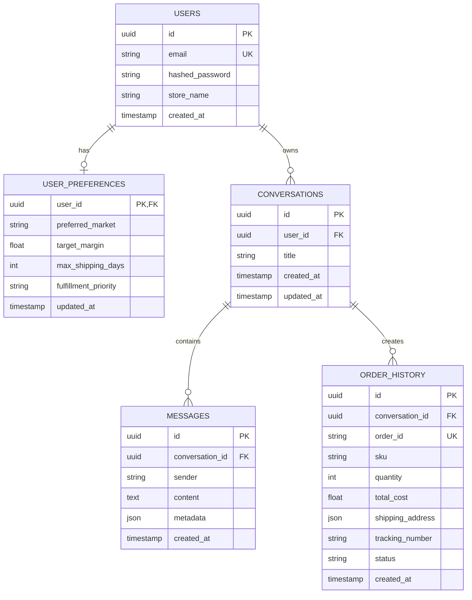

# DATABASE AND VECTOR DATABASE SPECIFICATION: PRINTFLOW AI

Tài liệu này đặc tả kiến trúc lưu trữ dữ liệu, thiết kế Schema cơ sở dữ liệu quan hệ (Relational DB) để quản lý tài khoản người dùng, phiên hội thoại, lịch sử tin nhắn; và thiết kế Vector Database phục vụ tìm kiếm ngữ nghĩa (Semantic Search) danh mục sản phẩm (Catalog RAG).

---

## 1. Cơ Sở Dữ Liệu Quan Hệ (Relational Database Schema)

Để đáp ứng các yêu cầu: Đăng nhập/Đăng ký đơn giản, Lưu lịch sử chat, và Lưu cấu hình ưu tiên (Preferences) của Seller, hệ thống sử dụng **SQLite** (cho môi trường phát triển nhanh/MVP) và sẵn sàng chuyển đổi cấu hình sang **PostgreSQL** trong môi trường production.

### 1.1. Sơ đồ thực thể liên kết (Entity-Relationship Diagram)



### 1.2. Đặc tả các Bảng dữ liệu (Table DDL Specification)

#### A. Bảng `users` (Quản lý tài khoản Seller)
Lưu trữ thông tin định danh và thông tin đăng nhập của người dùng. Mật khẩu được mã hóa bằng thuật toán `bcrypt`.
```sql
CREATE TABLE users (
    id TEXT PRIMARY KEY,                       -- UUID v4
    email TEXT UNIQUE NOT NULL,                -- Thư điện tử (dùng đăng nhập)
    hashed_password TEXT NOT NULL,             -- Mật khẩu đã mã hóa bcrypt
    store_name TEXT,                           -- Tên cửa hàng của seller
    created_at TIMESTAMP DEFAULT CURRENT_TIMESTAMP
);
CREATE INDEX idx_users_email ON users(email);
```

#### B. Bảng `user_preferences` (Bộ nhớ sở thích Seller)
Ghi nhớ các cấu hình tối ưu hóa mặc định của Seller để tự động điền vào State của Agent.
```sql
CREATE TABLE user_preferences (
    user_id TEXT PRIMARY KEY,                  -- FK đến users.id
    preferred_market TEXT DEFAULT 'US',        -- Thị trường ưu tiên (US, EU, VN...)
    target_margin REAL DEFAULT 40.0,           -- Margin mục tiêu (%)
    max_shipping_days INTEGER DEFAULT 7,       -- Số ngày ship tối đa mong muốn
    fulfillment_priority TEXT DEFAULT 'margin',-- Ưu tiên: 'margin' hoặc 'speed'
    updated_at TIMESTAMP DEFAULT CURRENT_TIMESTAMP,
    FOREIGN KEY (user_id) REFERENCES users(id) ON DELETE CASCADE
);
```

#### C. Bảng `conversations` (Quản lý phiên chat)
Tương đương với `thread_id` trong LangGraph. Cho phép phục hồi hoặc xem lại lịch sử.
```sql
CREATE TABLE conversations (
    id TEXT PRIMARY KEY,                       -- UUID v4 (Sử dụng làm thread_id)
    user_id TEXT NOT NULL,                     -- FK đến users.id
    title TEXT NOT NULL,                       -- Tiêu đề chat (tự sinh dựa trên nội dung đầu)
    created_at TIMESTAMP DEFAULT CURRENT_TIMESTAMP,
    updated_at TIMESTAMP DEFAULT CURRENT_TIMESTAMP,
    FOREIGN KEY (user_id) REFERENCES users(id) ON DELETE CASCADE
);
CREATE INDEX idx_conversations_user ON conversations(user_id);
```

#### D. Bảng `messages` (Lịch sử hội thoại chi tiết)
Lưu vết tất cả tin nhắn gửi và nhận. Cột `metadata` dạng JSON dùng để lưu cấu trúc bảng so sánh hoặc thông số slots đã bóc tách phục vụ việc render lại UI.
```sql
CREATE TABLE messages (
    id TEXT PRIMARY KEY,                       -- UUID v4
    conversation_id TEXT NOT NULL,             -- FK đến conversations.id
    sender TEXT CHECK(sender IN ('user', 'assistant')) NOT NULL, -- Người gửi
    content TEXT NOT NULL,                     -- Nội dung tin nhắn chữ (Markdown)
    metadata TEXT,                             -- Dạng JSON (ví dụ: data bảng so sánh, custom cards)
    created_at TIMESTAMP DEFAULT CURRENT_TIMESTAMP,
    FOREIGN KEY (conversation_id) REFERENCES conversations(id) ON DELETE CASCADE
);
CREATE INDEX idx_messages_conversation ON messages(conversation_id);
```

#### E. Bảng `order_history` (Lưu lịch sử đẩy đơn thành công)
Lưu trữ thông tin đối soát đơn hàng đã được đẩy qua API BurgerPrints để hiển thị trạng thái lên UI.
```sql
CREATE TABLE order_history (
    id TEXT PRIMARY KEY,                       -- UUID v4
    conversation_id TEXT NOT NULL,             -- FK đến conversations.id
    order_id TEXT UNIQUE NOT NULL,             -- Mã đơn hàng trả về từ BurgerPrints API
    sku TEXT NOT NULL,                         -- SKU sản phẩm đặt in
    quantity INTEGER NOT NULL,                 -- Số lượng
    total_cost REAL NOT NULL,                  -- Landed cost thực tế tại thời điểm đặt đơn
    shipping_address TEXT NOT NULL,            -- Địa chỉ nhận hàng (JSON String)
    tracking_number TEXT,                      -- Mã vận đơn tracking
    status TEXT NOT NULL,                      -- Trạng thái đơn (Pending, Printing, Shipped...)
    created_at TIMESTAMP DEFAULT CURRENT_TIMESTAMP,
    FOREIGN KEY (conversation_id) REFERENCES conversations(id)
);
```

---

## 2. Thiết Kế Vector Database Cho Tìm Kiếm Hội Thoại (Semantic Memory DB)

Để đảm bảo thông tin xưởng in, báo giá và chi tiết SKU của sản phẩm luôn cập nhật tức thời và chính xác 100% theo ngày/giờ, hệ thống **không lưu trữ dữ liệu danh mục (catalog) sản phẩm trong Vector Database hay Database quan hệ**. Toàn bộ catalog và báo giá sẽ được lấy trực tiếp thông qua BurgerPrints API v2.0 tại thời điểm người dùng truy vấn.

Thay vào đó, Vector Database được sử dụng để lập chỉ mục **Lịch sử hội thoại & tin nhắn (Semantic Chat Memory)** của Seller. Điều này cho phép Agent thực hiện tìm kiếm ngữ nghĩa trên các cuộc trò chuyện trước đó để truy xuất các tùy chọn ưu tiên hoặc ngữ cảnh mà người dùng không nhắc lại.

### 2.1. Tại sao cần Vector Database cho Lịch sử chat trong MVP?
*   **Tránh hỏi lặp lại:** Khi Seller đã cung cấp các thông tin thiết lập/sở thích ở các lượt chat trước hoặc phiên chat cũ, Vector DB giúp Agent tự động recall (gợi lại) thông tin cũ bằng tìm kiếm độ tương đồng ngữ nghĩa.
*   **Tìm kiếm thông minh:** Cho phép Seller tra cứu nhanh các quyết định cũ: *"Tuần trước tôi có hỏi về loại áo thun xưởng Mỹ giá dưới $12, đó là SKU nào nhỉ?"* - hệ thống sẽ tự quét Vector DB để lấy ra tin nhắn trả lời cũ của Agent.

### 2.2. Lựa chọn Công nghệ
*   **Vector DB Engine:** **ChromaDB** (ưu tiên hàng đầu) hoặc **FAISS**. ChromaDB đặc biệt phù hợp cho SQLite vì nó siêu nhẹ, chạy trực tiếp dạng tiến trình nhúng (embedded database) và lưu trữ thành các file cục bộ trong thư mục `ai/data/chromadb/`.
*   **Embedding Model:** `text-embedding-004` (Gemini API) với độ dài vector **768** dimensions.

### 2.3. Quy trình Đóng gói & Nhúng Hội thoại (Conversation Indexing Pipeline)
Mỗi khi cuộc hội thoại phát sinh tin nhắn mới (gồm câu hỏi của User hoặc câu trả lời kèm bảng so sánh của Agent), hệ thống sẽ tiến hành lưu vào SQLite đồng thời chạy tiến trình bất đồng bộ nhúng tin nhắn vào ChromaDB:

```
┌─────────────────────────────────┐
│     New Message Generated       │ ──► [Conversation ID: conv_01]
│  (User message or Agent response)│     [Content: "Tôi muốn bán T-shirt..."]
└────────────────┬────────────────┘
                 │
                 ▼
┌─────────────────────────────────┐
│       Message Embedding         │ ──► Gọi Gemini text-embedding-004
│      (Gemini API Client)        │     Tạo Vector đại diện [768 dimensions]
└────────────────┬────────────────┘
                 │
                 ▼
┌─────────────────────────────────┐
│      ChromaDB Local Collection  │ ──► Lưu Vector kèm Metadata:
│       ("chat_history_memory")   │     { conversation_id, sender, user_id }
└─────────────────────────────────┘
```

#### Cấu trúc một Chunk lưu trong ChromaDB Collection:
*   **Document Content:** 
    ```markdown
    Conversation ID: conv_88776655
    Sender: user
    Message: Tôi muốn bán T-shirt cho thị trường Mỹ, giá vốn dưới $8, ship dưới 5 ngày, chọn xưởng nào, SKU nào?
    Timestamp: 2026-06-06 10:45:00
    ```
*   **Metadata:**
    *   `conversation_id` (String): Liên kết khóa ngoại đến bảng `conversations.id`.
    *   `sender` (String): `'user'` hoặc `'assistant'`.
    *   `user_id` (String): Liên kết đến `users.id` để phân quyền tìm kiếm (chỉ cho phép truy vấn lịch sử của chính user đó).
    *   `created_at` (String): Mốc thời gian tạo tin nhắn.

### 2.4. Chiến lược Truy vấn Ngữ cảnh & Phục hồi Bộ nhớ (Semantic Memory Retrieval)
Khi người dùng bắt đầu lượt chat mới, LangGraph sẽ kích hoạt cơ chế hồi tưởng bộ nhớ theo luồng sau:

```
[Seller Input: "Tìm xưởng in Hoodie ship EU rẻ nhất"]
   │
   ▼
1. Semantic Recall (ChromaDB Query)
   - Nhúng câu hỏi hiện tại thành vector [768].
   - Tìm kiếm ChromaDB giới hạn metadata { user_id: active_user_id } với top_k = 3.
   - Trả ra 3 tin nhắn trong quá khứ liên quan nhất (ví dụ: User từng nói muốn bán Hoodie ở Đức).
   │
   ▼
2. Context Injection (LangGraph Memory Node)
   - Bổ sung 3 tin nhắn quá khứ vừa recall được vào System Prompt / State Context làm bộ nhớ tạm thời.
   │
   ▼
3. Real-time API Sourcing (BurgerPrints API v2.0)
   - Gọi trực tiếp API để lấy giá gốc phôi Hoodie và phí ship EU thời gian thực (đảm bảo giá mới nhất).
   │
   ▼
4. Deterministic Calculation & Ranking (Python Pricing Engine)
   - Tính toán landed cost và margin của các xưởng.
   - Agent xếp hạng và xuất phản hồi kèm bảng so sánh trực quan.
```

Giải pháp này tối ưu hóa việc quản lý bộ nhớ của Agent (Stateful Agent Memory) đồng thời bảo vệ hệ thống khỏi các sai lệch về mặt dữ liệu thương mại thay đổi liên tục của catalog BurgerPrints.
