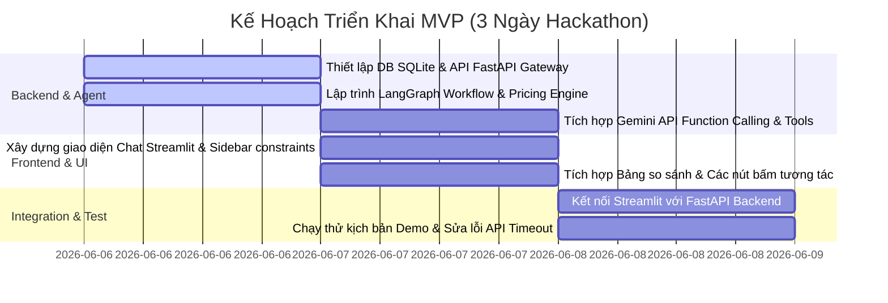

# MVP SCOPE: BURGERPRINTS AGENT

Tài liệu này xác định phạm vi sản phẩm khả dụng tối thiểu (Minimum Viable Product - MVP) cho dự án **BurgerPrints Agent** tham dự Hackathon. Việc phân định rõ ràng các tính năng giúp đội ngũ phát triển tập trung nguồn lực tối đa vào những phần mang lại giá trị trình diễn cao nhất, tránh bẫy phình chướng tính năng (Scope Creep) và đảm bảo bàn giao sản phẩm đúng hạn.

Tài liệu này được thiết kế thống nhất và liên kết chặt chẽ với [Solution Overview](file:///E:/Hackathon2026/J4F/Solution/docs/ai/solution_overview.md), [System Architecture](file:///E:/Hackathon2026/J4F/Solution/docs/ai/system_architecture.md), [Agent Design Specification](file:///E:/Hackathon2026/J4F/Solution/docs/ai/agent_design_specification.md), [API & Tool Contract](file:///E:/Hackathon2026/J4F/Solution/docs/ai/api_and_tool_contract.md), và [User Flow & Conversation Flow](file:///E:/Hackathon2026/J4F/Solution/docs/ai/user_flow_and_conversation_flow.md).

---

## 1. Ma Trận Phân Định Phạm Vi MoSCoW (MoSCoW Matrix)

Hệ thống tính năng được phân chia thành 4 cấp độ ưu tiên để quản lý tiến độ phát triển:

| Phân nhóm | Tính năng | Mục tiêu cốt lõi | Lý do kỹ thuật & nghiệp vụ |
| :--- | :--- | :--- | :--- |
| **Must Have** *(Bắt buộc)* | 1. Chatbox Interface 2. Product Search 3. Compare Options 4. Recommendation | Hiển thị giao diện chat, tra cứu catalog, hiển thị bảng so sánh Top 3 xưởng in, giải thích ưu/nhược điểm các phương án. | Định hình bộ khung cơ bản chứng minh năng lực hiểu nhu cầu và xử lý dữ liệu của Agent. Quyết định sự sống còn của MVP. |
| **Should Have** *(Nên có)* | 5. Preference Memory 6. Multi-language (Việt/Anh) | Ghi nhớ lịch sử chat ngắn hạn, lưu sở thích dài hạn của Seller (thị trường, margin mục tiêu), xử lý ngôn ngữ tự nhiên đa ngữ. | Tăng trải nghiệm mượt mà, giúp Agent thông minh hơn nhờ cơ chế hội thoại đa lượt (Multi-turn), không hỏi lặp lại. |
| **Nice to Have** *(Điểm cộng)* | 7. Order Creation 8. Order Tracking | Tạo đơn hàng nháp hoặc thật trực tiếp qua API BurgerPrints, lấy mã tracking và link vận đơn trả về chat. | Điểm cộng lớn (Wow Factor) chứng minh Agent có năng lực hành động (Action Execution) thay vì chỉ tư vấn lý thuyết. |
| **Won't Do** *(Chưa làm)* | 9. Analytics Dashboard 10. Inventory Control 11. Multi-tenant | Báo cáo doanh thu bằng biểu đồ, quản lý kho hàng phôi sản phẩm, hệ thống đăng ký/đăng nhập phân quyền user. | Không thuộc phạm vi cốt lõi của bài toán ra quyết định. Đòi hỏi thời gian xây dựng lâu, gây loãng trọng tâm demo. |

---

## 2. Chi Tiết Yêu Cầu Kỹ Thuật Từng Nhóm Tính Năng

### 2.1. Nhóm "Must Have" (Cam kết bàn giao 100%)

#### A. Chatbox Interface (Giao diện hội thoại)
*   **Yêu cầu:** Khung chat trực quan cho phép nhập câu hỏi tự nhiên và hiển thị phản hồi của Agent dưới dạng bong bóng chat.
*   **Triển khai:** Sử dụng thành phần `st.chat_input` và `st.chat_message` của Streamlit. Đảm bảo tốc độ hiển thị phản hồi nhanh, tích hợp loading spinner khi Agent đang gọi API ngoài hoặc suy luận.

#### B. Product Search (Truy vấn Catalog)
*   **Yêu cầu:** Agent tự động bóc tách thực thể (slots) để chuyển đổi câu hỏi tự nhiên thành câu lệnh gọi hàm API tra cứu sản phẩm trong danh mục BurgerPrints.
*   **Triển khai:** Tích hợp Gemini API Function Calling gọi hàm `search_catalog` trong Tool Layer.

#### C. Compare Options (Bảng so sánh trực quan)
*   **Yêu cầu:** Hiển thị Top 3 phương án xưởng in/sản phẩm tối ưu dưới dạng bảng so sánh dễ đọc thay vì chỉ trả lời bằng các đoạn text dài.
*   **Triển khai:** Dùng `st.dataframe` hoặc bảng Markdown để hiển thị: landed cost, margin dự kiến, thời gian ship SLA, độ tin cậy xưởng.

#### D. Recommendation (Giải trình đề xuất)
*   **Yêu cầu:** Agent xếp hạng các lựa chọn dựa trên hàm Scoring tính điểm và giải thích ngắn gọn lý do vì sao lựa chọn đó phù hợp nhất với các ràng buộc của Seller.
*   **Triển khai:** Tích hợp module Python xếp hạng deterministic kết hợp Gemini NLG để sinh văn bản giải trình.

### 2.2. Nhóm "Should Have" (Nỗ lực hoàn thành)

#### A. Preference & Session Memory (Bộ nhớ ngữ cảnh)
*   **Yêu cầu:** Cho phép Seller thực hiện cuộc trò chuyện nhiều lượt. Agent nhớ được các câu chat trước và tự động áp dụng các cài đặt ưu tiên dài hạn của Seller.
*   **Triển khai:** Sử dụng SQLite lưu trữ trạng thái. Sử dụng cơ chế Checkpointer của LangGraph để lưu và khôi phục state đồ thị theo `thread_id`.

#### B. Multi-language (Xử lý đa ngôn ngữ)
*   **Yêu cầu:** Nhận diện và phản hồi tốt bằng cả Tiếng Việt (ngôn ngữ sử dụng chính của Seller) và Tiếng Anh (thuật ngữ kỹ thuật POD và thông tin sản phẩm trên catalog).
*   **Triển khai:** Cấu hình System Instruction cho Gemini API tự động phát hiện ngôn ngữ đầu vào và phản hồi bằng ngôn ngữ tương ứng, giữ nguyên các danh từ kỹ thuật không cần dịch (ví dụ: *landed cost, base cost, DTG, fulfillment*).

### 2.3. Nhóm "Nice to Have" (Ưu tiên phát triển sau khi xong Must/Should)

#### A. Order Creation (Tạo đơn hàng thực thi)
*   **Yêu cầu:** Khi Seller ra lệnh *"Đặt đơn"* hoặc click nút confirm, Agent tiến hành validate địa chỉ giao hàng và gọi API BurgerPrints để tạo mã đơn hàng thật.
*   **Triển khai:** Tích hợp Action Tool `create_order` gọi endpoint `POST /orders` của BurgerPrints API.

#### B. Order Tracking (Theo dõi vận đơn)
*   **Yêu cầu:** Sau khi tạo đơn, Agent lấy thông tin vận chuyển (Carrier, Tracking Number, Tracking Link) hiển thị trực quan lên UI và cập nhật trạng thái đơn hàng khi Seller hỏi.
*   **Triển khai:** Gọi API `GET /orders/{order_id}` của BurgerPrints.

### 2.4. Nhóm "Won't Do" (Từ chối thực hiện trong MVP)

*   **Analytics Dashboard (Trực quan hóa số liệu dài hạn):** Không vẽ biểu đồ doanh thu, thống kê lợi nhuận theo tuần/tháng.
*   **Inventory Control (Quản lý kho hàng):** Không quản lý số lượng phôi áo tồn kho hay kiểm soát nhập xuất kho nguyên liệu của các nhà in.
*   **Multi-tenant & User Management (Hệ thống tài khoản):** Hệ thống chỉ chạy cho một phiên người dùng duy nhất tại một thời điểm (single-user demo), không tích hợp Auth0, JWT, hay phân quyền quản trị Admin/Seller.

---

## 3. Kế Hoạch Triển Khai MVP Trong 3 Ngày Hackathon (Sprint Plan)

Để phân bổ nguồn lực hợp lý, dự án được chia làm 3 giai đoạn nước rút:

*   **Day 1: Phát triển Backend và Nhân Agent (Brain & Logic)**
    *   *Mục tiêu:* Thiết lập khung FastAPI, cấu hình SQLite lưu session, lập trình luồng LangGraph Workflow (6 bước) và module Pricing Engine bằng Python.
*   **Day 2: Phát triển Frontend và Tích hợp Layer (UI & Connection)**
    *   *Mục tiêu:* Dựng giao diện Streamlit UI, liên kết khung chat với backend, tích hợp bảng so sánh, Sidebarconstraints và đăng ký các Tools cho Gemini.
*   **Day 3: Tối ưu, Sửa lỗi và Chuẩn bị Kịch bản Demo (Wow Factor & Pitching)**
    *   *Mục tiêu:* Chạy thử 3 Kịch bản Hội thoại của [User Flow](file:///E:/Hackathon2026/J4F/Solution/docs/ai/user_flow_and_conversation_flow.md), sửa các lỗi về định dạng hiển thị, tối ưu hóa tốc độ phản hồi (Caching) và quay video demo sản phẩm.

---

## 4. Quản Trị Rủi Ro Của Phạm Vi (Scope Risks & Mitigation)

1.  **Rủi ro trượt tiến độ (Schedule Slippage):**
    *   *Mô tả:* Việc tích hợp API thật của BurgerPrints mất quá nhiều thời gian do tài liệu thiếu hoặc lỗi kết nối.
    *   *Giải pháp:* Chuyển ngay cơ chế gọi API sang **Mocking mode (USE_MOCK_API=true)** ở nhóm Nice-to-have, đảm bảo UI và Agent vẫn hoạt động mượt mà bằng dữ liệu giả lập chất lượng cao.
2.  **Lạm dụng tính năng (Scope Creep):**
    *   *Mô tả:* Các thành viên muốn bổ sung thêm tính năng vẽ biểu đồ margin hoặc gửi email thông báo đơn hàng.
    *   *Giải pháp:* Đóng cứng phạm vi thiết kế trong tài liệu này. Mọi ý tưởng phát sinh sẽ được ghi nhận vào danh mục *Nice to Have* và chỉ được xem xét nếu toàn bộ các tính năng *Must Have* và *Should Have* đã được nghiệm thu hoàn chỉnh.
