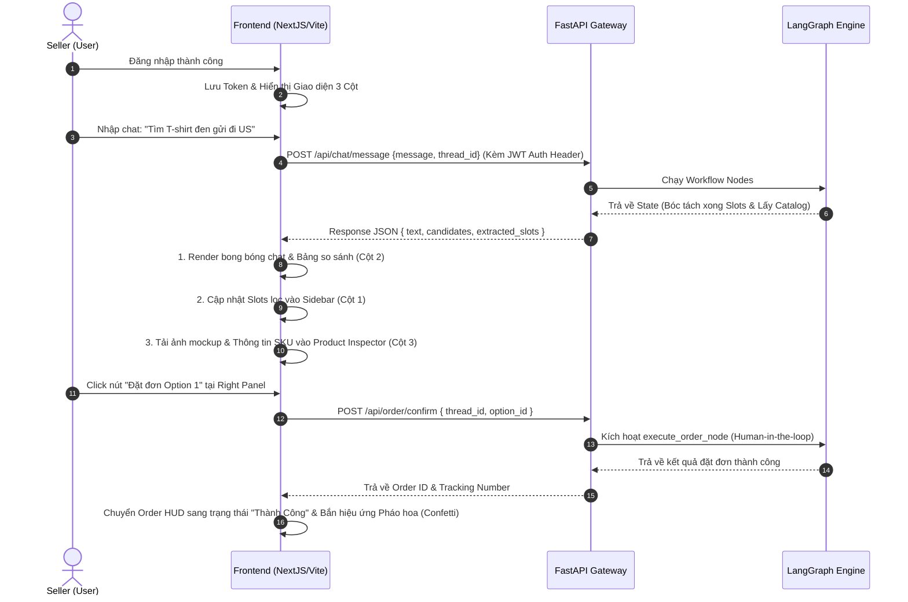

# PRODUCT BRANDING AND UI/UX SPECIFICATION: PRINTFLOW AI

Tài liệu này đặc tả chi tiết về nhận diện thương hiệu, định vị sản phẩm, và thiết kế UI/UX cho ứng dụng **PrintFlow AI** (tên gọi chính thức thay thế cho BurgerPrints Agent) - Trợ lý quyết định fulfillment tối ưu cho các Seller Print-on-Demand (POD).

---

## 1. Định Vị Sản Phẩm & Nhận Diện Thương Hiệu (Product Identity)

### 1.1. Tên Gọi & Ý Nghĩa
*   **Tên chính thức:** **PrintFlow AI**
*   **Slogan:** *AI-Powered POD Fulfillment Decision Engine*
*   **Ý nghĩa:** Đại diện cho dòng chảy mượt mà, tự động hóa từ khâu lên ý tưởng, tìm kiếm danh mục, tính toán chi phí, cho đến khi đẩy đơn hàng in ấn (Fulfillment Flow). Chữ **Print** thể hiện ngành hàng POD, **Flow** thể hiện quy trình liền mạch, không điểm nghẽn.

### 1.2. Định Vị Chiến Lược (Positioning)
*   **Vấn đề giải quyết:** Loại bỏ việc so sánh thủ công hàng ngàn SKU, nhà in, phương thức vận chuyển và thuế phí phức tạp trên BurgerPrints.
*   **Giá trị cốt lõi:**
    *   *Tính tức thì (Speed):* Ra quyết định chọn xưởng tối ưu chỉ trong 30 giây hội thoại.
    *   *Tính chuẩn xác (Accuracy):* Không có sai số trong tính toán tài chính nhờ Deterministic Engine bằng Python.
    *   *Tính thực thi (Actionability):* Đẩy đơn hàng trực tiếp lên hệ thống BurgerPrints qua API.
*   **Tone of Voice:** Chuyên nghiệp, tin cậy, hướng dữ liệu (data-driven), ngắn gọn và hỗ trợ tối đa cho việc ra quyết định.

### 1.3. Đối Tượng Người Dùng Mục Tiêu (Target Audience)
*   **Primary Users:** POD Sellers trung và cao cấp (vận hành hàng trăm đơn mỗi ngày, cần tối ưu margin và SLA ship để giữ tài khoản quảng cáo/cổng thanh toán).
*   **Secondary Users:** Sellers mới gia nhập thị trường (cần trợ lý thông minh gợi ý dòng sản phẩm, giải thích thuật ngữ và hướng dẫn lên đơn).

---

## 2. Hệ Thống Style Tokens & Nguyên Tắc Thiết Kế (UI/UX Guidelines)

Để tạo ấn tượng mạnh mẽ cho Ban giám khảo (Wow Factor), giao diện được thiết kế theo phong cách **Sleek Modern Dashboard with Glassmorphism** (tối giản, chuyên nghiệp và mượt mà).

### 2.1. Bảng Màu (Color Palette)

| Vai trò | Hệ màu HSL | Mã HEX | Trực quan hóa & Ứng dụng |
| :--- | :--- | :--- | :--- |
| **Primary (Brand)** | `hsl(220, 80%, 56%)` | `#2563EB` | Electric Blue (Glow buttons, Active states, Brand accents) |
| **Secondary** | `hsl(262, 83%, 58%)` | `#7C3AED` | Neon Violet (AI symbols, Highlighted optimal choice) |
| **Background (Dark)** | `hsl(224, 71%, 4%)` | `#020617` | Deep Midnight Navy (Nền ứng dụng chính) |
| **Card Background** | `hsla(224, 71%, 8%, 0.65)` | `#0b1129` | Glassmorphic Navy (Nền sidebar, khung chat, right panel) |
| **Success/Margin** | `hsl(142, 76%, 36%)` | `#16A34A` | Emerald Green (High margin indicators, Order completed) |
| **Warning/SLA Risk** | `hsl(38, 92%, 50%)` | `#CA8A04` | Golden Amber (SLA warnings, Missing details) |
| **Text Primary** | `hsl(210, 40%, 98%)` | `#F8FAFC` | Bright White (Tiêu đề, text chính) |
| **Text Secondary** | `hsl(215, 20%, 65%)` | `#94A3B8` | Cool Grey (Chú thích, thông số phụ) |

### 2.2. Typography (Phông chữ)
*   **Headings & UI Labels:** `Outfit` (Google Fonts) - mang lại cảm giác hiện đại, công nghệ và sắc nét.
*   **Body & Chat Text:** `Inter` (Google Fonts) - tối ưu hóa khả năng đọc hiển thị chữ nhỏ và bảng biểu số liệu.
*   **Code & Numeric Data:** `JetBrains Mono` - căn chỉnh lề hoàn hảo cho bảng so sánh chi phí.

### 2.3. Hiệu Ứng Trực Quan (Visual Effects)
*   **Glassmorphism:** Sử dụng thuộc tính `backdrop-filter: blur(12px) saturate(180%)` kết hợp viền mỏng `border: 1px solid rgba(255, 255, 255, 0.08)`.
*   **Glow Accents:** Hiệu ứng đổ bóng mờ (box-shadow) màu xanh/tím xung quanh khung nhập liệu chat và nút "Confirm Order" để dẫn dắt hành vi người dùng.
*   **Micro-animations:**
    *   *Trạng thái chờ (Processing state):* Bong bóng chat AI sử dụng hiệu ứng gradient dịch chuyển (shimmer effect).
    *   *Chuyển trang/Panel:* Hiệu ứng trượt nhẹ (slide-in) 15px từ lề trái/phải với timing function `cubic-bezier(0.16, 1, 0.3, 1)`.

---

## 3. Cấu Trúc Bố Cục Giao Diện (Layout Grid Architecture)

Ứng dụng sử dụng cấu trúc **3 cột tỷ lệ 20% : 50% : 30%** thích ứng (Responsive Layout) trên Next.js/Vite:

```
┌─────────────────┬──────────────────────────────────────┬──────────────────────┐
│  LEFT SIDEBAR   │            CENTER PANEL              │     RIGHT PANEL      │
│  (Chat History  │           (Chat Engine)              │    (Product & HUD)   │
│   & Navigation) │                                      │                      │
│                 │  ┌────────────────────────────────┐  │  ┌────────────────┐  │
│  [+ New Chat]   │  │                                │  │  │ Product        │  │
│                 │  │       Conversation Area        │  │  │ Details        │  │
│  - Today        │  │       (Bong bóng chat,         │  │  │                │  │
│    * Chat A     │  │        bảng so sánh)           │  │  └────────────────┘  │
│    * Chat B     │  │                                │  │  ┌────────────────┐  │
│                 │  └────────────────────────────────┘  │  │ Order HUD      │  │
│  - Yesterday    │  ┌────────────────────────────────┐  │  │ (Checkout list,│  │
│    * Chat C     │  │ [ Prompt input field     ] [🚀]│  │  │  Confirm CTA)  │  │
│                 │  └────────────────────────────────┘  │  │                │  │
│  [User Settings]│  [ Suggestion Chips ]                │  └────────────────┘  │
└─────────────────┴──────────────────────────────────────┴──────────────────────┘
```

### 3.1. Cột 1: Left Sidebar (Quản lý Phiên & Auth) - Chiếm 20% width
*   **Nút New Chat:** Định dạng bo tròn với border gradient, khi click sẽ reset LangGraph State và tạo một `thread_id` mới.
*   **Session History List:** Liệt kê các phiên chat trước của Seller lưu trong DB. Click vào phiên chat nào sẽ restore checkpoint của Graph tương ứng. Chia nhóm theo thời gian (Today, Yesterday, Last 7 Days).
*   **User Profile Section (Bottom):** Hiển thị Avatar của Seller, tên cửa hàng, và nút Đăng xuất.

### 3.2. Cột 2: Center Panel (Khung Chat & So Sánh Cốt Lõi) - Chiếm 50% width
*   **Chat Output Area:**
    *   *User Message:* Canh lề phải, bong bóng chat nền Navy sáng hơn (`hsl(224, 71%, 12%)`), chữ trắng.
    *   *AI Message:* Canh lề trái, hiển thị avatar logo PrintFlow AI, nền trong suốt. Định dạng Markdown hoàn chỉnh.
    *   *Comparison Table:* Nhúng trực tiếp bảng HTML/React CSS có cấu trúc hover, highlight phương án tối ưu (Option 1) bằng viền tím (`Secondary color`) kèm nhãn "RECOMMENDED" phát sáng nhẹ.
*   **Chat Input Area (Bottom):** Khung chat dính (fixed) ở đáy, hỗ trợ gửi bằng phím Enter hoặc nút gửi icon phi thuyền.
*   **Suggestion Chips:** Các nút bấm nhanh gợi ý mẫu câu hỏi (ví dụ: *"Hoodie ship US dưới 5 ngày"*, *"Tìm cốc sứ margin > 45%"*).

### 3.3. Cột 3: Right Panel (Thanh Banner Thông Tin Động) - Chiếm 30% width
Đây là điểm cải tiến quan trọng nhất giúp giao diện thoát ly khỏi chatbot dạng thô, mang lại trải nghiệm chuyên nghiệp:
*   **Thành phần 1: Product Inspector (Bộ xem sản phẩm)**
    *   Khi Agent gọi API lấy catalog sản phẩm trong chat, Right Panel tự động đồng bộ hiển thị ảnh mockup sản phẩm lớn, tên sản phẩm, các biến thể (size, color khả dụng), và mô tả thông số kỹ thuật (chất liệu, công nghệ in).
*   **Thành phần 2: Order HUD (Heads-Up Display)**
    *   Khi luồng chuyển sang bước 6 (Tạo đơn hàng), panel này sẽ chuyển sang giao diện Checkout.
    *   Hiển thị tóm tắt: Người nhận, Địa chỉ, Số lượng, SKU.
    *   Bảng phân tích Landed Cost thời gian thực (Base cost + Ship cost + Print cost + Tax).
    *   Nút bấm lớn **"Confirm Fulfillment Order"** phát sáng Primary Color. Khi click, hệ thống sẽ thực hiện gọi API tạo đơn thật và khóa (disable) nút bấm để tránh double-click.

---

## 4. Đặc Tả Modal Login/Register Đơn Giản (Authentication Modal)

Để phục vụ yêu cầu của Mentor về bảo mật tối giản, ứng dụng tích hợp một cửa sổ đăng nhập độc lập:

*   **Trải nghiệm người dùng (UX Flow):**
    *   Khi truy cập ứng dụng lần đầu, giao diện chính sẽ bị làm mờ (Blur) 8px bằng một backdrop overlay.
    *   Modal Login xuất hiện ở chính giữa màn hình.
*   **Các trường dữ liệu:**
    *   *Email Address:* Kiểm tra định dạng (regex) thời gian thực.
    *   *Password:* Tích hợp nút ẩn/hiển thị mật khẩu (eye icon).
*   **Chuyển đổi thẻ (Tab Switch):** Hỗ trợ click chữ *"Bạn chưa có tài khoản? Đăng ký ngay"* để chuyển mượt mà sang form Đăng ký (nhập thêm trường *Tên cửa hàng POD*).
*   **Cơ chế lưu trữ:**
    *   Đăng nhập thành công trả về JWT Token và thông tin cơ bản của Seller.
    *   Token lưu tại `LocalStorage` hoặc `cookie HttpOnly` để duy trì trạng thái đăng nhập cho các API Gateway của FastAPI.

---

## 5. Kịch Bản Tương Tác Giữa Giao Diện & Agent (State Sync Logic)



Tài liệu này định hình giao thức thiết kế trực quan cho dự án. Mọi thành phần UI được xây dựng trong code frontend bắt buộc tuân thủ hệ màu, phông chữ và bố cục đã định nghĩa tại đây.
