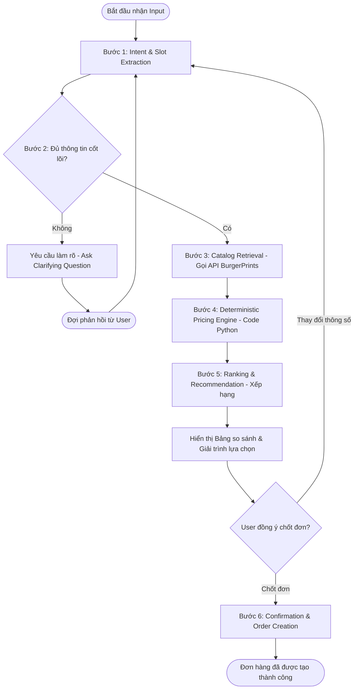

# SOLUTION OVERVIEW: BURGERPRINTS AGENT (POD CATALOG ASSISTANT)

Tài liệu này trình bày giải pháp kiến trúc tổng thể, mô hình luồng hoạt động (workflow), cấu trúc dữ liệu, và các quyết định kỹ thuật cốt lõi để xây dựng **BurgerPrints Agent** (Trợ lý Danh mục POD hỗ trợ ra quyết định cho Seller). Giải pháp được thiết kế tối ưu cho MVP tham gia Hackathon, cam kết tính thực tiễn, khả năng tương tác cao và hạn chế tối đa sai số dữ liệu.

---

## 1. Phân Tích Bài Toán & Bối Cảnh (Problem Statement)

Trong mô hình kinh doanh Print-on-Demand (POD), sự thành công của một Seller phụ thuộc rất lớn vào khả năng ra quyết định nhanh chóng và chính xác khi lựa chọn sản phẩm, xưởng in (fulfillment provider), và phương án vận chuyển. Hiện tại, Seller đang đối mặt với nhiều khó khăn lớn:
*   **Danh mục sản phẩm (Catalog) phân mảnh:** Thông tin về sản phẩm, biến thể (size, color), xưởng sản xuất, và các phương thức in ấn (Direct-to-Garment - DTG, Embroidery, Sublimation...) nằm rải rác và thay đổi liên tục.
*   **Tính toán chi phí phức tạp:** Landed Cost (tổng chi phí sản phẩm đến tay khách hàng) bao gồm: giá gốc sản phẩm (base cost), chi phí in ấn (printing fee), phí vận chuyển (shipping fee), thuế (tax/VAT) và phí hải quan tùy theo quốc gia đích. Việc tính toán thủ công các chi phí này rất dễ sai sót và tốn thời gian.
*   **Tối ưu hóa lợi nhuận (Margin) và thời gian giao hàng (SLA):** Seller phải liên tục cân nhắc giữa các lựa chọn: chọn xưởng giá rẻ nhưng ship lâu, hay chọn xưởng giá cao hơn ở gần thị trường đích để giao hàng nhanh nhằm tăng tỷ lệ hài lòng của khách hàng.
*   **Giao diện lọc tĩnh kém linh hoạt:** Các bảng dashboard lọc tĩnh truyền thống không hỗ trợ tốt việc truy vấn phối hợp nhiều điều kiện dạng hội thoại tự nhiên (ví dụ: *"Tìm cho tôi áo T-shirt cotton màu đen có landed cost dưới $15, ship đến US bang California dưới 5 ngày"*).

---

## 2. Mục Tiêu Dự Án (Goals & Non-Goals)

Để giải quyết triệt để bài toán trên mà vẫn đảm bảo tính khả thi trong thời gian phát triển ngắn của Hackathon, phạm vi dự án được phân định rõ ràng như sau:

### 2.1. Goals (Mục tiêu tập trung)
*   **Product Discovery:** Cho phép Seller tìm kiếm sản phẩm và biến thể thích hợp bằng ngôn ngữ tự nhiên thông qua bóc tách ý định (Intent) và trích xuất tham số (Slots).
*   **Fulfillment Recommendation:** Tự động kết nối, truy vấn dữ liệu báo giá từ xưởng và đề xuất các phương án tối ưu dựa trên bộ tiêu chí lọc (giá, tốc độ ship, độ tin cậy xưởng).
*   **Deterministic Calculation:** Đảm bảo toàn bộ phép tính toán tài chính (margin, landed cost) chạy bằng code Python chuẩn xác tuyệt đối, tránh hiện tượng ảo giác (hallucination) số liệu từ mô hình ngôn ngữ lớn (LLM).
*   **Order Creation Execution:** Cho phép Seller tạo nháp đơn hàng (order draft) và đẩy đơn hàng thực tế lên hệ thống BurgerPrints trực tiếp thông qua luồng tương tác hội thoại.

### 2.2. Non-Goals (Ngoài phạm vi)
*   **Không làm ERP / Hệ quản trị doanh nghiệp:** Không xây dựng quản lý dòng tiền toàn diện hay quản lý nhân sự.
*   **Không làm Quản lý kho hàng (Inventory Management):** Không lưu trữ và đồng bộ kho hàng vật lý quy mô lớn của Seller.
*   **Không làm Dashboard Phân tích (Analytics Dashboard):** Không vẽ biểu đồ doanh thu, báo cáo chi tiết hay phân tích xu hướng bán hàng dài hạn.
*   **Không làm Marketing AI:** Không sinh bài viết quảng cáo, không thiết kế mẫu in tự động bằng AI.

---

## 3. Tiêu Chí Thành Công (Success Criteria)

Dự án BurgerPrints Agent được đánh giá là thành công khi đáp ứng các tiêu chuẩn sau:

1.  **Hiểu đúng ngữ cảnh (Context Comprehension):** Agent bóc tách chính xác tối thiểu 90% các tham số (slots) quan trọng như thị trường (market), loại sản phẩm (product type), khoảng giá (target cost/price) từ câu lệnh của người dùng.
2.  **Truy vấn SKU chính xác:** Truy xuất đúng thông tin chi tiết và biến thể sản phẩm từ BurgerPrints API thực tế.
3.  **So sánh trực quan (Decision-Ready):** Trình bày rõ ràng bảng so sánh Top 3 lựa chọn kèm theo phân tích trade-off (đánh đổi giữa giá, tốc độ ship, chất lượng xưởng).
4.  **Tạo đơn hàng liền mạch (Execution):** Hỗ trợ tạo thành công đơn hàng hoàn chỉnh (hoặc nháp) thông qua API BurgerPrints sau khi có xác nhận cuối cùng từ Seller.
5.  **Trải nghiệm ấn tượng (Wow Factor):** Giao diện 3 cột hiện đại (Vite React + TypeScript) tích hợp Sidebar lịch sử chat động, khung chat mượt mà và Right Panel hiển thị mockup sản phẩm kèm theo Order HUD Checkout trực quan.

---

## 4. Kiến Trúc Hệ Thống (System Architecture)

Hệ thống được thiết kế theo mô hình **Client-Server hiệu năng cao**, tích hợp bảo mật JWT Authentication, cơ chế tìm kiếm lịch sử ngữ nghĩa (Semantic Memory) bằng Vector DB, và lấy thông tin catalog hoàn toàn thời gian thực.

```mermaid
graph TD
    subgraph Client Layer (UI)
        UI[Vite React App]
    end

    subgraph Backend Layer (FastAPI Gateway)
        API[FastAPI Router - JWT Auth]
        AgentEngine[LangGraph Orchestrator]
        PricingEngine[Deterministic Pricing Engine]
    end

    subgraph Model & Data Layer
        LLM[Gemini API - text-embedding-004 / Llama / Gemini]
        DB[(SQLite Relational DB)]
        VDB[(ChromaDB Vector DB)]
    end

    subgraph External System
        BP_API[BurgerPrints API v2.0]
    end

    UI <-->|HTTP / JSON + JWT| API
    API <--> AgentEngine
    AgentEngine <-->|Structured Output / Embeddings| LLM
    AgentEngine <-->|Calculations| PricingEngine
    AgentEngine <-->|Relational States / Prefs| DB
    AgentEngine <-->|Semantic Chat History| VDB
    AgentEngine <-->|Read/Action Tools (Real-time)| BP_API
```

### 4.1. Chi tiết các thành phần kiến trúc

#### A. Tầng Giao Diện (Vite React UI)
*   Được xây dựng bằng **Vite + React + TypeScript** và **Vanilla CSS**.
*   Gồm 3 cột chính:
    1.  **Left Sidebar (Cột 1):** Lịch sử chat và user profile.
    2.  **Center Chat Area (Cột 2):** Khung chat Markdown và bảng so sánh các xưởng in.
    3.  **Right Inspector & HUD (Cột 3):** Hiển thị mockup chi tiết sản phẩm và Order HUD Checkout.

#### B. Tầng Backend & API Gateway (FastAPI)
*   Sử dụng **FastAPI** hỗ trợ phân quyền JWT, quản lý phiên và làm cổng định tuyến.
*   Cung cấp các API: Đăng ký/Đăng nhập, gửi tin nhắn chat, lấy lịch sử phiên, xác nhận tạo đơn.
*   Tự động sinh Swagger UI tại `/docs`.

#### C. Tầng Điều Phối Agent (LangGraph Orchestration)
*   **LangGraph** đóng vai trò là xương sống quản lý trạng thái (State) và luồng rẽ nhánh (Routing) của Agent.
*   Đảm bảo khả năng chạy tuần tự (Stateful Agent Workflow), hỗ trợ cơ chế phục hồi trạng thái hội thoại thông qua `thread_id` và hỗ trợ chèn bước xác nhận của con người (Human-in-the-loop) trước khi thực hiện các hành động quan trọng (tạo đơn hàng tốn phí).

#### D. Tầng Mô hình Ngôn ngữ (Gemini API)
*   Sử dụng **Gemini API** nhờ hai tính năng cốt lõi:
    1.  **Function Calling:** Cho phép mô hình tự động quyết định khi nào cần gọi các API đọc thông tin catalog hoặc API tạo đơn hàng.
    2.  **Structured Outputs (JSON Schema):** Ép kiểu dữ liệu trả về từ LLM khớp chính xác với cấu trúc mong muốn của Backend (ví dụ: bóc tách slots, phân loại intent).

#### E. Tầng Dữ liệu & Lưu trữ (SQLite & ChromaDB)
*   **SQLite:** Lưu trữ dữ liệu quan hệ (tài khoản Seller, danh sách phiên chat, lịch sử tin nhắn và lịch sử đẩy đơn).
*   **ChromaDB:** Lưu trữ nhúng vector của tin nhắn hội thoại để phục vụ tìm kiếm và gợi nhớ ngữ cảnh ngữ nghĩa (Semantic Memory Recall).

---

## 5. Thiết Kế Chi Tiết Luồng Hoạt Động (Agent Workflow)

### 5.1. Định nghĩa Trạng thái Agent (Agent State Schema)

Trạng thái của Agent được lưu giữ xuyên suốt phiên làm việc trong một đối tượng State bao gồm:

```python
class AgentState(TypedDict):
    thread_id: str                      # ID phiên hội thoại
    user_profile: dict                  # Ưu tiên của seller (market, target_margin, min_sla)
    conversation_history: list          # Lịch sử chat (tin nhắn của User và Agent)
    extracted_requirements: dict        # Tham số đã bóc tách (product_type, market, max_cogs, print_method...)
    candidate_products: list            # Danh sách sản phẩm thô lấy từ Catalog
    candidate_quotes: list              # Báo giá từ các xưởng in
    ranking_results: list               # Danh sách phương án đã xếp hạng kèm landed cost và margin
    last_missing_fields: list           # Các trường thông tin cốt lõi còn thiếu cần hỏi thêm
    order_draft: dict                   # Bản nháp đơn hàng đang chuẩn bị tạo
    order_status: dict                  # Trạng thái của đơn hàng sau khi call API tạo đơn
```

### 5.2. Sơ đồ luồng hoạt động LangGraph Workflow



### 5.3. Chi tiết 6 bước thực thi của Workflow

#### Bước 1 — Intent & slot extraction
Mỗi khi nhận tin nhắn từ Seller, Agent sử dụng Gemini API để phân tích cú pháp ngôn ngữ tự nhiên, bóc tách các "slots" quan trọng:
*   `product_type` (ví dụ: Unisex T-shirt, Ceramic Mug)
*   `target_market` (ví dụ: US, EU, VN)
*   `max_budget_cogs` (giá vốn tối đa mong muốn)
*   `target_margin` (lợi nhuận mong muốn)
*   `shipping_sla` (thời gian giao hàng tối đa)

#### Bước 2 — Clarification (Làm rõ thông tin)
Nếu thiếu các thông tin quan trọng để thực hiện truy vấn (ví dụ: chưa rõ thị trường mục tiêu là US hay EU, hoặc chưa rõ loại vải), Agent sẽ chuyển trạng thái sang `ask_clarifying_question`. Agent sẽ hỏi tập trung vào điểm thiếu sót thay vì phán đoán mơ hồ.

#### Bước 3 — Catalog retrieval (Truy xuất Catalog)
Sau khi có đủ tham số lọc, Agent kích hoạt bộ **Read Tools** để gọi BurgerPrints API lấy về:
*   Các SKU sản phẩm phù hợp (`search_catalog`).
*   Danh sách biến thể (`get_product_variants`).
*   Danh sách nhà in có khả năng in sản phẩm đó kèm theo báo giá thô (`get_factory_quotes`).

#### Bước 4 — Deterministic pricing engine (Tính toán chi phí bằng code Python)
Để ngăn ngừa tuyệt đối lỗi tính toán sai số của LLM (ảo giác số liệu), toàn bộ báo giá thô được chuyển qua một module Python thuần để tính toán:
$$Landed\ Cost = Base\ Cost + Printing\ Fee + Shipping\ Cost + Tax\ (VAT/Hải\ quan)$$
$$Gross\ Profit\ Margin = \frac{Selling\ Price - Landed\ Cost}{Selling\ Price} \times 100\%$$
Module này trả ra kết quả tính toán chính xác dạng số thực để đính kèm vào state.

#### Bước 5 — Ranking & explanation (Xếp hạng & Đề xuất)
Hệ thống sử dụng một hàm tính điểm (Scoring Function) đơn giản để đánh giá thứ tự ưu tiên của các phương án:
$$Score = w_1 \cdot Margin + w_2 \cdot Speed + w_3 \cdot Reliability - w_4 \cdot LandedCost$$
*(Trong đó $w_i$ là trọng số có thể thay đổi dựa trên mong muốn ưu tiên giá/tốc độ của Seller).*
Sau đó, Agent xuất ra Top 3 lựa chọn kèm phân tích ưu nhược điểm (trade-off) rõ ràng của từng phương án để Seller đưa ra quyết định.

#### Bước 6 — Confirmation & order creation (Xác nhận & Tạo đơn)
Khi Seller đồng ý với một phương án (ví dụ: "Chốt phương án 1" hoặc nhấn nút "Confirm Fulfillment Order" trên Right Panel của giao diện), Agent sẽ:
1.  Tổng hợp thông tin đơn hàng nháp (`order_draft`): SKU, Size, Màu sắc, Địa chỉ ship, Số lượng.
2.  Yêu cầu xác nhận lần cuối từ người dùng.
3.  Gọi **Action Tool** (`create_order`) gửi request lên hệ thống BurgerPrints và lưu trữ mã vận đơn trả về.

---

## 6. Hệ Thống Tool Layer (Agent Tools)

Để thực thi các nhiệm vụ, Agent được trang bị bộ công cụ phân tách rõ ràng thành hai nhóm:

### 6.1. Nhóm công cụ đọc (Read Tools)
*   `search_catalog(query, product_type)`: Tìm kiếm sản phẩm trong danh mục.
*   `get_product_detail(product_id)`: Xem chi tiết kích thước, màu sắc của một sản phẩm.
*   `get_factory_quotes(product_id, variant_id, market)`: Lấy danh sách xưởng nhận in biến thể này kèm đơn giá base cost và printing fee.
*   `get_shipping_options(origin_factory, destination_market)`: Tính toán thời gian giao hàng (SLA) dự kiến và chi phí vận chuyển tương ứng.

### 6.2. Nhóm công cụ ghi/hành động (Action Tools)
*   `validate_order_draft(order_data)`: Kiểm tra tính hợp lệ của thông tin đơn hàng (địa chỉ nhận hàng, định dạng zip code, tính sẵn có của SKU).
*   `create_order(order_data)`: Gửi yêu cầu tạo đơn hàng thật lên cổng API của BurgerPrints.
*   `get_order_status(order_id)`: Tra cứu trạng thái xử lý/vận đơn của đơn hàng đã đặt.

---

## 7. Định Dạng Đầu Ra Hỗ Trợ Ra Quyết Định (Decision-Ready Outputs)

Để tăng trải nghiệm người dùng (UX) và giúp Seller quyết định nhanh, mỗi phản hồi dạng văn bản từ Agent luôn tuân thủ cấu trúc 4 khối rõ ràng:

1.  **Kết luận ngắn gọn:** *"Em đã tìm thấy 3 phương án tối ưu cho áo thun Unisex T-shirt tại thị trường US."*
2.  **Top 3 Phương án (Dạng bảng so sánh):**
    | Tiêu chí | Phương án 1 (Khuyên dùng) | Phương án 2 (Giá rẻ nhất) | Phương án 3 (Ship nhanh nhất) |
    | :--- | :--- | :--- | :--- |
    | **Xưởng fulfillment** | SwiftPrint (US) | GlobalPrint (VN) | ExpressInk (US) |
    | **Landed Cost** | \$11.50 | **\$9.80** | \$13.20 |
    | **Thời gian Ship** | 4 - 6 ngày | 10 - 14 ngày | **2 - 3 ngày** |
    | **Dự kiến Margin** | **42.5%** (Giá bán \$20) | 51.0% | 34.0% |
3.  **Giải trình & Trade-off:**
    *   *Phương án 1:* Đạt tỷ lệ Margin cao (>40%) và thời gian ship ngắn nhờ xưởng nội địa US.
    *   *Phương án 2:* Giá rẻ nhất nhưng thời gian ship lâu (từ VN sang US), có nguy cơ bị khách hàng phàn nàn về tốc độ.
4.  **Hành động tiếp theo (Next Action Prompt):** *"Bạn có muốn em tạo đơn nháp cho Phương án 1 không, hay cần điều chỉnh thông số lọc?"*

### 7.1. Quản lý Bộ nhớ Đa lượt & Gợi nhớ Ngữ nghĩa (Multi-turn & Semantic Memory Design)
Để tránh việc hỏi đi hỏi lại những thông tin cũ, hệ thống phân tách bộ nhớ thành 3 lớp riêng biệt kết hợp công nghệ tìm kiếm vector:
1.  **Short-term Memory (Bộ nhớ ngắn hạn):** Lưu trữ lịch sử tin nhắn trong session hiện tại (SQLite).
2.  **Semantic Long-term Memory (Bộ nhớ ngữ nghĩa dài hạn):** Sử dụng **ChromaDB** lập chỉ mục (index) các tin nhắn trước. Khi bắt đầu hội thoại mới, hệ thống truy vấn ChromaDB để recall (gợi lại) các tùy chọn ưu tiên của Seller (ví dụ: Seller chuyên bán thị trường US, Target Margin mặc định luôn là 40%) để tự động điền vào State mà không bắt Seller nhập lại.
3.  **Order Draft Memory (Bộ nhớ nháp đơn):** Lưu trữ tạm thời các thông tin sản phẩm và địa chỉ nhận hàng của khách hàng trong quá trình chuẩn bị chốt đơn.

---

## 8. Quản Trị Rủi Ro & Phương Án Giảm Thiểu (Risks & Mitigations)

| Rủi ro phát sinh | Khả năng xảy ra | Mức độ ảnh hưởng | Phương án giảm thiểu (Mitigation) |
| :--- | :--- | :--- | :--- |
| **API Latency / Rate Limits**<br>Gemini API hoặc BurgerPrints API phản hồi chậm làm đơ UI demo. | Trung bình | Cao | * Tích hợp bộ đệm (Caching) cho các truy vấn Catalog phổ biến.<br>* Thiết kế thanh trạng thái tải (Loading state) trực quan trên React UI.<br>* Giảm số lần gọi LLM không cần thiết bằng cách lưu các slots vào state cục bộ. |
| **LLM ảo giác số liệu**<br>Agent hiển thị sai số tiền hoặc phần trăm margin cho Seller. | Cao | Nghiêm trọng | * Cấm tuyệt đối việc để LLM tự tính toán cộng trừ nhân chia.<br>* Toàn bộ dữ liệu số được truyền qua **Deterministic Pricing Engine** viết bằng Python.<br>* LLM chỉ nhận chuỗi JSON kết quả đã tính sẵn từ Python để sinh văn bản giải trình. |
| **Mất ngữ cảnh hội thoại**<br>Seller đổi chủ đề đột ngột làm Agent bị rối loạn luồng đi. | Thấp | Trung bình | * LangGraph State Machine hỗ trợ cơ chế định tuyến linh hoạt (Conditional Routing).<br>* Khi phát hiện Intent mới hoàn toàn, Agent chủ động hỏi xác nhận: *"Bạn có muốn hủy đơn hàng đang tạo dở để tìm sản phẩm mới không?"* |
| **Demo thiếu thuyết phục (Weak UX)**<br>Ban giám khảo chỉ thấy một khung chat chữ thông thường. | Trung bình | Cao | * Giao diện 3 cột hiển thị song song khung chat, các ràng buộc và thông tin Checkout Order HUD thời gian thực.<br>* Hiển thị bảng so sánh Top 3 có định dạng HTML/CSS đẹp mắt.<br>* Cung cấp các nút bấm tương tác nhanh (Button, Suggestion Chips) ngay trong chat và Right Panel để tăng tốc độ demo. |
