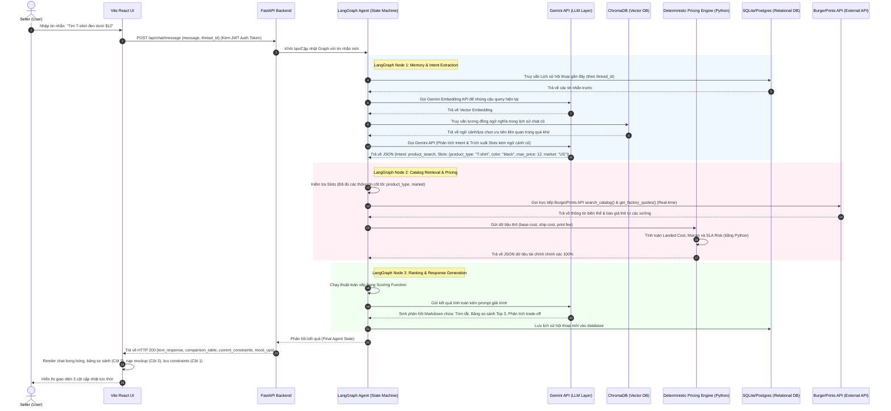

# SYSTEM ARCHITECTURE: PRINTFLOW AI

Tài liệu này mô tả chi tiết kiến trúc hệ thống, các thành phần phần mềm (components), luồng tuần tự của dữ liệu (data flow) và cơ chế tích hợp của **PrintFlow AI** (Trợ lý Danh mục POD hỗ trợ ra quyết định). Tài liệu này được thiết kế để đảm bảo tính nhất quán tuyệt đối với các tài liệu thiết kế đặc tả giao diện và cơ sở dữ liệu.

---

## 1. Hệ Thống Hoạt Động Như Thế Nào? (System Flow Overview)

PrintFlow AI hoạt động dựa trên mô hình điều phối trạng thái (State-driven Architecture), trong đó **LangGraph** đóng vai trò điều khiển trung tâm, **FastAPI** làm cổng kết nối API bảo mật hỗ trợ JWT Authentication, **Gemini API** xử lý hiểu ngôn ngữ tự nhiên (NLU) và sinh nhúng vector, **Python Pricing Engine** tính toán tài chính chính xác tuyệt đối, **ChromaDB** lưu trữ và truy hồi ngữ nghĩa lịch sử chat, và **Vite React UI** cung cấp giao diện tương tác 3 cột động cho Seller.

### 1.1. Sơ đồ tuần tự tương tác (System Sequence Diagram)

Sơ đồ dưới đây minh họa luồng đi của dữ liệu từ khi Seller nhập câu hỏi tìm kiếm sản phẩm cho đến khi nhận được bảng so sánh và gợi ý chốt đơn:



---

## 2. Chi Tiết Các Thành Phần Hệ Thống (Components Description)

Hệ thống được chia thành 5 thành phần cốt lõi. Mỗi thành phần đảm nhận một nhiệm vụ chuyên biệt và giao tiếp qua các giao thức chuẩn (HTTP/JSON).

```
┌────────────────────────────────────────────────────────────────────────┐
│                              Vite React UI                             │
│  - Giao diện 3 Cột (Sidebar, Chat Area, Right Banner Product & HUD)    │
└───────────────────────────────────┬────────────────────────────────────┘
                                    │ HTTP / JSON (JWT authenticated)
                                    ▼
┌────────────────────────────────────────────────────────────────────────┐
│                            FastAPI Backend                             │
│  - API Router (Auth, Chat) - Thread Manager      - API Swagger Docs    │
└───────────────────────────────────┬────────────────────────────────────┘
                                    │ Internal Call
                                    ▼
┌────────────────────────────────────────────────────────────────────────┐
│                        LangGraph Agent Engine                          │
│  - State Machine & Workflow      - Tool Layer Routing                  │
└──────┬────────────────────────────┬─────────────┬──────────────┬───────┘
       │                            │             │              │
       ▼                            ▼             ▼              ▼
┌──────────────┐             ┌──────────────┐┌──────────────┐┌───────────┐
│  Gemini LLM  │             │Pricing Engine││  ChromaDB    ││SQLite/Post│
│ - Intent/Slot│             │ - Landed Cost││ - Chat Memory││ - History │
│ - Embeddings │             │ - Margin %   ││ - Semantic   ││ - Prefs   │
└──────────────┘             └──────────────┘└──────────────┘└───────────┘
```

### 2.1. Vite React UI (Giao diện người dùng)
*   **Công nghệ:** Vite + React + TypeScript + Vanilla CSS.
*   **Nhiệm vụ:**
    *   Cung cấp giao diện 3 cột hiện đại, trực quan cho Seller, loại bỏ sự tẻ nhạt của chatbot đơn thuần.
    *   Tích hợp Client API (Axios) đính kèm JWT Token để thực hiện xác thực với backend.
*   **Các thành phần giao diện chính:**
    *   **Sidebar Panel (Cột 1):** Hiển thị lịch sử hội thoại (lấy từ DB qua API `/chat/history`) và các nút chuyển đổi phiên chat.
    *   **Chat Engine (Cột 2):** Khung chat chính, bong bóng chat Markdown, và bảng HTML so sánh Top 3 xưởng in.
    *   **Right Inspector & Order HUD (Cột 3):** Banner bên phải để hiển thị chi tiết hình ảnh SKU sản phẩm được chọn và giao diện xác nhận đặt hàng (Order HUD Checkout).

### 2.2. FastAPI Backend (Cổng kết nối và Quản lý phiên)
*   **Công nghệ:** FastAPI + Uvicorn + PyJWT + Passlib.
*   **Nhiệm vụ:**
    *   Đóng vai trò API Gateway, quản lý phân quyền truy cập thông qua xác thực Token JWT.
    *   Tự động sinh tài liệu API (OpenAPI Specification) tại `/docs` phục vụ mục đích kiểm thử trực tiếp.
    *   Quản lý vòng đời yêu cầu (Request Lifecycle) và liên kết phiên chat của User trong DB với định danh `thread_id` trong LangGraph.
*   **Các Endpoint chính:**
    *   `POST /api/v1/auth/register`: Đăng ký tài khoản Seller mới.
    *   `POST /api/v1/auth/login`: Xác thực Email/Mật khẩu và cấp khóa JWT.
    *   `POST /api/v1/chat/message`: Nhận tin nhắn mới từ UI kèm `thread_id`, chạy LangGraph và lưu kết quả vào DB.
    *   `POST /api/v1/order/confirm`: Xác nhận tạo đơn hàng thật trên BurgerPrints API.

### 2.3. LangGraph Agent (Bộ não điều phối trạng thái)
*   **Công nghệ:** LangGraph (LangChain Ecosystem).
*   **Nhiệm vụ:**
    *   Quản trị luồng nghiệp vụ dựa trên đồ thị có hướng (Directed Graph).
    *   Duy trì và cập nhật trạng thái Agent State (xem cấu trúc State tại [Solution Overview](file:///E:/Hackathon2026/J4F/Solution/docs/ai/solution_overview.md#51-định-nghĩa-trạng-thái-agent-agent-state-schema)).
    *   Thực hiện chuyển hướng tuần tự (State Transitions) và chuyển hướng có điều kiện (Conditional Routing).
*   **Các Node cốt lõi trong Đồ thị (Graph Nodes):**
    1.  `extract_slots_node`: Nhận tin nhắn, gửi đến Gemini LLM để trích xuất các thông số lọc và xác định ý định (Intent).
    2.  `clarify_node`: Nếu các slots quan trọng bị thiếu (ví dụ: tìm áo nhưng không rõ bán ở US hay EU để tính phí ship), Node này sẽ sinh ra câu hỏi làm rõ.
    3.  `retrieve_catalog_node`: Gọi các Read Tools tương ứng để truy vấn API BurgerPrints.
    4.  `calculate_pricing_node`: Chuyển dữ liệu báo giá thô sang Pricing Engine để xử lý số liệu.
    5.  `rank_and_recommend_node`: Xếp hạng các phương án theo hàm mục tiêu và định dạng phản hồi.
    6.  `execute_order_node`: Gọi Action Tools để tạo đơn hàng khi nhận được tín hiệu đồng ý (Human-in-the-loop).

### 2.4. Gemini LLM Integration (Tầng xử lý ngôn ngữ tự nhiên)
*   **Công nghệ:** Gemini API (sử dụng model `gemini-1.5-flash` cho các tác vụ nhanh/trích xuất và `gemini-1.5-pro` cho các tác vụ suy luận phức tạp).
*   **Nhiệm vụ:**
    *   **Ý định & Thực thể (Intent & Slot Extraction):** Chuyển đổi ngôn ngữ tự nhiên thành định dạng JSON có cấu trúc nhờ tính năng **Structured Outputs** của Gemini.
    *   **Sinh văn bản giải trình (Explanation Generation):** Dịch các con số Landed Cost, Margin khô khan từ Pricing Engine thành các lý do thuyết phục Seller (ví dụ: *"Xưởng A có base cost đắt hơn $1 nhưng phí ship rẻ hơn $2, giúp bạn tiết kiệm tổng cộng $1 landed cost"*).
    *   **Sinh câu hỏi làm rõ (Clarification Prompts):** Đặt các câu hỏi ngắn gọn, tập trung vào các trường dữ liệu còn thiếu.
*   **Cơ chế gọi công cụ (Function Calling):**
    *   Thay vì để LLM tự quyết định mọi việc, các API kết nối BurgerPrints được đăng ký dưới dạng các **Tools** của Gemini. Gemini sẽ tự phân tích và trả về yêu cầu gọi tool (`tool_calls`) kèm tham số khi Seller muốn tra cứu catalog hoặc đặt hàng.

### 2.5. Deterministic Pricing Engine (Bộ tính toán tài chính)
*   **Công nghệ:** Module Python độc lập (`pricing_engine.py`).
*   **Nhiệm vụ:**
    *   Loại bỏ hoàn toàn rủi ro tính toán sai số (hallucination) thường gặp ở các LLM khi xử lý phép tính cộng, trừ, nhân, chia phức tạp.
    *   Nhận dữ liệu đầu vào thô (Raw Quotations) từ BurgerPrints API và thực hiện tính toán tài chính theo công thức định sẵn.
*   **Logic tính toán cốt lõi:**
    1.  **Landed Cost ($LC$):**
        $$LC = BaseCost_{Product} + PrintFee_{Variant} + ShipFee_{Zone} + Tax_{VAT/Customs}$$
    2.  **Gross Profit ($GP$):**
        $$GP = SellingPrice - LC$$
    3.  **Gross Profit Margin Percentage ($GPM$):**
        $$GPM = \left(\frac{GP}{SellingPrice}\right) \times 100\%$$
    4.  **Đánh giá rủi ro SLA (SLA Risk Score):** Tính toán độ tin cậy thời gian giao hàng dựa trên lịch sử giao hàng của xưởng in và khoảng cách địa lý.
*   **Đầu ra:** Trả về một đối tượng JSON chứa danh sách các phương án đã được điền đầy đủ các thông số tài chính chính xác để đưa vào Node xếp hạng.

### 2.6. Session Memory & Semantic Memory Storage (Lịch sử & Bộ nhớ ngữ nghĩa)
*   **Công nghệ:** SQLite/PostgreSQL (Quan hệ) + ChromaDB (Vector DB).
*   **Nhiệm vụ:**
    *   Lưu thông tin đăng ký User, thiết lập sở thích của Seller, và lịch sử tin nhắn đa lượt.
    *   Lưu trữ Checkpoints của LangGraph để khôi phục trạng thái máy khi refresh trang.
    *   ChromaDB lưu trữ vector nhúng của lịch sử tin nhắn hội thoại để phục vụ tìm kiếm ngữ nghĩa và gợi nhớ ngữ cảnh (Semantic Memory Recall).
*   **Đặc tả cấu trúc chi tiết:**
    *   Toàn bộ cấu trúc Schema quan hệ (gồm bảng `users`, `user_preferences`, `conversations`, `messages`, `order_history`) được triển khai chi tiết tại [Database & VectorDB Specification](file:///E:/Hackathon2026/J4F/Solution/docs/ai/database_and_vectordb_spec.md).

### 2.7. Tool Layer / BurgerPrints API Integration (Tích hợp API BurgerPrints)
*   **Công nghệ:** HTTP Client (`httpx`) kết nối trực tiếp đến BurgerPrints API System.
*   **Nhiệm vụ:**
    *   Đóng gói (Wrap) toàn bộ các endpoint của BurgerPrints thành các Python function có định nghĩa kiểu dữ liệu rõ ràng (Type Hints) và mô tả chi tiết (docstrings) để Gemini LLM có thể nhận diện và gọi thông qua cơ chế Function Calling.
*   **Đặc tả các Tool API cốt lõi:**
    *   `search_catalog(query: str, limit: int = 5) -> List[dict]`: Gọi API BurgerPrints để tìm kiếm sản phẩm theo tên/loại.
    *   `get_factory_quotes(product_id: str, variant_id: str, market: str) -> List[dict]`: Lấy báo giá cơ bản và phí in ấn từ các nhà in liên kết với hệ thống BurgerPrints.
    *   `get_shipping_options(origin_factory_id: str, destination_country: str, zip_code: str) -> List[dict]`: Lấy các tùy chọn vận chuyển kèm giá tiền và thời gian SLA dự kiến.
    *   `create_order(sku: str, quantity: int, shipping_address: dict) -> dict`: Gửi yêu cầu đặt hàng chính thức lên BurgerPrints.

---

## 3. Luồng Vận Hành Dữ Liệu Thực Tế (Data Flow Scenarios)

### 3.1. Luồng Tìm kiếm & So sánh Sản phẩm (Discovery & Comparison Flow)

Khi người dùng gửi tin nhắn yêu cầu tìm kiếm, dữ liệu sẽ di chuyển qua các bước sau:

```
[User Input: "Áo thun cotton gửi đi US"] 
   │
   ▼ (Vite React UI đóng gói thành HTTP Request kèm JWT Token)
[POST /api/v1/chat/message] 
   │
   ▼ (FastAPI chuyển đổi thành LangGraph State)
[LangGraph: extract_slots_node] ────► (Gửi đến Gemini API để trích xuất slots)
   │                                  Đầu ra: {product_type: "T-shirt", market: "US"}
   ▼
[LangGraph: retrieve_catalog_node] ──► (Gọi trực tiếp BurgerPrints API search_catalog() & get_factory_quotes())
   │                                  Đầu ra: SKU & Báo giá thô thời gian thực từ các xưởng phù hợp
   ▼
[LangGraph: calculate_pricing_node] ─► (Chuyển sang Python Pricing Engine tính margin)
   │                                  Đầu ra: Landed Cost & Profit Margin chi tiết
   ▼
[LangGraph: rank_and_recommend_node] ► (Gemini LLM sinh text giải trình & so sánh)
   │
   ▼ (FastAPI lưu tin nhắn vào SQLite và trả về JSON kết quả)
[HTTP Response: Chat text + Table JSON + Product Specs]
   │
   ▼ (Vite React UI render trực quan đa cột)
[Hiển thị: Cột 2 hiển thị bảng so sánh & bong bóng chat; Cột 3 hiển thị mockup và chi tiết sản phẩm]
```

### 3.2. Luồng Tạo Đơn hàng (Order Creation Flow)

Đây là luồng nghiệp vụ quan trọng yêu cầu sự xác nhận của Seller (Human-in-the-loop) trước khi ghi dữ liệu xuống API thật:

```
[User nhấn nút "Confirm Order" hoặc gõ chat "Chốt phương án 1"]
   │
   ▼
[POST /api/order/confirm {thread_id, selected_option: 1}]
   │
   ▼
[FastAPI nạp dữ liệu vào LangGraph State]
   │
   ▼
[LangGraph: execute_order_node]
   │
   ├── 1. Kiểm tra tính hợp lệ của địa chỉ nhận hàng (validate_order_draft)
   │
   ├── 2. Gọi API BurgerPrints tạo đơn hàng (create_order)
   │
   ▼
[Lưu thông tin mã đơn hàng, vận đơn tracking vào SQLite]
   │
   ▼
[Trả về kết quả: "Đơn hàng #BP-12345 đã được tạo thành công!"]
```

---

## 4. Các Quyết Định Thiết Kế Kỹ Thuật (Architectural Decisions)

1.  **Lựa chọn React Vite + TypeScript + Vanilla CSS cho Frontend thay vì Streamlit:**
    *   *Lý do:* Để đạt được trải nghiệm UI/UX chat hiện đại 3 cột, có sidebar lịch sử, banner bên phải hiển thị sản phẩm và Order HUD đồng bộ động, Streamlit hoàn toàn không hỗ trợ hoặc cực kỳ khó tùy biến css. Sử dụng Vite + React + Vanilla CSS mang lại tính linh hoạt cao nhất và nhẹ hơn NextJS khi dựng demo nhanh.
2.  **Lựa chọn LangGraph làm Agent Orchestrator:**
    *   *Lý do:* Nghiệp vụ tư vấn và đặt đơn hàng POD cần một quy trình chặt chẽ (định dạng slots, xử lý clarification khi thiếu thông tin, chèn bước xác nhận của con người - Human-in-the-loop). LangGraph cung cấp cơ chế State Machine bằng Graph giúp kiểm soát luồng chuẩn xác.
3.  **Tách biệt Pricing Engine khỏi LLM:**
    *   *Lý do:* Đảm bảo tính nhất quán dữ liệu tài chính. LLM dễ bị ảo giác số học. Do đó, Pricing Engine bằng Python thuần chịu trách nhiệm tính toán toàn bộ số liệu, LLM chỉ đóng vai trò thuyết minh.
4.  **Sử dụng SQLite cho Database quan hệ & lưu Checkpoints:**
    *   *Lý do:* Gọn nhẹ, không yêu cầu thiết lập container database cồng kềnh trong quá trình chạy thử hackathon. Dễ cấu hình migrations và backup.
5.  **Tích hợp ChromaDB làm Vector DB cho Lịch sử chat (Semantic Memory):**
    *   *Lý do:* Giúp hệ thống hồi tưởng ngữ cảnh cũ thông minh qua tìm kiếm độ tương đồng vector, hỗ trợ cuộc trò chuyện nhiều lượt tự nhiên mà không bắt Seller khai báo lại các sở thích đã thống nhất trong các phiên trước. ChromaDB siêu nhẹ, chạy local nhanh.
