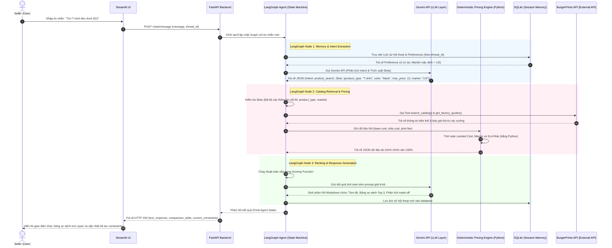

# SYSTEM ARCHITECTURE: BURGERPRINTS AGENT

Tài liệu này mô tả chi tiết kiến trúc hệ thống, các thành phần phần mềm (components), luồng tuần tự của dữ liệu (data flow) và cơ chế tích hợp của **BurgerPrints Agent** (Trợ lý Danh mục POD hỗ trợ ra quyết định). Tài liệu này được thiết kế để đảm bảo tính nhất quán tuyệt đối với tài liệu [Solution Overview](file:///E:/Hackathon2026/J4F/Solution/docs/ai/solution_overview.md).

---

## 1. Hệ Thống Hoạt Động Như Thế Nào? (System Flow Overview)

BurgerPrints Agent hoạt động dựa trên mô hình điều phối trạng thái (State-driven Architecture), trong đó **LangGraph** đóng vai trò điều khiển trung tâm, **FastAPI** làm cổng kết nối API bảo mật, **Gemini API** xử lý hiểu ngôn ngữ tự nhiên (NLU), **Python Pricing Engine** tính toán tài chính chính xác tuyệt đối, và **Streamlit UI** cung cấp giao diện tương tác động cho Seller.

### 1.1. Sơ đồ tuần tự tương tác (System Sequence Diagram)

Sơ đồ dưới đây minh họa luồng đi của dữ liệu từ khi Seller nhập câu hỏi tìm kiếm sản phẩm cho đến khi nhận được bảng so sánh và gợi ý chốt đơn:



---

## 2. Chi Tiết Các Thành Phần Hệ Thống (Components Description)

Hệ thống được chia thành 5 thành phần cốt lõi. Mỗi thành phần đảm nhận một nhiệm vụ chuyên biệt và giao tiếp qua các giao thức chuẩn (HTTP/JSON).

```
┌────────────────────────────────────────────────────────────────────────┐
│                              Streamlit UI                              │
│  - Khung Chat Tương Tác    - Bảng Constraints    - Bảng So Sánh Top 3  │
└───────────────────────────────────┬────────────────────────────────────┘
                                    │ HTTP / JSON
                                    ▼
┌────────────────────────────────────────────────────────────────────────┐
│                            FastAPI Backend                             │
│  - API Router (/chat)      - Thread Manager      - API Swagger Docs    │
└───────────────────────────────────┬────────────────────────────────────┘
                                    │ Internal Call
                                    ▼
┌────────────────────────────────────────────────────────────────────────┐
│                        LangGraph Agent Engine                          │
│  - State Machine & Workflow      - Tool Layer Routing                  │
└──────┬────────────────────────────┬─────────────────────────────┬──────┘
       │                            │                             │
       ▼                            ▼                             ▼
┌──────────────┐             ┌──────────────┐              ┌─────────────┐
│  Gemini LLM  │             │Pricing Engine│              │ SQLite DB   │
│ - Intent/Slot│             │ - Landed Cost│              │ - History   │
│ - Clarify    │             │ - Margin %   │              │ - Preference│
└──────────────┘             └──────────────┘              └─────────────┘
```

### 2.1. Streamlit UI (Giao diện người dùng)
*   **Công nghệ:** Streamlit (Python 3.10+).
*   **Nhiệm vụ:**
    *   Cung cấp giao diện Web trực quan, thân thiện cho Seller, tối ưu hóa hiển thị dữ liệu bảng biểu thay vì chỉ có giao diện chat chữ đơn thuần.
    *   Gửi yêu cầu người dùng đến FastAPI Backend thông qua thư viện `httpx`.
*   **Các thành phần giao diện chính:**
    *   **Chat Container (`st.chat_message`):** Hiển thị lịch sử hội thoại dưới dạng bong bóng chat.
    *   **Constraints Sidebar Panel (`st.sidebar`):** Hiển thị các thông số ràng buộc hiện tại mà Agent đã bóc tách được từ Seller (Thị trường ưu tiên, Margin mục tiêu, Mức giá trần, Phương thức in). Giúp Seller biết Agent đang hiểu đúng hay sai nhu cầu của mình.
    *   **Interactive Comparison Table:** Hiển thị kết quả so sánh Top 3 phương án tối ưu dưới dạng bảng (`st.dataframe` hoặc `st.table`) kèm theo các nút bấm hành động nhanh như *"Chọn Phương án 1"* hoặc *"Đặt đơn hàng nháp này"*.

### 2.2. FastAPI Backend (Cổng kết nối và Quản lý phiên)
*   **Công nghệ:** FastAPI + Uvicorn.
*   **Nhiệm vụ:**
    *   Đóng vai trò API Gateway, nhận và phân phối các yêu cầu từ giao diện Streamlit UI (hoặc các kênh phụ như Telegram Bot nếu mở rộng).
    *   Tự động sinh tài liệu API (OpenAPI Specification) tại `/docs` phục vụ mục đích kiểm thử trực tiếp.
    *   Quản lý vòng đời yêu cầu (Request Lifecycle) và quản trị định danh Thread (`thread_id`) để gửi sang LangGraph.
*   **Các Endpoint chính:**
    *   `POST /api/chat/message`: Nhận tin nhắn mới từ UI kèm `thread_id`. Trả về nội dung phản hồi của Agent kèm bảng dữ liệu so sánh đã được định dạng.
    *   `POST /api/order/draft`: API tạo đơn hàng nháp trên hệ thống.
    *   `POST /api/order/confirm`: API xác nhận thanh toán/chuyển trạng thái đơn hàng thật.
    *   `GET /api/catalog/search`: API tra cứu nhanh danh mục sản phẩm (sử dụng cache cục bộ để tăng tốc).

### 2.3. LangGraph Agent (Bộ não điều phối trạng thái)
*   **Công nghệ:** LangGraph (LangChain Ecosystem).
*   **Nhiệm vụ:**
    *   Quản trị luồng nghiệp vụ dựa trên đồ thị có hướng (Directed Graph).
    *   Duy trì và cập nhật trạng thái Agent State (xem cấu trúc State tại [Solution Overview](file:///E:/Hackathon2026/J4F/Solution/docs/ai/solution_overview.md#51-định-nghĩa-trạng-thái-agent-agent-state-schema)).
    *   Thực hiện chuyển hướng tuần tự (State Transitions) và chuyển hướng có điều kiện (Conditional Routing).
*   **Các Node cốt lõi trong Đồ thị (Graph Nodes):**
    1.  `extract_slots_node`: Nhận tin nhắn, gửi đến Gemini LLM để trích xuất các thông số lọc và xác định ý định (Intent).
    2.  `clarify_node`: Nếu các slots quan trọng bị thiếu (ví dụ: tìm áo nhưng không rõ bán ở US hay EU để tính phí ship), Node này sẽ sinh ra câu hỏi làm rõ.
    3.  `retrieve_catalog_node`: Gọi các Read Tools tương ứng để truy vấn API BurgerPrints.
    4.  `calculate_pricing_node`: Chuyển dữ liệu báo giá thô sang Pricing Engine để xử lý số liệu.
    5.  `rank_and_recommend_node`: Xếp hạng các phương án theo hàm mục tiêu và định dạng phản hồi.
    6.  `execute_order_node`: Gọi Action Tools để tạo đơn hàng khi nhận được tín hiệu đồng ý (Human-in-the-loop).

### 2.4. Gemini LLM Integration (Tầng xử lý ngôn ngữ tự nhiên)
*   **Công nghệ:** Gemini API (sử dụng model `gemini-1.5-flash` cho các tác vụ nhanh/trích xuất và `gemini-1.5-pro` cho các tác vụ suy luận phức tạp).
*   **Nhiệm vụ:**
    *   **Ý định & Thực thể (Intent & Slot Extraction):** Chuyển đổi ngôn ngữ tự nhiên thành định dạng JSON có cấu trúc nhờ tính năng **Structured Outputs** của Gemini.
    *   **Sinh văn bản giải trình (Explanation Generation):** Dịch các con số Landed Cost, Margin khô khan từ Pricing Engine thành các lý do thuyết phục Seller (ví dụ: *"Xưởng A có base cost đắt hơn $1 nhưng phí ship rẻ hơn $2, giúp bạn tiết kiệm tổng cộng $1 landed cost"*).
    *   **Sinh câu hỏi làm rõ (Clarification Prompts):** Đặt các câu hỏi ngắn gọn, tập trung vào các trường dữ liệu còn thiếu.
*   **Cơ chế gọi công cụ (Function Calling):**
    *   Thay vì để LLM tự quyết định mọi việc, các API kết nối BurgerPrints được đăng ký dưới dạng các **Tools** của Gemini. Gemini sẽ tự phân tích và trả về yêu cầu gọi tool (`tool_calls`) kèm tham số khi Seller muốn tra cứu catalog hoặc đặt hàng.

### 2.5. Deterministic Pricing Engine (Bộ tính toán tài chính)
*   **Công nghệ:** Module Python độc lập (`pricing_engine.py`).
*   **Nhiệm vụ:**
    *   Loại bỏ hoàn toàn rủi ro tính toán sai số (hallucination) thường gặp ở các LLM khi xử lý phép tính cộng, trừ, nhân, chia phức tạp.
    *   Nhận dữ liệu đầu vào thô (Raw Quotations) từ BurgerPrints API và thực hiện tính toán tài chính theo công thức định sẵn.
*   **Logic tính toán cốt lõi:**
    1.  **Landed Cost ($LC$):**
        $$LC = BaseCost_{Product} + PrintFee_{Variant} + ShipFee_{Zone} + Tax_{VAT/Customs}$$
    2.  **Gross Profit ($GP$):**
        $$GP = SellingPrice - LC$$
    3.  **Gross Profit Margin Percentage ($GPM$):**
        $$GPM = \left(\frac{GP}{SellingPrice}\right) \times 100\%$$
    4.  **Đánh giá rủi ro SLA (SLA Risk Score):** Tính toán độ tin cậy thời gian giao hàng dựa trên lịch sử giao hàng của xưởng in và khoảng cách địa lý.
*   **Đầu ra:** Trả về một đối tượng JSON chứa danh sách các phương án đã được điền đầy đủ các thông số tài chính chính xác để đưa vào Node xếp hạng.

### 2.6. Session Memory (Hệ thống lưu trữ & Bộ nhớ)
*   **Công nghệ:** SQLite (hoặc PostgreSQL).
*   **Nhiệm vụ:**
    *   Lưu trữ trạng thái hội thoại và thiết lập của Seller để phục vụ tính năng đa lượt (Multi-turn Conversation) và khôi phục trạng thái (Checkpoints).
*   **Cấu trúc bảng cơ sở dữ liệu (SQLite Schemas):**
    
    #### Bảng `sessions` (Lịch sử hội thoại ngắn hạn)
    Dùng để lưu vết các lượt chat và trạng thái Graph Checkpoint của LangGraph.
    ```sql
    CREATE TABLE sessions (
        session_id TEXT PRIMARY KEY,
        thread_id TEXT NOT NULL,
        user_id TEXT,
        state_checkpoint BLOB,       -- Trạng thái nén của LangGraph State
        updated_at TIMESTAMP DEFAULT CURRENT_TIMESTAMP
    );
    ```

    #### Bảng `user_preferences` (Bộ nhớ sở thích dài hạn)
    Ghi nhớ các thiết lập ưu tiên của Seller để tự áp dụng cho các lượt tìm kiếm sau.
    ```sql
    CREATE TABLE user_preferences (
        user_id TEXT PRIMARY KEY,
        preferred_market TEXT DEFAULT 'US',   -- Thị trường ưu tiên (US, EU, VN...)
        target_margin REAL DEFAULT 40.0,      -- Margin mục tiêu (%)
        max_shipping_days INTEGER DEFAULT 7,   -- Thời gian ship tối đa mong muốn
        fulfillment_priority TEXT DEFAULT 'margin' -- Ưu tiên 'margin' (lợi nhuận) hoặc 'speed' (tốc độ ship)
    );
    ```

### 2.7. Tool Layer / BurgerPrints API Integration (Tích hợp API BurgerPrints)
*   **Công nghệ:** HTTP Client (`httpx`) kết nối trực tiếp đến BurgerPrints API System.
*   **Nhiệm vụ:**
    *   Đóng gói (Wrap) toàn bộ các endpoint của BurgerPrints thành các Python function có định nghĩa kiểu dữ liệu rõ ràng (Type Hints) và mô tả chi tiết (docstrings) để Gemini LLM có thể nhận diện và gọi thông qua cơ chế Function Calling.
*   **Đặc tả các Tool API cốt lõi:**
    *   `search_catalog(query: str, limit: int = 5) -> List[dict]`: Gọi API BurgerPrints để tìm kiếm sản phẩm theo tên/loại.
    *   `get_factory_quotes(product_id: str, variant_id: str, market: str) -> List[dict]`: Lấy báo giá cơ bản và phí in ấn từ các nhà in liên kết với hệ thống BurgerPrints.
    *   `get_shipping_options(origin_factory_id: str, destination_country: str, zip_code: str) -> List[dict]`: Lấy các tùy chọn vận chuyển kèm giá tiền và thời gian SLA dự kiến.
    *   `create_order(sku: str, quantity: int, shipping_address: dict) -> dict`: Gửi yêu cầu đặt hàng chính thức lên BurgerPrints.

---

## 3. Luồng Vận Hành Dữ Liệu Thực Tế (Data Flow Scenarios)

### 3.1. Luồng Tìm kiếm & So sánh Sản phẩm (Discovery & Comparison Flow)

Khi người dùng gửi tin nhắn yêu cầu tìm kiếm, dữ liệu sẽ di chuyển qua các bước sau:

```
[User Input: "Áo thun cotton gửi đi US"] 
   │
   ▼ (Streamlit UI đóng gói thành HTTP Request)
[POST /api/chat/message] 
   │
   ▼ (FastAPI chuyển đổi thành LangGraph State)
[LangGraph: extract_slots_node] ────► (Gửi đến Gemini API để trích xuất slots)
   │                                  Đầu ra: {product_type: "T-shirt", market: "US"}
   ▼
[LangGraph: retrieve_catalog_node] ──► (Gọi Tool search_catalog & get_factory_quotes)
   │                                  Đầu ra: 3 báo giá thô từ 3 xưởng khác nhau
   ▼
[LangGraph: calculate_pricing_node] ─► (Chuyển sang Python Pricing Engine tính margin)
   │                                  Đầu ra: Landed Cost & Profit Margin chi tiết
   ▼
[LangGraph: rank_and_recommend_node] ► (Gemini LLM sinh text giải trình & so sánh)
   │
   ▼ (FastAPI trả về JSON kết quả)
[HTTP Response: Chat text + Table JSON]
   │
   ▼ (Streamlit UI render trực quan)
[Hiển thị Bảng so sánh 3 xưởng in trên màn hình Seller]
```

### 3.2. Luồng Tạo Đơn hàng (Order Creation Flow)

Đây là luồng nghiệp vụ quan trọng yêu cầu sự xác nhận của Seller (Human-in-the-loop) trước khi ghi dữ liệu xuống API thật:

```
[User nhấn nút "Confirm Order" hoặc gõ chat "Chốt phương án 1"]
   │
   ▼
[POST /api/order/confirm {thread_id, selected_option: 1}]
   │
   ▼
[FastAPI nạp dữ liệu vào LangGraph State]
   │
   ▼
[LangGraph: execute_order_node]
   │
   ├── 1. Kiểm tra tính hợp lệ của địa chỉ nhận hàng (validate_order_draft)
   │
   ├── 2. Gọi API BurgerPrints tạo đơn hàng (create_order)
   │
   ▼
[Lưu thông tin mã đơn hàng, vận đơn tracking vào SQLite]
   │
   ▼
[Trả về kết quả: "Đơn hàng #BP-12345 đã được tạo thành công!"]
```

---

## 4. Các Quyết Định Thiết Kế Kỹ Thuật (Architectural Decisions)

1.  **Lựa chọn Streamlit thay vì NextJS/React cho MVP:**
    *   *Lý do:* Rút ngắn thời gian phát triển giao diện xuống còn vài giờ thay vì vài ngày. Streamlit hỗ trợ sẵn các thành phần hiển thị bảng dữ liệu, chatbox, và biểu đồ rất mạnh mẽ bằng Python, giúp đồng bộ mã nguồn với backend dễ dàng.
2.  **Lựa chọn LangGraph thay vì Agent thuần:**
    *   *Lý do:* Nghiệp vụ tư vấn và đặt đơn hàng POD cần một quy trình chặt chẽ (định hướng luồng rõ ràng, xử lý clarification khi thiếu thông tin, chèn bước xác nhận của con người). LangGraph cung cấp cơ chế Graph Node/Edge giúp kiểm soát luồng hoạt động chuẩn xác hơn các agent hoạt động tự do (ReAct Loop) dễ bị lặp vô hạn.
3.  **Tách biệt Pricing Engine khỏi LLM:**
    *   *Lý do:* Đảm bảo tính nhất quán dữ liệu tài chính. LLM rất yếu trong việc tính toán số thập phân phức tạp và dễ gặp hiện tượng ảo giác số. Bằng cách tính toán bằng Python trước, LLM chỉ đóng vai trò "người phát ngôn" đọc kết quả đã được tính chính xác.
4.  **Sử dụng SQLite cho lưu trữ nội bộ:**
    *   *Lý do:* Không yêu cầu cấu hình server database phức tạp trong môi trường chạy thử/hackathon. SQLite lưu trữ trực tiếp dưới dạng file trong thư mục dự án, dễ dàng sao lưu và di chuyển.
