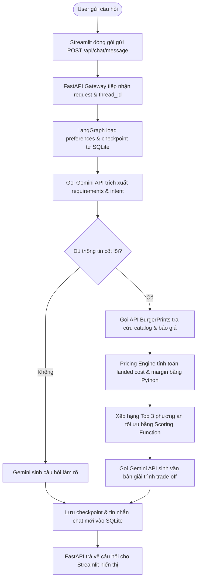

# SYSTEM ARCHITECTURE DOCUMENT: BURGERPRINTS AGENT

Tài liệu này mô tả chi tiết kiến trúc phần mềm (Software Architecture Document - SAD) của hệ thống **BurgerPrints Agent** (Trợ lý Danh mục POD hỗ trợ ra quyết định cho Seller). Tài liệu được xây dựng để đáp ứng đầy đủ các yêu cầu và ràng buộc kỹ thuật đặt ra trong đề bài [Solution Topic](file:///E:/Hackathon2026/J4F/Solution/docs/topic.md), đồng thời đảm bảo tính thống nhất với toàn bộ tài liệu giải pháp trong thư mục [Solution/docs/ai/](file:///E:/Hackathon2026/J4F/Solution/docs/ai).

---

## 1. Nguyên Tắc Thiết Kế Kiến Trúc (Architectural Design Principles)

Kiến trúc của BurgerPrints Agent được xây dựng dựa trên 4 nguyên tắc cốt lõi nhằm tối ưu hóa hiệu năng, độ tin cậy và trải nghiệm người dùng trong khuôn khổ một cuộc thi Hackathon:

1.  **Tách biệt Giao diện và Nghiệp vụ (Decoupled Front-to-Back):** Tách bạch hoàn toàn tầng hiển thị (Presentation Layer - Streamlit) và tầng xử lý nghiệp vụ (Business Layer - FastAPI & LangGraph). Hai tầng giao tiếp qua giao thức HTTP RESTful chuẩn hóa. Điều này cho phép dễ dàng thay thế giao diện Web (Streamlit) bằng các kênh giao tiếp khác (như Telegram Bot, Discord Bot) mà không cần viết lại bộ não Agent.
2.  **Tính toán tài chính chính xác (Deterministic Calculations):** Loại bỏ hoàn toàn khả năng tính toán sai lệch của mô hình ngôn ngữ lớn (LLM). Mọi phép tính liên quan đến Landed Cost, Profit Margin, VAT, và Shipping Fee đều được thực thi bằng mã nguồn Python thuần túy. LLM chỉ đóng vai trò diễn giải ngôn ngữ tự nhiên và trình bày dữ liệu.
3.  **Điều khiển Trạng thái Đồ thị (State-driven Conversation):** Sử dụng mô hình đồ thị có hướng quản trị bởi LangGraph để kiểm soát chặt chẽ luồng hội thoại. Khác với các mô hình Agent tự do (ReAct loop) dễ bị lặp vô hạn hoặc đi chệch hướng, LangGraph đảm bảo Agent luôn đi theo đúng các bước nghiệp vụ định sẵn và hỗ trợ chèn bước xác nhận của con người (Human-in-the-loop) trước khi tạo đơn hàng.
4.  **Cài đặt Gọn nhẹ & Cơ động (10-Minute Portability):** Toàn bộ ứng dụng và các dịch vụ đi kèm được container hóa (Dockerization), cho phép Giám khảo cài đặt và chạy thử nghiệm trên bất kỳ máy tính nào trong vòng dưới 10 phút chỉ với một câu lệnh duy nhất.

---

## 2. Kiến Trúc Phân Tầng (Layered Architecture View)

Hệ thống được tổ chức thành 5 tầng chức năng rõ ràng, xếp chồng lên nhau nhằm tăng khả năng bảo trì và nâng cấp:

```mermaid
graph TD
    subgraph Tầng 1: Presentation (Streamlit UI)
        StreamlitApp[Streamlit Web UI]
        ChatWidget[Khung Chat Tương Tác]
        ConstraintsSidebar[Thanh Lọc Constraints Side]
        ComparisonView[Bảng So Sánh Top 3]
    end

    subgraph Tầng 2: API Gateway & Gateway (FastAPI)
        FastAPIGateway[FastAPI Gateway Router]
        ThreadManager[Quản Lý Phiên Thread ID]
        SwaggerDocs[Swagger UI API Docs]
    end

    subgraph Tầng 3: Agent Orchestration (LangGraph Engine)
        LangGraphOrchestrator[LangGraph Workflow Controller]
        StatePersistence[SQLite State Checkpointer]
    end

    subgraph Tầng 4: Logic & Tools Layer
        GeminiNLU[Gemini API - Intent & Slot Extraction]
        PricingEngine[Deterministic Pricing Engine - Python]
        BurgerPrintsWrapper[BurgerPrints API Client Wrapper]
    end

    subgraph Tầng 5: Data & Integration (External)
        SQLiteDB[(SQLite Database Local)]
        BPAPI[BurgerPrints API v2.0 Sandbox]
        GoogleLLM[Gemini API Cloud Services]
    end

    StreamlitApp <-->|HTTP / JSON| FastAPIGateway
    FastAPIGateway <-->|Internal Call| LangGraphOrchestrator
    LangGraphOrchestrator <-->|Save State| StatePersistence
    StatePersistence <-->|Read/Write| SQLiteDB
    LangGraphOrchestrator <-->|Analyze / NLG| GeminiNLU
    LangGraphOrchestrator <-->|Calculate| PricingEngine
    LangGraphOrchestrator <-->|Execute API Tools| BurgerPrintsWrapper
    BurgerPrintsWrapper <-->|HTTPS API Key| BPAPI
    GeminiNLU <-->|HTTPS Cloud API| GoogleLLM
```

### 2.1. Tầng 1: Presentation Layer (Streamlit UI)

- **Chức năng:** Nhận tin nhắn từ Seller, gửi yêu cầu tới Backend và hiển thị giao diện kết hợp (Hybrid UX).
- **Chi tiết:** Streamlit chạy như một dịch vụ Web độc lập. Nó nhận dữ liệu JSON trả về từ backend để render động bảng so sánh xưởng in, thanh lọc constraints sidebar và nút bấm xác nhận tạo đơn hàng.

### 2.2. Tầng 2: API Gateway & Controller Layer (FastAPI)

- **Chức năng:** Cổng kết nối API bảo mật, tiếp nhận request từ Client, điều phối định danh phiên (`thread_id`), và cung cấp tài liệu API tự động tại `/docs`.
- **Chi tiết:** Đảm bảo không lộ thông tin cấu hình và API key ra phía Client. FastAPI tiếp nhận payload từ Streamlit, trích xuất cấu hình bảo mật từ biến môi trường và nạp vào luồng xử lý của Agent.

### 2.3. Tầng 3: Agent Orchestration Layer (LangGraph)

- **Chức năng:** Quản lý vòng đời trạng thái của cuộc hội thoại (Conversation State) và định tuyến thông minh (Routing).
- **Chi tiết:** Sử dụng SQLite làm bộ lưu trữ trạng thái (Checkpointer). Nếu cuộc hội thoại bị gián đoạn hoặc cần bước xác nhận từ con người, LangGraph sẽ lưu trạng thái hiện tại xuống SQLite và khôi phục lại ngay khi nhận được tín hiệu tiếp theo của Seller thông qua `thread_id`.

### 2.4. Tầng 4: Logic & Tools Layer (Nghiệp vụ)

- **Chức năng:** Thực thi các tác vụ nghiệp vụ chuyên biệt của hệ thống.
- **Chi tiết:**
  - **Gemini NLU:** Phân tích ngôn ngữ tự nhiên để bóc tách slots.
  - **Pricing Engine:** Chạy thuật toán Python tính toán margin và landed cost chính xác 100%.
  - **BurgerPrints API Wrapper:** Lớp trung gian thực hiện các cuộc gọi API và xử lý dữ liệu trả về từ BurgerPrints.

### 2.5. Tầng 5: Data & Integration Layer (Dữ liệu ngoại vi)

- **Chức năng:** Các hệ thống cơ sở dữ liệu và API bên ngoài.
- **Chi tiết:** SQLite cục bộ (lưu lịch sử chat, preferences), Cloud Gemini API và hệ thống API của BurgerPrints.

---

## 3. Luồng Vận Hành Dữ Liệu (Data & Message Flow)

Luồng hoạt động dưới đây mô tả cách thức hệ thống xử lý một yêu cầu tìm kiếm sản phẩm:



---

## 4. Hướng Dẫn Cài Đặt & Triển Khai Dưới 10 Phút (10-Minute Setup Guide)

Để đảm bảo yêu cầu _"Cài đặt $\le$ 10 phút trên máy giám khảo"_, toàn bộ hệ thống được đóng gói bằng **Docker Compose**. Giám khảo chỉ cần cài đặt Docker Desktop và thực hiện các bước sau:

### 4.1. File cấu hình môi trường `.env` mẫu

Tạo file `.env` tại thư mục gốc của dự án (được bỏ qua không commit lên GitHub để bảo mật API Key):

```ini
# Cấu hình bảo mật hệ thống
BURGERPRINTS_API_KEY=your_real_burgerprints_api_key_here
GEMINI_API_KEY=your_real_gemini_api_key_here

# Thiết lập môi trường chạy
USE_MOCK_API=false
ENVIRONMENT=production
LOG_LEVEL=info
PORT_BACKEND=8000
PORT_FRONTEND=8501
```

### 4.2. File `docker-compose.yml` mẫu

```yaml
version: "3.8"

services:
  backend:
    build:
      context: ./Product
      dockerfile: Dockerfile.backend
    container_name: burgerprints-agent-backend
    env_file:
      - .env
    ports:
      - "${PORT_BACKEND}:8000"
    volumes:
      - ./Product/data:/app/data
    restart: always

  frontend:
    build:
      context: ./Product
      dockerfile: Dockerfile.frontend
    container_name: burgerprints-agent-frontend
    ports:
      - "${PORT_FRONTEND}:8501"
    environment:
      - BACKEND_URL=http://backend:8000
    depends_on:
      - backend
    restart: always
```

### 4.3. Các bước khởi chạy dành cho Giám khảo

1.  **Bước 1:** Clone mã nguồn dự án từ GitHub về máy cục bộ.
2.  **Bước 2:** Tạo file `.env` ở thư mục gốc và điền mã `GEMINI_API_KEY` và `BURGERPRINTS_API_KEY` như hướng dẫn trên.
3.  **Bước 3:** Chạy lệnh duy nhất trong terminal tại thư mục gốc:
    ```bash
    docker-compose up --build -d
    ```
4.  **Bước 4:** Truy cập và trải nghiệm hệ thống:
    - **Giao diện chat Web (Streamlit UI):** Truy cập `http://localhost:8501`
    - **Tài liệu tương tác API (FastAPI Swagger Docs):** Truy cập `http://localhost:8000/docs`

---

## 5. Bảng Đối Chiếu Đáp Ứng Đề Bài (Requirements Traceability Matrix)

Dưới đây là bảng đối chiếu chứng minh kiến trúc hệ thống đáp ứng đầy đủ các yêu cầu và kịch bản mẫu từ đề bài [topic.md](file:///E:/Hackathon2026/J4F/Solution/docs/topic.md):

| Yêu cầu từ Đề bài                                                                | Giải pháp Kiến trúc đáp ứng                                                                                                                       | Vị trí đặc tả chi tiết                                                                                                                                                                      |
| :------------------------------------------------------------------------------- | :------------------------------------------------------------------------------------------------------------------------------------------------ | :------------------------------------------------------------------------------------------------------------------------------------------------------------------------------------------ |
| **Dùng BurgerPrints API v2.0 làm nguồn dữ liệu**                                 | Xây dựng bộ `BurgerPrints API Client Wrapper` hỗ trợ gọi thực tế qua HTTP Client, có cơ chế Mocking Fallback dự phòng.                            | [API & Tool Contract](file:///E:/Hackathon2026/J4F/Solution/docs/ai/api_and_tool_contract.md#1-burgerprints-api-v20-contract-external-integration)                                          |
| **AI Agent hội thoại (không làm form lọc tĩnh)**                                 | Sử dụng framework **LangGraph** quản lý máy trạng thái hội thoại nhiều lượt (Multi-turn), tự động trích xuất slots và hỏi làm rõ (Clarification). | [Agent Design Specification](file:///E:/Hackathon2026/J4F/Solution/docs/ai/agent_design_specification.md#3-đặc-tả-chi-tiết-từng-node-agent-nodes-specification)                             |
| **Cài đặt $\le$ 10 phút trên máy giám khảo**                                     | Container hóa toàn bộ hệ thống bằng Docker Compose chạy tự động qua 1 dòng lệnh.                                                                  | Mục 4 trong tài liệu này ([architecture.md](file:///E:/Hackathon2026/J4F/Solution/docs/architecture/architecture.md#4-hướng-dẫn-cài-đặt--triển-khai-dưới-10-phút-10-minute-setup-guide))    |
| **Không upload API key lên public repo**                                         | Sử dụng file cấu hình môi trường `.env` nằm ngoài git control (`.gitignore`).                                                                     | Mục 4.1 trong tài liệu này ([architecture.md](file:///E:/Hackathon2026/J4F/Solution/docs/architecture/architecture.md#41-file-cấu-hình-môi-trường-env-mẫu))                                 |
| **Tình huống mẫu 1:** _"Tìm T-shirt gửi đi Mỹ, landed cost < $8, ship < 5 ngày"_ | Bóc tách slots `product_type`, `market`, `max_cogs`, `shipping_sla` và so sánh các xưởng in tại Mỹ.                                               | [User Flow & Conversation Flow](file:///E:/Hackathon2026/J4F/Solution/docs/ai/user_flow_and_conversation_flow.md#2-scenario-01-tìm-kiếm-t-shirt-tối-ưu-cho-thị-trường-us-find-best-t-shirt) |
| **Tình huống mẫu 2:** _"So sánh Hoodie xưởng US và xưởng VN"_                    | Gọi API lấy quote từ 2 vùng địa lý, so sánh chênh lệch giá base và giá ship xuyên biên giới.                                                      | [User Flow & Conversation Flow](file:///E:/Hackathon2026/J4F/Solution/docs/ai/user_flow_and_conversation_flow.md#3-scenario-02-so-sánh-sản-phẩm-hoodie-giữa-các-xưởng-compare-hoodie)       |
| **Tình huống mẫu 3:** _"Bán giá $24.99, margin tối thiểu 40%"_                   | Pricing Engine tính toán mức landed cost trần phải $\le \$14.99$, từ đó lọc và gợi ý sản phẩm phù hợp.                                            | [Agent Design Specification](file:///E:/Hackathon2026/J4F/Solution/docs/ai/agent_design_specification.md#35-recommendation-node-rank_and_recommend_node)                                    |
| **Bonus tạo đơn hàng**                                                           | Thiết lập API tạo đơn hàng, validate địa chỉ giao hàng và xác nhận qua cơ chế Human-in-the-loop.                                                  | [Agent Design Specification](file:///E:/Hackathon2026/J4F/Solution/docs/ai/agent_design_specification.md#36-order-creation-node-execute_order_node)                                         |
