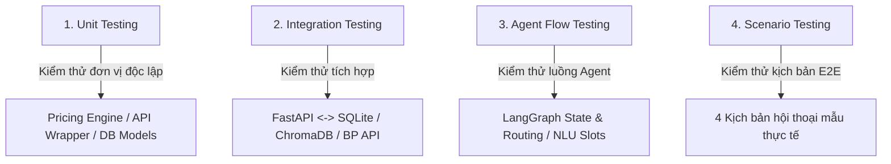

# TEST PLAN: BURGERPRINTS AGENT

Tài liệu này xác định kế hoạch kiểm thử tổng thể (Master Test Plan) cho hệ thống **BurgerPrints Agent** (Trợ lý Danh mục POD hỗ trợ ra quyết định cho Seller). Kế hoạch kiểm thử này tập trung hoàn toàn vào việc xác thực phân hệ **Backend (FastAPI)** và **AI (LangGraph Agent & Pricing Engine)**, đảm bảo toàn bộ hệ thống hoạt động ổn định, chính xác và sẵn sàng cho việc chấm điểm Hackathon.

Tài liệu này được thiết kế thống nhất và liên kết chặt chẽ với [System Architecture](file:///E:/Hackathon2026/J4F/Solution/docs/architecture/architecture.md), [Agent Design Specification](file:///E:/Hackathon2026/J4F/Solution/docs/ai/agent_design_specification.md), và [User Flow & Conversation Flow](file:///E:/Hackathon2026/J4F/Solution/docs/ai/user_flow_and_conversation_flow.md).

---

## 1. Mục Tiêu Kiểm Thử (Test Objectives)

1.  **Xác thực logic nghiệp vụ:** Đảm bảo toàn bộ quy trình từ hội thoại, bóc tách yêu cầu, tính toán chi phí và tạo đơn hàng hoạt động chính xác.
2.  **Bảo đảm tính chính xác tài chính (Zero-Error Finance):** Xác minh thuật toán tính toán Landed Cost, Margin, Tax và Shipping Fee trên Pricing Engine (Python) khớp 100% với số liệu thực tế, loại bỏ hoàn toàn hiện tượng ảo giác (hallucination) của LLM.
3.  **Kiểm tra tính ổn định của luồng hội thoại:** Đảm bảo LangGraph điều phối trạng thái (State Machine) đúng hướng, xử lý tốt các tình huống thiếu thông tin (Clarification) hoặc thay đổi chủ đề đột ngột (Context Switch).
4.  **Xác thực tích hợp API:** Đảm bảo kết nối thông suốt với BurgerPrints API v2.0 (hoặc Mock API dự phòng) và Gemini API Cloud.
5.  **Bảo đảm tính toàn vẹn dữ liệu:** Xác thực cơ chế lưu trữ SQLite (phiên chat, preferences, orders) và khả năng lưu trữ/gợi nhớ ngữ nghĩa (Semantic Chat Memory) của ChromaDB.

---

## 2. Phạm Vi Kiểm Thử (Test Scope)

Theo yêu cầu nghiệp vụ hiện tại, **phạm vi kiểm thử không bao gồm giao diện người dùng (Frontend)** mà chỉ tập trung vào Backend API và AI Engine.

### 2.1. Thành phần nằm trong phạm vi (In-Scope)
*   **LangGraph AI Agent:** Kiểm thử các Nodes (`extract_intent_node`, `clarify_node`, `retrieve_catalog_node`, `calculate_pricing_node`, `rank_and_recommend_node`, `execute_order_node`) và Conditional Routing.
*   **Gemini NLU & NLG:** Khả năng trích xuất slots và sinh văn bản giải thích so sánh trade-off theo đúng format 4 khối.
*   **Deterministic Pricing Engine:** Logic tính toán landed cost, gợi ý giá bán lẻ và biên lợi nhuận (margin) bằng Python.
*   **FastAPI RESTful Web Gateway:** Các endpoint đăng ký/đăng nhập (`/auth`), cổng hội thoại (`/chat`), tạo và tra cứu đơn hàng (`/order`).
*   **BurgerPrints API Client Wrapper:** Khả năng giao tiếp HTTP Client, xử lý lỗi (timeout, bad request) và cơ chế Mock Fallback khi cấu hình `USE_MOCK_API=true`.
*   **SQLite Relational Database:** Xác thực tính toàn vẹn dữ liệu của 5 bảng (`users`, `user_preferences`, `conversations`, `messages`, `order_history`).
*   **ChromaDB Vector Database:** Quá trình tạo embeddings (`text-embedding-004`), lưu trữ và truy xuất ngữ nghĩa (recall) từ bộ nhớ hội thoại.

### 2.2. Thành phần ngoài phạm vi (Out-of-Scope)
*   **Frontend UI:** Streamlit Web UI hoặc các thành phần giao diện Vite/React (không thực hiện kiểm thử tự động hay kiểm thử giao diện trong tài liệu này).
*   **Payment Gateway:** Không kiểm thử cổng thanh toán trực tiếp (BurgerPrints sử dụng ví store hoặc trừ tiền tài khoản sau, do đó chỉ dừng lại ở bước tạo đơn thành công trên sandbox).
*   **Stress & Load Testing:** Kiểm thử chịu tải hệ thống quy mô lớn (ngoài phạm vi MVP Hackathon).

---

## 3. Chiến Lược Kiểm Thử (Test Strategy)

Hệ thống được kiểm thử thông qua 4 cấp độ tiếp cận:



### 3.1. Kiểm thử Đơn vị (Unit Testing)
*   **Mục tiêu:** Kiểm tra các hàm tính toán, hàm xử lý chuỗi và kết nối DB cơ bản độc lập.
*   **Đối tượng:**
    *   Hàm tính toán trong `pricing_engine.py` (Landed cost, đề xuất giá bán lẻ, margin).
    *   Hàm validate thông tin đơn hàng `validate_order_draft` trong `tools.py`.
    *   Các hàm mã hóa password, tạo JWT token trong `backend/app/core/security.py`.

### 3.2. Kiểm thử Tích hợp (Integration Testing)
*   **Mục tiêu:** Xác thực khả năng tương tác dữ liệu giữa các module và dịch vụ bên thứ ba.
*   **Đối tượng:**
    *   Tương tác giữa FastAPI Gateway và SQLite Database (ghi log chat, lưu preferences).
    *   Tương tác giữa AI Agent và ChromaDB (nhúng tin nhắn mới, truy vấn độ tương đồng vector).
    *   Tương tác giữa API Wrapper và BurgerPrints Sandbox API (cả chế độ Mock và Real).

### 3.3. Kiểm thử Luồng Agent (Agent Flow Testing)
*   **Mục tiêu:** Xác thực các trạng thái chuyển dịch của LangGraph (State Machine) và độ chính xác của Gemini NLU trong việc điền slots.
*   **Đối tượng:**
    *   Trích xuất slots (NLU) khi người dùng đưa thông số lọc.
    *   Kích hoạt câu hỏi làm rõ (Clarification) khi thiếu `product_type` hoặc `market`.
    *   Cơ chế Human-in-the-loop: Dừng đồ thị để đợi user gõ "xác nhận" hoặc điền ZIP code trước khi tạo đơn hàng thật.

### 3.4. Kiểm thử Kịch bản Đầu cuối (Scenario Testing)
*   **Mục tiêu:** Thực thi các kịch bản hội thoại thực tế của Seller để kiểm chứng trải nghiệm người dùng cuối.
*   **Đối tượng:** 4 kịch bản mẫu từ đề bài và tài liệu đặc tả luồng người dùng (T-shirt US, Hoodie US/VN/EU, Margin-based recommendation, Order creation).

---

## 4. Môi Trường Kiểm Thử (Test Environment)

Để triển khai và thực thi các bài kiểm thử, môi trường cần được cấu hình như sau:

*   **Quản lý thư viện:** Sử dụng công cụ `uv` với file cấu hình `pyproject.toml` để cài đặt và cô lập môi trường ảo Python.
*   **Thư viện kiểm thử:** `pytest` (cho Unit & Integration tests), `pytest-asyncio` (để test các API async của FastAPI và LangGraph).
*   **Cấu hình biến môi trường (`.env` cho Test):**
    ```ini
    BURGERPRINTS_API_KEY=test_api_key_sandbox
    GEMINI_API_KEY=test_gemini_api_key
    USE_MOCK_API=true           # Mặc định bật Mock API để test độc lập không phụ thuộc mạng
    ENVIRONMENT=testing
    DATABASE_URL=sqlite:///./ai/data/test_sqlite.db
    CHROMADB_DIR=./ai/data/test_chromadb
    ```

---

## 5. Checklist Thành Công Của Kế Hoạch (Success Criteria Checklist)

Trước khi ký nghiệm thu (Sign-off) hệ thống Backend & AI, các bài test phải vượt qua các tiêu chí sau:

- [ ] **100% Pass Unit Tests:** Mọi hàm tính toán tài chính trong `pricing_engine.py` phải trả về kết quả chính xác tuyệt đối, làm tròn đến 2 chữ số thập phân, không có lỗi runtime.
- [ ] **NLU Slot Accuracy >= 90%:** Khi đưa các câu lệnh test vào, Gemini NLU phải trích xuất đúng các slots chính trong phần lớn trường hợp.
- [ ] **LangGraph State Consistency:** Đảm bảo thread_id được duy trì chính xác, trạng thái checkpoint được lưu trữ đầy đủ xuống SQLite và khôi phục thành công.
- [ ] **Mock API Fidelity:** Khi ngắt mạng (`USE_MOCK_API=true`), hệ thống vẫn chạy mượt mà toàn bộ các kịch bản so sánh xưởng và tạo đơn nháp nhờ kho dữ liệu mock tĩnh.
- [ ] **ChromaDB Semantic Memory Recall:** Khi người dùng mở đầu phiên chat mới, hệ thống truy xuất và gợi nhớ thành công tối thiểu 1 thông tin sở thích cũ (ví dụ: thị trường đích) từ ChromaDB.
- [ ] **FastAPI Endpoints Responsiveness:** Các endpoints `/auth`, `/chat`, `/order` trả về mã HTTP thích hợp (200, 201, 400, 401, 422) kèm payload JSON đúng cấu trúc hợp đồng dữ liệu.
