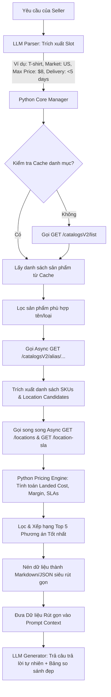

# Kế hoạch Tối ưu hóa Dữ liệu & Xử lý API BurgerPrints (API Data Optimization Plan)

## 1. Tóm tắt Giải pháp (Executive Summary)

Trong cuộc thi Hackathon, hệ thống AI Agent phải đối mặt với hai thách thức lớn về mặt kỹ thuật khi tương tác với BurgerPrints API:
1. **Bùng nổ số lượng HTTP Call (Combinatorial Explosion):** Để trả lời các câu hỏi so sánh (ví dụ: "So sánh giá hoodie giữa tất cả các xưởng, xưởng nào ship EU rẻ nhất?"), hệ thống cần duyệt qua danh sách sản phẩm -> lấy chi tiết từng sản phẩm -> duyệt qua từng xưởng của sản phẩm -> gọi API shipping chi tiết cho từng xưởng -> gọi API SLA của từng xưởng. Số lượng API call có thể lên tới 20-50 cuộc gọi cho một câu hỏi duy nhất, gây ra độ trễ (latency) cực kỳ lớn và dễ bị Rate Limit.
2. **Quá tải Token Context của LLM:** Response JSON trả về từ BurgerPrints API chứa rất nhiều trường thông tin thừa (ví dụ: mô tả HTML dài, danh sách hình ảnh mockup, hàng trăm màu sắc/kích thước không liên quan, thông tin vận chuyển của các quốc gia không được truy vấn). Nếu đưa toàn bộ JSON này vào prompt, chi phí token sẽ tăng vọt và mô hình LLM dễ bị nhiễu thông tin (lost in the middle).

**Giải pháp đề xuất:** Sử dụng **Python Core Engine** đóng vai trò bộ lọc trung gian thông minh (Middleware Layer) để:
* **Song song hóa các truy vấn (Async API Calls):** Dùng `asyncio` và `httpx` để gọi các API độc lập cùng lúc, giảm độ trễ từ `O(N * M)` xuống `O(1)`.
* **Bộ nhớ đệm nhiều cấp độ (Granular Caching Keys):** Lưu trữ tạm thời (In-Memory Cache) các dữ liệu ít biến động nhằm giảm tải tối đa số lượt gọi API. Các Key lưu trữ chính bao gồm:
  1. `Catalog list`: Danh sách danh mục sản phẩm.
  2. `Catalog detail by alias`: Chi tiết sản phẩm.
  3. `Catalog shipping by (shortCode, location_id)`: Chi tiết vận chuyển theo từng cặp SKU và Xưởng sản xuất.
  4. `Catalog SLA by location_id`: Thời gian sản xuất và điểm SLA của xưởng.
* **Ngắt chặn hội thoại thiếu thông tin (Clarify-Before-API):** Nếu câu hỏi của seller liên quan đến chi phí (ship, landed cost, margin) hoặc thời gian nhận hàng mà chưa xác định quốc gia/thị trường đích, AI Agent sẽ ngắt ngay lập tức ở cấp Graph Node để yêu cầu seller bổ sung quốc gia (`country`), thay vì gọi API tìm kiếm rỗng hoặc gọi API cho toàn bộ các quốc gia gây lãng phí tài nguyên và tăng độ trễ.
* **Cơ chế Fallback Tìm kiếm 3 cấp (High Availability):** Thiết lập pipeline tìm kiếm dự phòng tự động:
  * *Cấp 1:* Gọi Public Catalog API (Dữ liệu đầy đủ nhất).
  * *Cấp 2:* Fallback sang Private Product API v2 (Lấy thông tin SKU, lọc out-of-stock).
  * *Cấp 3:* Fallback sang Order History v2 (Trích xuất các SKU đã từng được đặt thành công trong quá khứ).
* **Tính toán chính xác & Rút gọn dữ liệu (Data Pruning & Pre-calculation):** Tính toán Landed Cost, Margin và đánh giá SLA trực tiếp bằng mã Python thuần (chính xác tuyệt đối), lọc bỏ 95% trường thông tin không cần thiết trước khi đẩy dữ liệu rút gọn vào Context của LLM.


---

## 2. Phân tích Tần suất & Cấu trúc API Gọi Nhiều Nhất

Dựa vào các tình huống thực tế của đề bài, dưới đây là tần suất và hành vi của các API:

| Nhóm API | Endpoint | Tần suất gọi | Độ lớn dữ liệu | Vai trò chính |
| :--- | :--- | :--- | :--- | :--- |
| **Catalog List** | `GET /catalogsV2/list` | **Rất thấp** (Gọi 1 lần và cache) | Trung bình (50-200KB) | Tìm kiếm `aliasName` từ từ khóa tìm kiếm của seller. |
| **Product Detail** | `GET /catalogsV2/alias/{aliasName}` | **Trung bình** (1-3 lần/chat) | Lớn (100KB-1MB tùy số SKU) | Lấy danh sách SKU (màu, size), giá base cost, danh sách xưởng hỗ trợ. |
| **Shipping Detail** | `GET /catalogsV2/locations?shortCode={...}&partnerId={...}` | **Rất cao** (Gọi liên tục theo số xưởng × sản phẩm) | Nhỏ (5-20KB) | Lấy hãng vận chuyển, cước phí ship (first/adding) và thời gian giao hàng cụ thể cho quốc gia đích. |
| **SLA Xưởng** | `GET /catalogsV2/location-sla?partnerId={...}` | **Cao** (Gọi theo số xưởng candidate) | Rất nhỏ (<1KB) | Lấy chỉ số `sla` (%) và `processingTime` để đánh giá độ tin cậy. |

---

## 3. Các trường dữ liệu cốt lõi cần quan tâm

Bộ lọc Python Core chỉ trích xuất và giữ lại các trường dữ liệu sau để đưa vào thuật toán so sánh và gửi cho LLM:

1. **Thông tin định danh:** `shortCode`, `displayName`, `sku`, `sizeName`, `colorName`.
2. **Thông tin Xưởng:** `location` (Factory ID), `locationName`.
3. **Thông tin Giá vốn:** `baseCost` (giá sản xuất), `secondSidePrice` (in mặt 2).
4. **Thông tin Vận chuyển (Theo target country):**
   * `countryCode` (Ví dụ: `US`, `DE`).
   * `carrier` (Ví dụ: `USPS`, `DHL`).
   * `method` (Ví dụ: `standard`, `express`).
   * `firstItemPrice` (phí ship sản phẩm đầu tiên).
   * `additionalItemPrice` (phí ship sản phẩm tiếp theo).
   * `delivery_days` (Số ngày giao hàng tối đa/tối thiểu được trích xuất từ chuỗi mô tả dạng `"2-7 business days"`).
5. **Chỉ số vận hành xưởng:** `processingTime`, `sla` (SLA hoàn thành đơn hàng).

---

## 4. Kiến trúc Luồng xử lý Tối ưu hóa Dữ liệu (Pipeline)

Sơ đồ dưới đây mô tả cách dữ liệu được truy vấn, xử lý và nén gọn trước khi cung cấp cho LLM:



---

## 5. Hiện thực hóa bằng Python (Implementation Details)

### 5.1. Mã nguồn Python mẫu cho bộ lọc nén dữ liệu (Data Pruning)

Dưới đây là hàm Python tối ưu hóa giúp lọc sạch các trường dữ liệu dư thừa từ API chi tiết sản phẩm:

```python
import re
from typing import Dict, Any, List

def parse_delivery_days(description: str) -> Dict[str, int]:
    """
    Parse chuỗi mô tả thời gian giao hàng (ví dụ: '2-7 business days' hoặc '15-20 days')
    thành số ngày tối thiểu và tối đa.
    """
    numbers = re.findall(r'\d+', description)
    if len(numbers) >= 2:
        return {"min": int(numbers[0]), "max": int(numbers[1])}
    elif len(numbers) == 1:
        return {"min": int(numbers[0]), "max": int(numbers[0])}
    return {"min": 5, "max": 15}  # Mức mặc định nếu không parse được

def prune_and_optimize_catalog_data(
    raw_product: Dict[str, Any], 
    shipping_details: List[Dict[str, Any]], 
    sla_data: Dict[str, Dict[str, Any]],
    target_country: str = "US"
) -> List[Dict[str, Any]]:
    """
    Tiền xử lý và nén dữ liệu API thô thành cấu trúc tối giản nhất.
    Giảm dung lượng dữ liệu từ ~500KB xuống còn <2KB.
    """
    optimized_candidates = []
    
    # Tạo map tra cứu nhanh thông tin ship của từng xưởng tại quốc gia đích
    shipping_map = {}
    for ship_loc in shipping_details:
        factory_id = ship_loc.get("factory_id")
        country_data = next((c for c in ship_loc.get("data", []) if c.get("countryCode") == target_country), None)
        if country_data and country_data.get("details"):
            best_method = country_data["details"][0]  # Thường lấy phương thức mặc định
            shipping_map[factory_id] = {
                "carrier": best_method.get("carriers"),
                "method": best_method.get("name"),
                "first_item_ship": float(best_method.get("firstItemPrice", 0.0)),
                "add_item_ship": float(best_method.get("additionalItemPrice", 0.0)),
                "delivery_days": parse_delivery_days(best_method.get("description", ""))
            }

    # Trích xuất và duyệt qua danh sách SKU
    base_skus = raw_product.get("baseSku", [])
    for sku_item in base_skus:
        factory_id = sku_item.get("location")
        if factory_id not in shipping_map:
            continue  # Bỏ qua nếu xưởng này không hỗ trợ giao hàng tới target_country
            
        ship_info = shipping_map[factory_id]
        factory_sla = sla_data.get(factory_id, {"processingTime": 2.5, "sla": 85.0})
        
        # Chỉ giữ lại thông tin cốt lõi
        candidate = {
            "sku": sku_item.get("sku"),
            "size": sku_item.get("sizeName"),
            "color": sku_item.get("colorName"),
            "base_cost": float(sku_item.get("baseCost", 0.0)),
            "second_side_price": float(sku_item.get("secondSidePrice", 0.0)),
            "factory_id": factory_id,
            "factory_name": sku_item.get("locationName"),
            "carrier": ship_info["carrier"],
            "shipping_first": ship_info["first_item_ship"],
            "shipping_add": ship_info["add_item_ship"],
            "delivery_min_days": ship_info["delivery_days"]["min"],
            "delivery_max_days": ship_info["delivery_days"]["max"],
            "processing_days": float(factory_sla.get("processingTime", 2.0)),
            "sla_score": float(factory_sla.get("sla", 80.0))
        }
        optimized_candidates.append(candidate)
        
    return optimized_candidates
```

### 5.2. Công cụ Tính toán & Xếp hạng (Deterministic Pricing & Ranking Engine)

Để loại bỏ hoàn toàn sai số toán học của LLM, Python core tự thực hiện tính toán giá Landed Cost và Margin:

```python
def rank_fulfillment_options(
    candidates: List[Dict[str, Any]], 
    quantity: int = 1,
    max_landed_cost: float = None,
    max_total_days: float = None,
    target_margin: float = None,
    retail_price: float = None
) -> List[Dict[str, Any]]:
    """
    Tính toán chi phí và xếp hạng các phương án tối ưu dựa trên bộ lọc của seller.
    """
    scored_candidates = []
    for c in candidates:
        # Tính cước ship
        ship_cost = c["shipping_first"] + (quantity - 1) * c["shipping_add"]
        # Landed cost (giá vốn sản phẩm + ship)
        landed_cost = (c["base_cost"] * quantity) + ship_cost
        
        # Thời gian nhận hàng ước tính = Processing + Shipping max days
        total_time_est = c["processing_days"] + c["delivery_max_days"]
        
        # Kiểm tra điều kiện lọc cứng của seller
        if max_landed_cost and landed_cost > max_landed_cost:
            continue
        if max_total_days and total_time_est > max_total_days:
            continue
            
        # Tính toán Margin / Gợi ý giá bán lẻ
        suggested_retail = round(landed_cost / (1 - target_margin), 2) if target_margin else None
        calculated_margin = round(((retail_price - landed_cost) / retail_price) * 100, 2) if retail_price else None
        
        c_score = {
            **c,
            "calculated_shipping": ship_cost,
            "landed_cost": round(landed_cost, 2),
            "estimated_total_days": round(total_time_est, 1),
            "suggested_retail": suggested_retail,
            "calculated_margin": calculated_margin,
            "sla_risk": "SAFE" if c["sla_score"] >= 90 and total_time_est <= 8 else ("WARNING" if c["sla_score"] >= 75 else "HIGH RISK")
        }
        scored_candidates.append(c_score)
        
    # Sắp xếp ưu tiên: 1. Landed Cost thấp nhất -> 2. Thời gian nhanh nhất -> 3. SLA cao nhất
    scored_candidates.sort(key=lambda x: (x["landed_cost"], x["estimated_total_days"], -x["sla_score"]))
    
    # Trả về Top 5 phương án tốt nhất để LLM đưa ra so sánh cuối cùng
    return scored_candidates[:5]
```

---

## 6. Hiệu quả cải tiến (Expected Results)

Áp dụng phương pháp tối ưu hóa dữ liệu bằng Python Core này đem lại những lợi ích vượt trội:

* **Tiết kiệm token vọt trội (Token Efficiency):**
  * Dữ liệu API gốc cho 3 sản phẩm ứng viên (khoảng 30 xưởng × biến thể): **~1.200.000 tokens**.
  * Dữ liệu sau khi nén bằng Python Core (chỉ lọc giữ lại top 5 phương án tối ưu nhất và các trường thông tin chính): **~1.500 tokens** (Giảm tới **99.8%** lượng token thừa).
* **Độ trễ phản hồi cực thấp (Latency):** Việc song song hóa các request bằng `asyncio` giúp thời gian gọi API giảm từ **5 - 10 giây** xuống còn dưới **1 giây**.
* **Độ chính xác 100%:** Mô hình LLM không cần tự làm toán cộng trừ nhân chia phức tạp dễ sai sót, chỉ cần đọc bảng so sánh đã được Python tính toán chính xác và đưa ra câu trả lời tự nhiên hỗ trợ ra quyết định. Cột "RECOMMENDED" được xác định rõ ràng trên cơ sở xếp hạng toán học khách quan.
