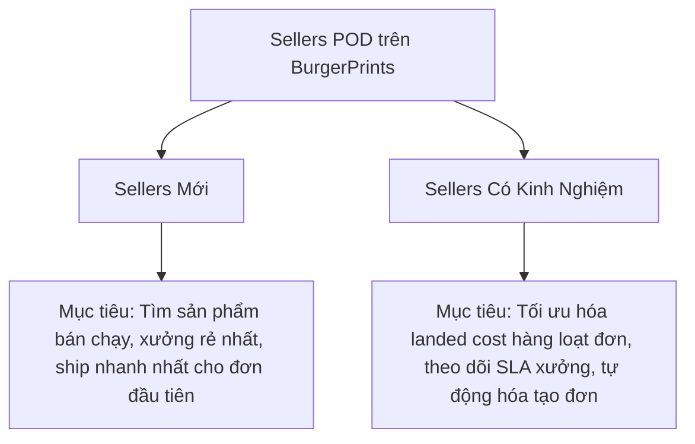
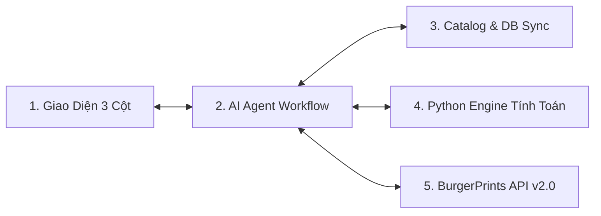
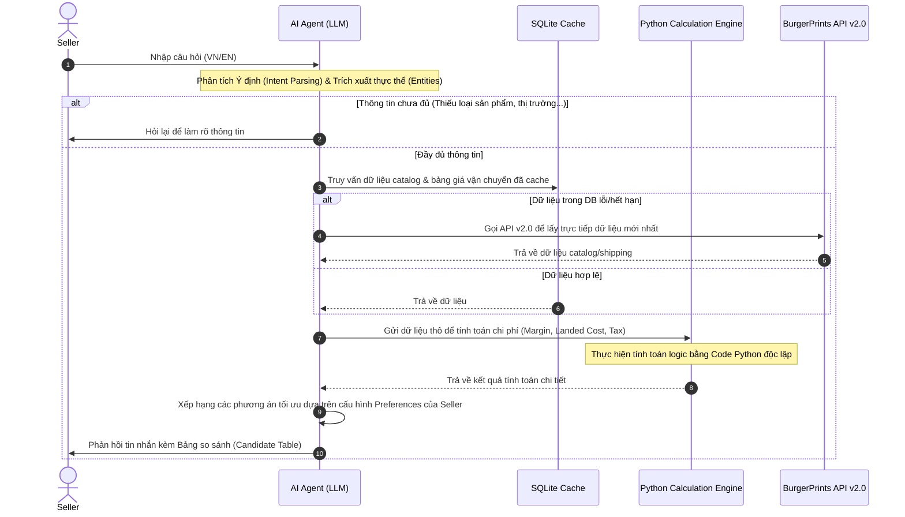
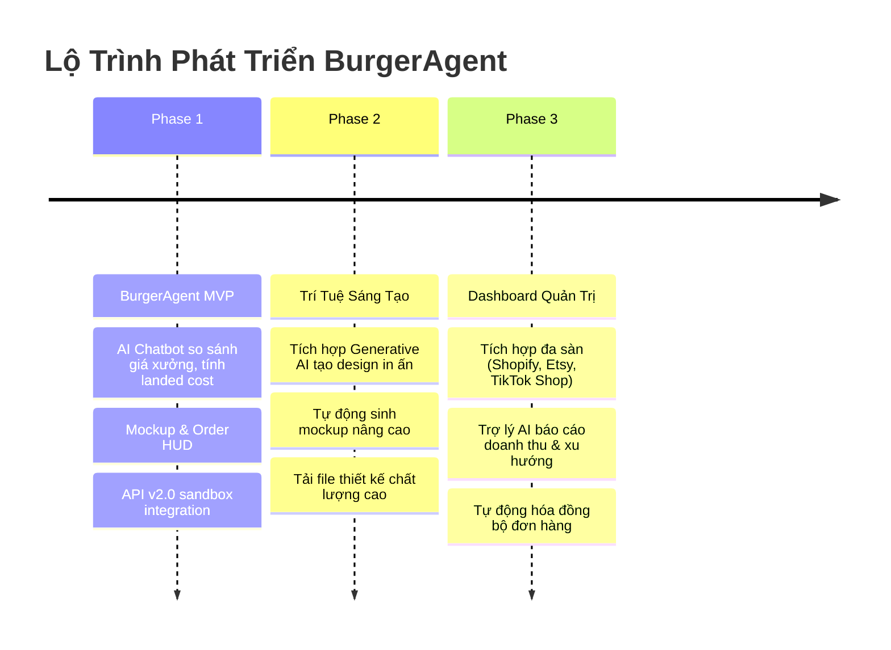

# TÀI LIỆU YÊU CẦU NGHIỆP VỤ (BUSINESS REQUIREMENTS DOCUMENT - BRD)

## DỰ ÁN: BURGERAGENT AI (POD CATALOG ASSISTANT)

> [!IMPORTANT]
> **Tên dự án:** BurgerAgent AI
> **Phiên bản:** v1.0.0
> **Ngày cập nhật:** 2026-06-16
> **Trạng thái:** DỰ THẢO (Chờ phê duyệt)
> **Đối tác tài trợ:** BurgerPrints

---

## 1. Giới Thiệu Dự Án (Executive Summary)

### 1.1. Tuyên Ngôn Dự Án (Slogan)

> _"Từ hàng trăm xưởng đến một SKU hoàn hảo, để AI Agent của bạn làm phần nặng nhọc."_

### 1.2. Tổng Quan Dự Án

**BurgerAgent AI** là một trợ lý ảo thông minh (AI Conversational Agent) được thiết kế chuyên biệt dành cho các nhà bán hàng Print-on-Demand (POD) trên nền tảng **BurgerPrints**. Hệ thống giúp tối ưu hóa quá trình tìm kiếm, so sánh chi phí và đưa ra quyết định lựa chọn xưởng in (fulfillment provider) phù hợp nhất thông qua tương tác ngôn ngữ tự nhiên (tiếng Việt và tiếng Anh).

Thay vì phải tra cứu thủ công bảng giá phức tạp của hàng trăm sản phẩm từ nhiều xưởng in với các thông số thay đổi liên tục (kích thước, màu sắc, kỹ thuật in, phí vận chuyển, thuế), seller có thể trực tiếp đặt câu hỏi và nhận về các đề xuất tối ưu hóa tức thì từ trợ lý AI. Đồng thời, hệ thống tích hợp khả năng hiển thị mockup trực quan và tự động tạo đơn hàng sandbox trực tiếp qua API v2.0 của BurgerPrints.

---

## 2. Bài Toán Kinh Doanh & Mục Tiêu (Business Context & Objectives)

### 2.1. Vấn Đề Hiện Tại (Problem Statement)

Hệ sinh thái POD của BurgerPrints vô cùng phong phú nhưng cũng cực kỳ phức tạp:

- **Độ phức tạp của SKU:** Hàng trăm dòng sản phẩm × nhiều nhà cung cấp/xưởng in đối tác × hàng ngàn biến thể SKU (kết hợp của size, màu sắc, chất liệu, kỹ thuật in mặt trước/sau).
- **Tính toán Landed Cost phức tạp:** Tổng chi phí để đưa sản phẩm đến tay khách hàng (Landed Cost) bao gồm: `Base Cost (giá phôi gốc) + Print Cost (giá in ấn) + Shipping Fee (phí vận chuyển quốc tế) + Tax (thuế nhập khẩu/VAT)`. Các thông số này thay đổi liên tục theo thị trường đích (Mỹ, châu Âu, Việt Nam) và theo từng xưởng in.
- **Rủi ro SLA:** Tốc độ sản xuất và thời gian vận chuyển (SLA) giữa các xưởng có sự chênh lệch lớn. Việc chọn sai xưởng có thể dẫn đến giao hàng trễ, bị đánh giá xấu trên Etsy/Amazon/TikTok Shop/Shopify.
- **Rào cản cho người mới:** Các nhà bán hàng mới phải mất nhiều giờ, thậm chí nhiều ngày để tự so sánh và lập bảng tính Excel nhằm tìm ra tổ hợp fulfillment tối ưu nhất.

### 2.2. Mục Tiêu Chiến Lược

- **Giảm thời gian ra quyết định:** Rút ngắn thời gian chọn xưởng fulfillment từ vài giờ xuống dưới 1 phút.
- **Tối đa hóa biên lợi nhuận (Margin):** Giúp seller nhanh chóng xác định xưởng in có tổng chi phí (Landed Cost) thấp nhất nhưng đáp ứng tốt nhất yêu cầu thời gian vận chuyển.
- **Tăng tỷ lệ chuyển đổi đơn hàng:** Tích hợp trực tiếp quy trình cấu hình mockup sản phẩm và checkout/fulfillment vào một màn hình duy nhất thông qua Order HUD (Heads-Up Display).
- **Dễ dàng cài đặt và tích hợp:** Thiết kế ứng dụng chạy mượt mà, cài đặt nhanh chóng (dưới 10 phút) và hướng đến khả năng scale thành hệ thống Microservices tích hợp vào nền tảng chính của BurgerPrints.

---

## 3. Chân Dung Người Dùng (User Personas)

### 3.1. Nhà Bán Hàng Mới (New Sellers)

- **Hành vi:** Đang bắt đầu xây dựng cửa hàng trên Etsy/Shopify. Chưa nắm rõ sự khác biệt giữa các xưởng in tại Việt Nam, Mỹ hay Trung Quốc.
- **Nhu cầu:** Cần được gợi ý sản phẩm phù hợp dựa trên vốn (Base Cost) và thị trường mục tiêu. Cần giao diện dễ hiểu, không quá nhiều thuật ngữ kỹ thuật phức tạp.
- **Nỗi đau:** Dễ bị ngộp trước bảng giá và cấu trúc SKU khổng lồ của BurgerPrints. Sợ tính sai thuế và phí ship dẫn đến lỗ.

### 3.2. Nhà Bán Hàng Chuyên Nghiệp (Experienced Sellers)

- **Hành vi:** Có lượng đơn hàng ổn định hàng ngày trên Amazon, Shopify hoặc TikTok Shop.
- **Nhu cầu:** Cần so sánh chi tiết và chính xác từng cent chi phí Landed Cost của các xưởng. Cần lọc xưởng theo chỉ số SLA thực tế và điểm đánh giá rủi ro giao hàng.
- **Nỗi đau:** Việc thủ công tạo đơn cho từng đơn lẻ tốn thời gian. Cần một công cụ bán tự động hoặc tự động tạo đơn nhanh khi có khách mua.

---

## 4. Yêu Cầu Tính Năng Cốt Lõi (Core Functional Requirements)

Hệ thống được chia thành **5 khối tính năng chính** phối hợp chặt chẽ:

### 4.1. Khối 1: Giao Diện Người Dùng (3-Column Dashboard UI)

Giao diện được thiết kế theo tỷ lệ **20% : 50% : 30%** sử dụng hiệu ứng **Glassmorphism** trên nền tối sâu (Dark Mode mặc định) mang lại cảm giác hiện đại và cao cấp:

1. **Cột 1: Left Sidebar (Quản lý Phiên & Auth - 20%):**
   - **Đăng ký/Đăng nhập (Auth Modal):** Chặn màn hình chính bằng hiệu ứng blur cho đến khi người dùng đăng nhập bằng Email và Password của tài khoản Seller.
   - **Nút Hội thoại mới (New Chat):** Tạo phiên chat mới, reset trạng thái Agent.
   - **Lịch sử hội thoại:** Liệt kê các phiên chat trước đó của Seller (lấy từ SQLite), phân nhóm theo thời gian (Hôm nay, Hôm qua, 7 ngày trước). Hỗ trợ nút xóa nhanh phiên chat khi hover.
   - **Profile & Cài đặt (Preferences Modal):** Cho phép cấu hình các tùy chọn mặc định của Seller (Thị trường ưu tiên: US/EU/VN, Lợi nhuận mục tiêu %, SLA vận chuyển tối đa, Tiêu chí ưu tiên: Tốc độ hay Chi phí).

2. **Cột 2: Center Panel - Chat Engine (50%):**
   - **Màn hình chào mừng (Welcome Screen):** Hiển thị khi chưa có tin nhắn, gồm tiêu đề gradient và các nút gợi ý câu hỏi nhanh (Suggestion Chips).
   - **Bong bóng chat (Chat Bubbles):** Bong bóng User (canh phải, nền sẫm hơn/chữ sáng), bong bóng AI (canh trái, hỗ trợ định dạng Markdown đầy đủ).
   - **Bảng so sánh tối ưu (Candidate Table):** Nhúng trực tiếp trong phản hồi của AI. Hiển thị 10 cột thông tin: _Xưởng in, Base Cost, Print Cost, Shipping Fee, Tax, Landed Cost, Margin % (tính theo giá retail đề xuất), Ship SLA, Rủi ro SLA, và nút hành động "Chọn Xưởng"_.
   - **Visual Highlight:** Hàng đề xuất số 1 sẽ được tô viền màu tím/cam, hiển thị badge **"RECOMMENDED"** phát sáng và nút chọn xưởng được highlight nổi bật.

3. **Cột 3: Right Panel - Product & Order HUD (30%):**
   - **Tab 1: Fulfillment Checkout:**
     - **Trạng thái trống:** Nhắc nhở người dùng click "Chọn Xưởng" từ cột Chat.
     - **Product Inspector (Bộ xem phôi):** Hiển thị ảnh Mockup phôi sản phẩm dạng SVG/Img. Tự động đổi màu mockup theo Color Swatches và đổi kích thước theo Size Selector của người dùng.
     - **Lồng thiết kế (Design Overlay):** Hỗ trợ nhập URL thiết kế hoặc upload file thiết kế trực tiếp lên. Hình ảnh thiết kế sẽ tự động được lồng ghép hiển thị đè lên ngực/lưng mockup theo đúng tỷ lệ thực (mặt trước/mặt sau).
     - **Thông tin nhận hàng (Order Form):** Các trường nhập tên, địa chỉ, zip code, quốc gia của khách mua.
     - **Tóm tắt hóa đơn (Billing Summary):** Tính toán động Landed Cost chi tiết và nút lớn **"Confirm Fulfillment Order"**.
     - **Checkout Success Screen:** Hiển thị mã đơn hàng sandbox, thông tin tracking và trạng thái đơn khi đặt hàng thành công kết hợp hiệu ứng pháo hoa giấy chúc mừng.
   - **Tab 2: Lịch sử đơn (Order History):**
     - Liệt kê toàn bộ các đơn hàng đã đặt thành công của Seller từ DB.
     - Click vào đơn hàng để xem chi tiết hóa đơn, ảnh thiết kế đã in, địa chỉ giao nhận và thông tin tracking vận đơn thực tế từ API.

---

### 4.2. Khối 2: Quy Trình Xử Lý AI Agent (AI Agent Workflow)

AI Agent sử dụng cơ chế **State-Agent** kết hợp **Function-calling** nhằm đảm bảo tính chính xác tuyệt đối trong việc xử lý logic và tính toán số liệu:

**Các nguyên tắc của Agent Workflow:**

- **Không để LLM tự tính toán:** Mọi phép toán nhân chia cộng trừ liên quan đến Landed Cost, Margin, Thuế đều phải thông qua **Python Engine (Internal Tool)** để đảm bảo độ chính xác 100%, không bị ảo giác (hallucination).
- **Thinking Process:** LLM được cấu hình system prompt cho phép suy nghĩ từng bước (Chain-of-Thought) trước khi quyết định gọi tool, lấy dữ liệu nào hay phản hồi seller.
- **Đánh giá rủi ro SLA:** Hệ thống tính toán độ lệch trung bình giữa thời gian giao hàng dự kiến của xưởng (SLA cam kết) và thời gian giao hàng thực tế trong lịch sử vận đơn. Nếu độ lệch (trễ) trung bình lớn hơn 2 ngày, xưởng đó sẽ bị xếp hạng rủi ro SLA Cao (High Risk).
- **Hội thoại nhiều lượt:** Trợ lý có khả năng giữ ngữ cảnh (memory) để seller có thể hỏi tiếp nối, ví dụ: _"So sánh thêm với xưởng ở Việt Nam"_ hoặc _"Nếu tôi tăng giá bán lên $29.99 thì margin thế nào?"_.

---

### 4.3. Khối 3: Đồng Bộ & Lưu Trữ Dữ Liệu (Catalog & Database Layer)

Để hạn chế việc gọi API liên tục làm chậm hệ thống và vượt quá giới hạn lượt gọi (rate limits) của BurgerPrints API, hệ thống sử dụng kiến trúc lưu trữ đệm (Caching):

- **Chiến lược Caching:**
  - Đồng bộ toàn bộ dữ liệu Catalog (sản phẩm, xưởng in, giá base, kỹ thuật in) và bảng giá Shipping định kỳ **5 giờ một lần** từ API v2.0 về cơ sở dữ liệu local.
  - Thuế nhập khẩu/VAT của các quốc gia mục tiêu (US, EU, VN) được cấu hình mức thuế cố định (Flat rates: US = 8.25%, EU = 19%, VN = 10%) lưu trữ trong DB và được cập nhật thủ công định kỳ **1 tháng một lần** (Giai đoạn sau có thể phối hợp nâng cấp để BurgerPrints đồng bộ thuế động).
- **Cơ sở dữ liệu lựa chọn:** **SQLite** (nhẹ, không cần cài đặt server phức tạp, dễ dàng tích hợp và đóng gói).
- **Kiến trúc phân tầng:** Tách biệt hoàn toàn tầng Cơ sở dữ liệu (Database Layer) khỏi Logic nghiệp vụ (Service Layer) thông qua **Repository Pattern** để sẵn sàng chuyển đổi sang các DB lớn hơn như PostgreSQL, MongoDB khi đưa lên hệ thống production thực tế.

---

### 4.4. Khối 4: Tích Hợp API BurgerPrints v2.0 (API Integration)

Hệ thống kết nối trực tiếp đến Sandbox/Production của BurgerPrints API v2.0:

- **Tài liệu tham khảo:** `https://api.burgerprints.com/`
- **Các Endpoint cần tích hợp:**
  1. _Authentication Endpoint:_ Xác thực tài khoản của Seller.
  2. _Catalog Endpoint:_ Lấy danh sách sản phẩm từ endpoint `/v2/product/{id}`, trong đó giá gốc (gồm 1 mặt in) được lấy từ thuộc tính `price`, giá in mặt thứ hai là `2nd_price`, và giá in mặt thứ ba là `addition_price` (nếu không null). Công thức tính tổng giá sản xuất = `price` + `2nd_price` (nếu in 2 mặt) + `addition_price` (nếu in 3 mặt).
  3. _Shipping Rate Endpoint:_ Tính toán phí vận chuyển dựa trên địa chỉ khách nhận, kích thước và trọng lượng sản phẩm.
  4. _Order Creation Endpoint (Bonus):_ Gửi yêu cầu tạo đơn fulfillment sandbox trên hệ thống BurgerPrints. API Sandbox sẽ cho phép tạo đơn thành công vô điều kiện để phục vụ kiểm thử tích hợp (hoặc có thể dùng mock API Order của BurgerPrints để giả lập).
  5. _Order Tracking Endpoint:_ Lấy thông tin trạng thái đơn hàng, đơn vị vận chuyển (Carrier) và mã vận đơn (Tracking number) để hiển thị trong tab Lịch sử đơn.
- **Bảo mật:** Tuyệt đối không hardcode API Key của BurgerPrints lên repository. Key phải được quản lý tập trung thông qua file môi trường `.env` trên Server khi triển khai ứng dụng bằng Docker.

---

## 5. Yêu Cầu Phi Chức Năng (Non-Functional Requirements)

### 5.1. Khả Năng Cài Đặt (Deployment & Setup)

- **Tiêu chuẩn:** Thời gian cài đặt và chạy thử nghiệm hệ thống trên máy tính cá nhân phải **dưới 10 phút**.
- **Container hóa:** Cung cấp file cấu hình `Dockerfile` và `docker-compose.yml` để đóng gói toàn bộ hệ thống gồm Frontend, Backend và AI Agent thành một khối duy nhất, dễ dàng chạy chỉ với 1 dòng lệnh `docker-compose up`.

### 5.2. Hiệu Năng & Trải Nghiệm (Performance & UX)

- **Tốc độ phản hồi:**
  - Các yêu cầu truy vấn thông số sản phẩm hoặc tính toán Landed Cost phải phản hồi dưới **2 giây** nhờ dữ liệu đã được cache trong SQLite.
  - Phản hồi từ AI Agent phải sử dụng cơ chế streaming (chữ chạy ra dần) để giảm cảm giác chờ đợi của người dùng.
- **Tính tương thích (Responsive Design):** Hỗ trợ tốt trên màn hình Desktop lớn. Ở màn hình nhỏ (Tablet/Mobile), Left Sidebar sẽ được ẩn vào menu Drawer trượt và Right Panel sẽ chuyển thành Bottom Sheet trượt lên từ phía dưới.

### 5.3. Chất Lượng Mã Nguồn (Code Quality)

- Tuân thủ các nguyên tắc thiết kế phần mềm sạch: **SOLID, Clean Code, OOP**.
- Chia cấu trúc thư mục rõ ràng theo mô hình kiến trúc ba lớp: **Controller - Service - Repository** đối với Backend (FastAPI).

---

## 6. Lộ Trình Phát Triển & Mở Rộng (Future Roadmap)

Sau khi hoàn thiện phiên bản MVP giải quyết bài toán cốt lõi của BurgerPrints, hệ thống có thể mở rộng thêm 3 tính năng chiến lược:

### 6.1. Phase 2: AI Design Assistant & Mockup Generation

- **Tính năng:** Tích hợp các mô hình tạo ảnh (như Midjourney, Stable Diffusion hoặc Imagen) trực tiếp vào chatbot.
- **Trải nghiệm:** Seller chỉ cần mô tả ý tưởng bằng văn bản (ví dụ: _"Tạo cho tôi một thiết kế chú mèo phi hành gia phong cách retro"_). Agent sẽ tự sinh ảnh thiết kế, tự động lồng lên mockup sản phẩm phù hợp nhất, cho phép seller tinh chỉnh và chốt đơn fulfillment mà không cần sử dụng các công cụ thiết kế bên ngoài.

### 6.2. Phase 3: Đa Kênh & Báo Cáo Thông Minh (Multi-store & Smart Analytics)

- **Tính năng:** Tích hợp kết nối API với các cửa hàng của Seller trên Etsy, Shopify, TikTok Shop.
- **Trải nghiệm:**
  - Tự động quét đơn hàng mới từ các cửa hàng này về BurgerAgent, trợ lý AI sẽ tự động phân tích địa chỉ khách hàng và đề xuất xưởng in tối ưu nhất, chờ seller click duyệt để bắn đơn lên BurgerPrints.
  - Cho phép seller yêu cầu tạo báo cáo kinh doanh bằng ngôn ngữ tự nhiên: _"Tổng hợp doanh thu tuần này của tôi trên Etsy và so sánh margin giữa các xưởng đã dùng"_. Agent sẽ tự động vẽ biểu đồ và xuất báo cáo PDF/Excel chia sẻ với nhóm.

---

## 7. Các Quyết Định Nghiệp Vụ Đã Thống Nhất (Agreed Business Decisions)

Dựa trên các phản hồi từ Product Manager/Mentor tại tài liệu [ask-brd.md](file:///E:/MyProject/BurgerAgent/docs/ai/ask-brd.md), các quyết định nghiệp vụ sau đây được thống nhất làm cơ sở triển khai dự án:

- **Cơ chế tính Thuế (VAT / Sales Tax):** Trong giai đoạn đầu, hệ thống áp dụng mức thuế cố định (Flat rates) lưu trong DB (US = 8.25%, EU = 19%, VN = 10%) và được cập nhật định kỳ hàng tháng. Giai đoạn tiếp theo sẽ phối hợp với BurgerPrints để tích hợp tính thuế động qua hệ thống của họ.
- **Giá in ấn (Print Cost) động:** Lấy trực tiếp từ thuộc tính sản phẩm của API v2.0 của BurgerPrints. Cụ thể: `price` là giá gốc (gồm 1 mặt in), `2nd_price` là giá in mặt thứ hai, và `addition_price` là giá in mặt thứ ba. Tổng chi phí sản xuất = `price` + `2nd_price` (nếu in 2 mặt) + `addition_price` (nếu in 3 mặt và không null).
- **Lưu trữ API Key an toàn:** Các API Key của BurgerPrints sẽ được cấu hình tập trung trong file môi trường `.env` trên Server khi deploy bằng Docker để đảm bảo tính bảo mật và không bị lộ trên public repository.
- **Tạo đơn hàng Sandbox:** API Sandbox của BurgerPrints cho phép tạo đơn thành công vô điều kiện mà không cần kiểm tra số dư ví (Wallet Balance). Khi cần thiết, hệ thống sẽ sử dụng mock API Order của BurgerPrints để kiểm thử toàn diện.
- **Đánh giá rủi ro SLA vận chuyển:** Chỉ số rủi ro SLA được tính toán dựa trên số ngày trễ lệch trung bình giữa thời gian giao hàng thực tế và thời gian ước tính trong lịch sử vận đơn (Độ lệch > 2 ngày sẽ bị phân loại là rủi ro Cao).
