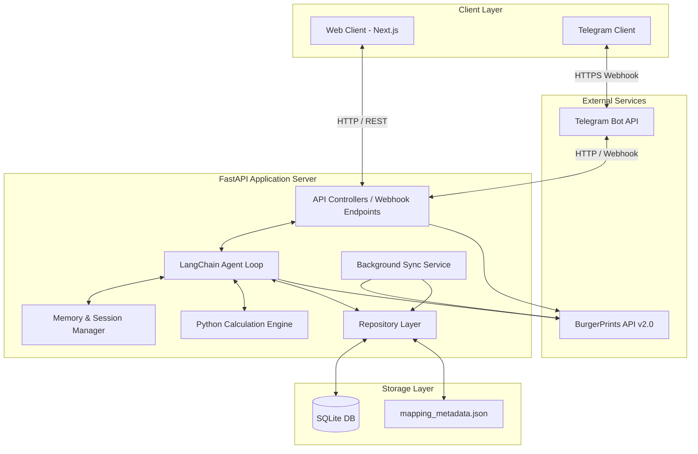
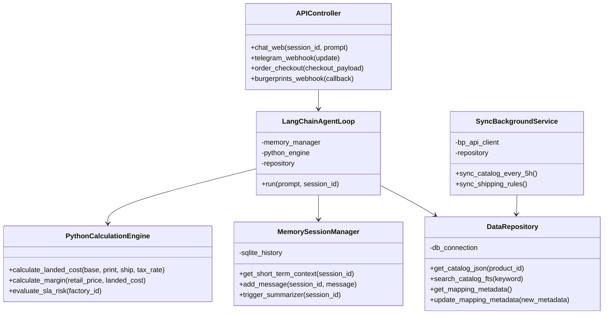
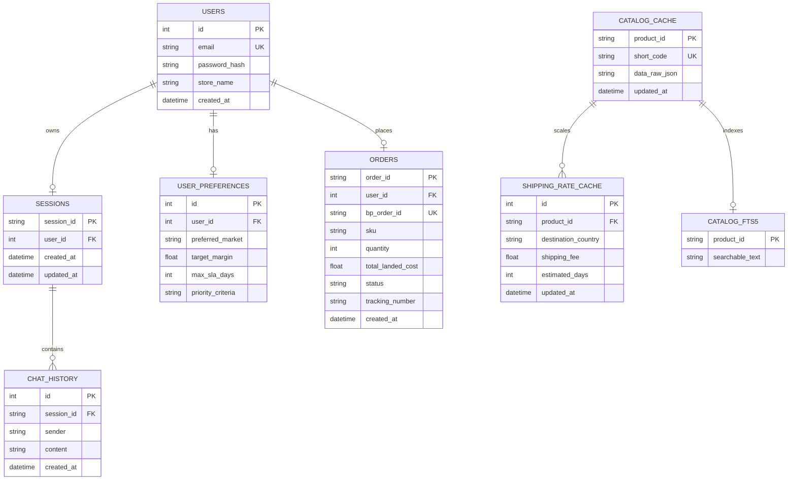
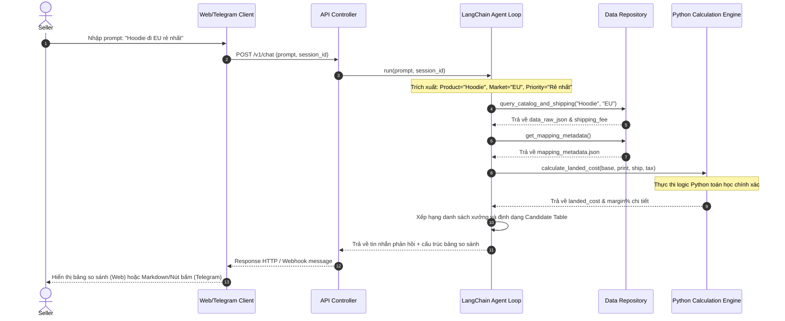
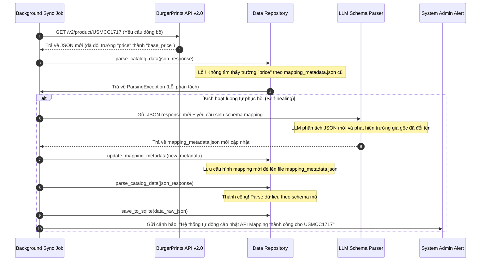
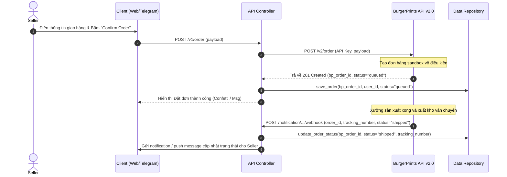

# THIẾT KẾ KIẾN TRÚC HỆ THỐNG (SYSTEM ARCHITECTURE DESIGN)

## DỰ ÁN: BURGERAGENT CORE (HỆ THỐNG CỐT LÕI)

> [!IMPORTANT]
> **Tên tài liệu:** Thiết kế Kiến trúc Hệ thống BurgerAgent Core
> **Phiên bản:** v1.0.1 (Bản loại bỏ VectorDB/RAG)
> **Ngày cập nhật:** 2026-06-16
> **Trạng thái:** DỰ THẢO (Sẵn sàng triển khai)

---

## 1. Tổng Quan Hệ Thống (System Context)

Hệ thống **BurgerAgent Core** được phát triển dưới dạng kiến trúc đa kênh (Omni-channel) hỗ trợ đồng thời giao diện Web Dashboard (Next.js) và ứng dụng Telegram Bot. Hệ thống sử dụng FastAPI làm Backend dịch vụ, tích hợp cơ chế LangChain Custom Agent Loop cùng công cụ tính toán Python Engine độc lập để giải quyết bài toán tư vấn catalog, landed cost và đặt đơn Sandbox tự động thông qua BurgerPrints API v2.0.



---

## 2. Thiết Kế Các Thành Phần (Component Architecture)

Backend FastAPI được xây dựng theo mô hình kiến trúc phân tầng sạch (**Clean Architecture**): `Controller - Service - Repository` để đảm bảo khả năng mở rộng, bảo trì và dễ dàng chuyển đổi công nghệ bên dưới.



### 2.1. Tầng Controller (API Controllers)

- **Web API Controller:** Tiếp nhận các request HTTP từ Client React/Next.js, quản lý phiên cookie/token.
- **Telegram Webhook Controller:** Tiếp nhận gói tin Update từ Telegram Bot API, giải mã tin nhắn của người dùng và chuyển đổi luồng checkout.
- **BurgerPrints Callback Controller:** Tiếp nhận webhook thông báo trạng thái đơn hàng (queued, place, processed, shipped) từ BurgerPrints và đẩy thông tin cập nhật cho Client.

### 2.2. Tầng AI Agent & Logic (LangChain Agent Loop & Python Engine)

- **LangChain Custom Agent Loop:** Khởi tạo Agent với mô hình Chain-of-Thought (suy nghĩ từng bước). Nhận diện ý định, bóc tách thực thể và tự động định tuyến (Routing) gọi các Tool. Không sử dụng LangGraph để giữ tính tự do tối đa cho LLM.
- **Python Calculation Engine:** Cung cấp các hàm toán học thuần túy cho Landed Cost, Margin, và SLA Risk để loại bỏ hoàn toàn hiện tượng ảo giác số học của LLM.
- **Memory & Session Manager:** Điều phối bộ nhớ ngắn hạn (Sliding Window), bộ nhớ dài hạn (SQLite) và tiến trình tóm tắt (Summarizer Worker).

### 2.3. Tầng Repository & Lưu Trữ (Data Caching Layer)

- **Data Repository:** Lớp trừu tượng (Abstraction) đóng gói các thao tác đọc ghi dữ liệu. Cung cấp API đồng nhất cho tầng Service.
- **SQLite Database:** Lưu trữ dữ liệu cấu trúc tĩnh, tài liệu JSON động và tích hợp module FTS5 để tìm kiếm từ khóa/tên sản phẩm tối ưu.

---

## 3. Kiến Trúc Cơ Sở Dữ Liệu (Database & Caching Design)

Hệ thống áp dụng cơ chế cơ sở dữ liệu lai (**Hybrid SQL/NoSQL Database**) trên SQLite để tối ưu hóa hiệu năng, giảm số lần gọi API bên ngoài và thích ứng linh hoạt trước sự thay đổi của API đối tác.



### 3.1. Thiết kế Bảng Tĩnh (Statically-typed Tables)

Các bảng nghiệp vụ có cấu trúc cố định và liên kết chặt chẽ với Backend:

- `USERS`: Quản lý định danh Seller.
- `SESSIONS` & `CHAT_HISTORY`: Lưu vết hội thoại để phục vụ khôi phục phiên và tóm tắt ngữ cảnh.
- `USER_PREFERENCES`: Lưu trữ cấu hình cài đặt của Seller.
- `ORDERS`: Lưu trữ thông tin đơn hàng fulfillment sandbox đã đặt và mã vận đơn.

### 3.2. Thiết kế Bảng Catalog Cache Lai (Dynamic JSON Cache)

Dữ liệu Catalog từ API BurgerPrints được lưu trữ thô trong cột `data_raw_json` của bảng `CATALOG_CACHE`:

- **Bảng `CATALOG_CACHE`:**
  - `product_id` (VARCHAR - Khóa chính): Mã ID hệ thống.
  - `short_code` (VARCHAR): Mã SKU phôi (VD: `USMCC1717`).
  - `data_raw_json` (TEXT - JSON Document): Chứa toàn bộ dữ liệu trả về từ endpoint `/v2/product/{id}` (bao gồm các swatch màu, size, giá `price`, `2nd_price`, `addition_price`, tên xưởng).
  - `updated_at` (DATETIME): Thời gian đồng bộ gần nhất.

### 3.3. Module Tìm kiếm Tích hợp (SQLite FTS5 Index)

- Để hỗ trợ LLM tìm kiếm sản phẩm theo từ khóa (Ví dụ: "áo thun 100% cotton", "hoodie dày"), hệ thống tạo bảng ảo `CATALOG_FTS5` sử dụng engine FTS5 tích hợp sẵn trong SQLite.
- Trình đồng bộ (Sync service) sẽ tự động bóc tách các trường mô tả, chất liệu, tên sản phẩm từ JSON thô để ghi vào `CATALOG_FTS5`. Khi người bán nhắn tin, Agent gọi hàm `search_catalog_fts()` để thực hiện truy vấn văn bản tốc độ cao bằng SQL, tránh hoàn toàn chi phí token và độ trễ của Vector Search.

### 3.4. File Metadata Ánh Xạ (mapping_metadata.json)

File cấu hình cục bộ được LLM sinh ra để ánh xạ đường dẫn JSON từ `data_raw_json` sang các trường tính toán:

```json
{
  "catalog_mapping": {
    "base_sku": "$.short_code",
    "base_price": "$.price",
    "second_side_price": "$.2nd_price",
    "third_side_price": "$.addition_price",
    "variants": "$.variations",
    "factory_name": "$.partner_name"
  }
}
```

---

## 4. Thiết Kế Các Luồng Dữ Liệu (Sequence Flows)

### 4.1. Luồng 1: Seller Hỏi Chatbot & Tư Vấn Chọn Xưởng

Luồng xử lý từ lúc Seller gửi câu hỏi đến khi AI Agent truy vấn dữ liệu cached, tính toán landed cost bằng Python Engine và hiển thị Bảng so sánh.



---

### 4.2. Luồng 2: Cơ Chế Tự Phục Hồi Schema (Self-healing Schema Mapper)

Khi API của BurgerPrints thay trúc dữ liệu JSON response, hệ thống Backend sẽ tự động phát hiện lỗi và sử dụng LLM để sinh lại Metadata Mapping mà không bị gián đoạn hay cần can thiệp code.



---

### 4.3. Luồng 3: Quy Trình Đặt Hàng Đa Kênh (Checkout & Webhook)

Mô tả luồng Seller đặt hàng từ Web Dashboard hoặc Telegram Bot, Backend gọi Sandbox API để tạo đơn và nhận Webhook thông báo hành trình.



---

## 5. Thiết Kế Quy Đổi Giao Diện Telegram (Telegram Bot UI/UX Adapter)

Do giao diện Telegram giới hạn trong một khung chat duy nhất, toàn bộ các thành phần visual phức tạp ở Web Dashboard sẽ được quy đổi sang dạng tương tác hội thoại tối giản:

### 5.1. Quy đổi Bảng So Sánh (Candidate Table)

Bảng so sánh dạng cột ngang trên web sẽ được Telegram Bot Adapter định dạng thành khối tin nhắn văn bản Markdown với cấu trúc phân cấp rõ ràng:

```markdown
## 🔍 Đề xuất tối ưu cho: Comfort Colors 1717 (Thị trường: US)

🌟 [RECOMMENDED] 1. Factory A (VN)

- Landed Cost: $11.50 (Base: $5.00 | In: $3.50 | Ship: $2.50 | Thuế: $0.50)
- Lợi nhuận (Margin): 48% (Giá bán đề xuất: $22.00)
- Vận chuyển: 5-8 ngày (Rủi ro SLA: Thấp)
  👉 Chọn xưởng này: Nhấn /select_factory_A

2. Factory B (US)

- Landed Cost: $13.20 (Base: $6.00 | In: $4.00 | Ship: $3.00 | Thuế: $0.20)
- Lợi nhuận (Margin): 40% (Giá bán đề xuất: $22.00)
- Vận chuyển: 3-5 ngày (Rủi ro SLA: Thấp)
  👉 Chọn xưởng này: Nhấn /select_factory_B
```

_(Các lệnh `/select_factory_A` được gắn dưới dạng nút bấm **Inline Keyboard** dưới tin nhắn)._

### 5.2. Quy đổi Mockup Display

- Khi Seller chọn phôi sản phẩm và nhập link ảnh in ấn, Backend FastAPI sẽ sử dụng thư viện **Pillow (Python)** để thực hiện ghép đè (Composite overlay) ảnh thiết kế lên phôi áo nền.
- Ảnh kết quả sẽ được lưu tạm tại server và Telegram Bot sẽ gọi API `sendPhoto` gửi ảnh trực quan cho Seller xem trước ngay trong khung chat kèm chú thích (caption) tóm tắt thuộc tính (Color/Size).

### 5.3. Quy đổi Checkout Form (Luồng Đặt Hàng)

- Thay vì điền một form dài, Bot sẽ thực hiện **Quy trình Checkout Hội thoại (Conversational Checkout)**:
  1. Hỏi: _"Xin vui lòng nhập Tên người nhận:"_ $\rightarrow$ Chờ user gõ $\rightarrow$ Lưu biến `recipient_name`.
  2. Hỏi: _"Nhập Địa chỉ nhận hàng (Dòng 1):"_ $\rightarrow$ Chờ user gõ $\rightarrow$ Lưu biến `address_line1`.
  3. Hỏi: _"Nhập City và Zip Code:"_ $\rightarrow$ Chờ user gõ $\rightarrow$ Lưu biến `city` & `postal_code`.
- Hoặc Bot sẽ hiển thị nút bấm mở **Telegram Web App (TWA)** để hiển thị một form HTML tối giản, cho phép người dùng điền nhanh và đồng bộ ngược về bot.

---

## 6. Chiến Lược Đảm Bảo Chất Lượng & Scale Hệ Thống (NFR & Scalability)

### 6.1. Caching & Tốc độ truy xuất (Performance & Latency)

- Sử dụng chiến lược **Cache Aside**: Đọc dữ liệu từ SQLite trước, nếu không có hoặc hết hạn mới gọi trực tiếp API BurgerPrints.
- Sử dụng SQLite JSON1 extension để trích xuất trực tiếp các thuộc tính trong JSON thô thông qua câu lệnh SQL mà không cần giải mã JSON trong code Python, tăng throughput của API truy vấn sản phẩm.

### 6.2. Khả năng chịu tải và Giới hạn Rate Limit (Reliability & Rate-limiting)

- Các cuộc gọi API viết đơn hàng và lấy trạng thái vận đơn sẽ được chuyển thành **Background Jobs** sử dụng hàng đợi xử lý bất đồng bộ (FastAPI BackgroundTasks).
- Nếu API BurgerPrints bị lỗi kết nối hoặc trả về mã lỗi HTTP 429 (Too Many Requests), hệ thống tự động đưa request vào cơ chế retry với thuật toán **Exponential Backoff** (Giãn cách thời gian thử lại tăng dần).

### 6.3. Khả năng mở rộng kiến trúc (Scalability Path)

Kiến trúc phân tầng chặt chẽ giúp hệ thống sẵn sàng chuyển đổi khi lượng người dùng tăng cao:

- **Database:** Dễ dàng thay thế SQLite bằng PostgreSQL bằng cách thay đổi cấu hình kết nối trong SQLAlchemy (Tầng Repository giữ nguyên 100% logic).
- **Search Engine:** Module SQLite FTS5 có thể mở rộng lên Elasticsearch hoặc Meilisearch chuyên biệt nếu catalog phát triển vượt ngưỡng 1 triệu bản ghi và đòi hỏi phân tích ngôn ngữ phức tạp.
- **Microservices:** Backend FastAPI dễ dàng tách ra thành các service độc lập (Chat Service, Catalog Service, Order Service) giao tiếp qua Message Queue (RabbitMQ / Kafka) trong tương lai.

---

## 7. Phân Tích Đánh Đổi Kiến Trúc (Architectural Trade-offs)

### 7.1. Chọn AP (Availability & Partition Tolerance) cho Catalog Caching

Hệ thống chấp nhận tính nhất quán yếu (**Eventual Consistency**) đối với dữ liệu sản phẩm. Catalog được đồng bộ định kỳ 5 giờ một lần.

- _Đánh đổi:_ Seller có thể nhìn thấy mức giá cũ của phôi áo trong khoảng tối đa 5 tiếng nếu BurgerPrints vừa cập nhật giá đột ngột.
- _Lý do chọn:_ Tăng tối đa tốc độ phản hồi chatbot (< 2s) và bảo vệ hệ thống không bị lock/block khi API BurgerPrints gặp sự cố.

### 7.2. Chọn CP (Consistency & Partition Tolerance) cho Đơn Hàng (Orders)

Đối với tiến trình checkout và đặt đơn hàng, hệ thống bắt buộc yêu cầu tính nhất quán cao (**Strong Consistency**).

- _Đánh đổi:_ Thời gian xử lý đặt đơn sẽ lâu hơn (khoảng 3-5 giây do phải đợi phản hồi trực tiếp từ API BurgerPrints).
- _Lý do chọn:_ Tránh việc tạo đơn hàng ảo, sai SKU hoặc lỗi địa chỉ giao nhận mà không được phát hiện kịp thời.

---

## 8. Kế Hoạch Giám Sát & Vận Hành (Observability Plan)

- **Định danh Request (RequestId):** Mỗi yêu cầu từ Web hoặc Telegram được gán một mã `request_id` duy nhất ở header để theo vết log xuyên suốt từ API Controller qua Agent Loop đến Repository.
- **Log suy nghĩ (Thinking Log):** Các bước suy nghĩ trung gian (Chain-of-Thought) của LangChain Agent được ghi lại riêng biệt vào hệ thống log để hỗ trợ debug các tình huống Agent gọi sai Tool hoặc hiểu sai ngữ cảnh của người dùng.
- **Cảnh báo lỗi Sync:** Khi module tự phục hồi (Self-healing Schema Mapper) phát hiện lỗi thay đổi cấu trúc API và tự động cập nhật lại Metadata file thành công/thất bại, một thông báo khẩn cấp sẽ được bắn về kênh cảnh báo của quản trị viên (qua Telegram Admin Channel).
