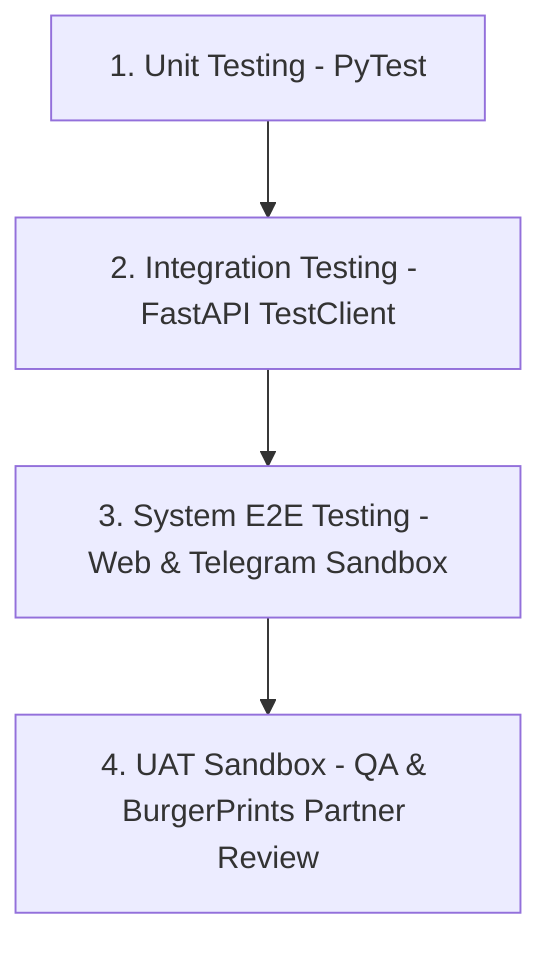

# KẾ HOẠCH & KỊCH BẢN KIỂM THỬ (QA/QC TEST PLAN & TEST CASES)

## DỰ ÁN: BURGERAGENT CORE (HỆ THỐNG CỐT LÕI)

> [!IMPORTANT]
> **Tên tài liệu:** Kế hoạch và Kịch bản Kiểm thử BurgerAgent Core  
> **Phiên bản:** v1.0.0  
> **Ngày cập nhật:** 2026-06-18  
> **Đối tượng áp dụng:** Đội ngũ QA/QC, Nhà phát triển Backend & Frontend  
> **Trạng thái:** DỰ THẢO (Sẵn sàng thực thi)

Tài liệu này đặc tả chi tiết kế hoạch kiểm thử (Test Plan) và các kịch bản kiểm thử chi tiết (Test Cases) để đảm bảo chất lượng vận hành của hệ thống **BurgerAgent Core** (bao gồm cả phân hệ Web Dashboard và Telegram Bot). Quy trình kiểm thử đối chiếu trực tiếp với các yêu cầu tại [BurgerAgent-BRD.md](file:///E:/MyProject/BurgerAgent/docs/product/BurgerAgent-BRD.md) và [burgeragent-core-prd.md](file:///E:/MyProject/BurgerAgent/docs/product/burgeragent-core-prd.md).

---

## 1. Kế Hoạch Kiểm Thử (Test Plan)

### 1.1. Phạm Vi Kiểm Thử (Scope of Testing)
Hệ thống kiểm thử tập trung vào toàn bộ các tính năng cốt lõi của BurgerAgent Core:

- **Kiểm thử chức năng (Functional Testing):**
  - **AI Agent Loop (F-1):** Khả năng nhận diện ý định (intent), bóc tách thực thể, duy trì ngữ cảnh (Memory sliding window & summarizer), xử lý hội thoại đa lượt và câu hỏi ngoài phạm vi.
  - **Python Calculation Engine (F-2):** Độ chính xác 100% của các công thức tính Landed Cost, Thuế VAT/Sales Tax, biên lợi nhuận (Margin) và phân loại mức độ rủi ro SLA.
  - **Candidate Table (F-3):** Hiển thị bảng so sánh tối ưu, highlight phương án RECOMMENDED, và đồng bộ lựa chọn.
  - **Product Inspector & Mockup (F-4):** Lựa chọn size/color, lồng ảnh thiết kế đè (composite preview) trên phôi, cập nhật hóa đơn thời gian thực.
  - **Sandbox Checkout (F-5):** Validate dữ liệu địa chỉ, gọi API v2.0 tạo đơn hàng Sandbox, xử lý tài khoản ví $0.00, ghi nhận lịch sử đơn hàng vào SQLite.
  - **Telegram Bot Adapter (F-6):** Kiểm thử luồng chat-to-select, conversational checkout và render ảnh mockup phía server.
  - **Đồng bộ dữ liệu & Khả năng chịu lỗi:** Tiến trình chạy nền đồng bộ catalog/shipping 5h/lần, module tự phục hồi (Self-healing Schema Mapper) khi API thay đổi cấu trúc JSON.

- **Kiểm thử phi chức năng (Non-Functional Testing):**
  - **Hiệu năng & Tải:** Thời gian phản hồi API cục bộ (SQLite cache) dưới 200ms, thời gian AI phản hồi dưới 2.0s.
  - **Bảo mật:** Ràng buộc an toàn API key trong tệp cấu hình `.env` trên Docker, mã hóa mật khẩu người dùng.
  - **Tính thích ứng (Responsive):** Khả năng thay đổi bố cục Drawer/Bottom Sheet trên di động và tablet.

---

### 1.2. Chiến Lược Kiểm Thử (Test Strategy)
Hệ thống áp dụng chiến lược kiểm thử đa tầng:



1. **Unit Testing:** Kiểm thử đơn vị các hàm logic toán học của Python Engine và các hàm parse dữ liệu SQLite.
2. **Integration Testing:** Giả lập request gọi API `/v1/chat`, `/v1/order` kiểm tra tính toàn vẹn của dữ liệu và xử lý exception. Sử dụng mock server giả lập API của BurgerPrints khi API Sandbox bị gián đoạn.
3. **End-to-End (E2E) Testing:** Kiểm thử toàn trình luồng nghiệp vụ từ bước Đăng nhập -> Chat tư vấn -> Chọn xưởng -> Customize phôi -> Đặt đơn Sandbox thành công trên cả 2 kênh Web và Telegram.
4. **User Acceptance Testing (UAT):** Phối hợp với BurgerPrints để kiểm thử kịch bản UAT trực tiếp trên môi trường sandbox thật, đối chiếu Landed Cost trong DB với landed cost thực tế trên hóa đơn BurgerPrints để đảm bảo sai lệch = $0.00.

---

### 1.3. Tiêu Chí Đạt/Không Đạt (Pass/Fail Criteria)
- **Tiêu chí đạt (Pass):** 
  - 100% các Test Cases thuộc nhóm **Ưu tiên: Critical** và **High** phải Pass.
  - Độ sai lệch landed cost tính toán so với thực tế = $0.00.
  - Không có lỗi Blocker hoặc Critical còn tồn tại trong báo cáo lỗi.
- **Tiêu chí không đạt (Fail):**
  - Có bất kỳ test case Critical hoặc High nào bị Fail.
  - Xảy ra lỗi ảo giác số học từ LLM (tự tính toán dẫn đến sai số).
  - Lộ API key trên repository hoặc logs.

---

## 2. Kịch Bản Kiểm Thử Chi Tiết (Test Cases)

### 2.1. Phân Hệ AI Agent & Calculation Engine (F-1, F-2, F-3)

| Mã TC | Tên Kịch Bản | Tiền Điều Kiện | Các Bước Thực Hiện | Kết Quả Mong Đợi | Ưu Tiên |
| :--- | :--- | :--- | :--- | :--- | :--- |
| **TC-001** | Nhận diện ý định & Hiển thị Candidate Table | Người dùng đã đăng nhập thành công vào Web Dashboard hoặc Telegram. | 1. Nhập câu hỏi: `"So sánh giá Hoodie giữa các xưởng đang có, xưởng nào ship EU rẻ nhất?"` <br>2. Kiểm tra câu trả lời của AI. | - AI nhận diện đúng sản phẩm (Hoodie), thị trường (EU), tiêu chí (Giá rẻ nhất).<br>- AI trả về tin nhắn văn bản phân tích kèm bảng so sánh (Candidate Table).<br>- Hàng tối ưu nhất (Option 1) được viền tím nổi bật và gắn badge RECOMMENDED. | **Critical** |
| **TC-002** | Xử lý thiếu thông tin đầu vào | Người dùng đang trong phiên chat mới. | 1. Nhập câu hỏi chung chung: `"Tôi muốn tìm xưởng in T-shirt."` | - AI phát hiện thiếu thị trường đích (destination) và số lượng mặt in.<br>- AI không trả bảng rỗng mà phản hồi hỏi lại: `"Bạn muốn gửi T-shirt sang thị trường nào (US, EU, VN) và thiết kế của bạn in mấy mặt?"` | **High** |
| **TC-003** | Duy trì ngữ cảnh & Tóm tắt hội thoại (Memory) | Phiên chat hiện tại đang hoạt động. | 1. Nhập: `"Tìm áo T-shirt cc1717 gửi đi US."`<br>2. AI phản hồi bảng so sánh.<br>3. Nhập tiếp câu hỏi nối cảnh: `"So sánh thêm với xưởng ở Việt Nam."` | - AI hiểu từ "So sánh thêm" là tiếp nối câu hỏi trước.<br>- AI giữ nguyên phôi CC1717 và thị trường US, cập nhật bảng so sánh bổ sung các xưởng in tại Việt Nam. | **High** |
| **TC-004** | Tính toán Landed Cost chính xác | Có catalog dữ liệu phôi CC1717 của Factory A (VN) trong SQLite cache. | 1. Gọi hàm tính toán Python Engine với đầu vào: Base=5.00, Print(1 mặt)=0.00, Ship=2.50, Tax_rate=8.25% (US). | - Python Engine tính đúng công thức:<br>  * Tax = (5.00 + 0.00 + 2.50) * 8.25% = 0.61875 -> 0.62.<br>  * Landed Cost = 5.00 + 2.50 + 0.62 = 8.12.<br>- Kết quả trả về đúng 8.12, không bị làm tròn sai số. | **Critical** |
| **TC-005** | Tính toán in 2 mặt (2nd Print Cost) | Đầu vào sản phẩm có cấu hình giá in mặt 2 (`2nd_price`) trong cache. | 1. Người dùng chọn phôi in 2 mặt (Front & Back).<br>2. Gọi hàm tính toán với thông số: Base=5.00, 2nd_print=3.50, Ship=2.50, Tax_rate=10% (VN). | - Python Engine tính đúng Print Cost = 3.50 (cho mặt thứ 2).<br>- Landed Cost = (5.00 + 3.50 + 2.50) * 1.10 = 12.10.<br>- Kết quả tính toán hiển thị chính xác. | **Critical** |
| **TC-006** | Đánh giá rủi ro SLA vận chuyển | Có lịch sử vận đơn của nhà in Factory C trong DB SQLite. | 1. Chạy hàm đánh giá rủi ro SLA với Factory C (lịch sử trễ trung bình = 2.5 ngày). | - Hệ thống nhận dạng độ lệch > 2 ngày.<br>- Phân loại và gán nhãn rủi ro SLA cho Factory C là "Cao" (High Risk) kèm mã cảnh báo màu vàng. | **Medium** |

---

### 2.2. Phân Hệ Product Inspector & Order Checkout (F-4, F-5)

| Mã TC | Tên Kịch Bản | Tiền Điều Kiện | Các Bước Thực Hiện | Kết Quả Mong Đợi | Ưu Tiên |
| :--- | :--- | :--- | :--- | :--- | :--- |
| **TC-007** | Đồng bộ dữ liệu chọn xưởng sang Right Panel | Web Dashboard hiển thị Candidate Table trong chat. | 1. Nhấn nút "Chọn Xưởng" của Factory A tại dòng số 1. | - Right Panel tự động chuyển sang tab "Fulfillment Checkout".<br>- Mockup hiển thị đúng phôi sản phẩm.<br>- Kích hoạt hiệu ứng bay phôi sản phẩm mượt mà (350ms) sang Right Panel. | **High** |
| **TC-008** | Lồng ghép thiết kế & Preview Mockup | Giao diện Product Inspector đang mở. | 1. Nhập một URL ảnh hợp lệ vào trường "Front Design URL" hoặc kéo thả tệp hình ảnh vào vùng drop-zone. | - Tệp tin được đọc thành công.<br>- Hình ảnh thiết kế tự động hiển thị đè đúng tỷ lệ lên ngực phôi sản phẩm trên khung Mockup Display. | **High** |
| **TC-009** | Cập nhật Billing Summary thời gian thực | Mockup đang mở phôi áo Navy. | 1. Chọn size L (Base = $5.00).<br>2. Thay đổi số lượng từ 1 sang 3.<br>3. Upload thiết kế mặt sau (Back Design). | - Phí in mặt 2 được cộng thêm vào hóa đơn.<br>- Billing Summary cập nhật giá Base Cost, Print Cost, Ship, Tax nhân 3 lần.<br>- Tổng Landed Cost hiển thị chính xác theo thời gian thực. | **Critical** |
| **TC-010** | Validation thông tin nhận hàng | Người dùng đang ở màn hình checkout. | 1. Bỏ trống trường "Address Line 1" và "Zip Code".<br>2. Nhấn nút "Confirm Fulfillment Order". | - Form không được gửi đi.<br>- Hiển thị viền đỏ cảnh báo tại các ô nhập liệu bị thiếu.<br>- Thông báo lỗi xuất hiện: `"Vui lòng nhập đầy đủ địa chỉ giao hàng để tính toán ship và đặt đơn"`. | **High** |
| **TC-011** | Đặt đơn hàng Sandbox thành công | Seller đã điền đầy đủ thông tin địa chỉ giao nhận và cấu hình sản phẩm. | 1. Nhấp nút "Confirm Fulfillment Order" (Môi trường Sandbox). | - Hệ thống gửi request API POST đơn hàng sang BurgerPrints.<br>- Nút bấm bị disable, hiển thị trạng thái Loading.<br>- Trả về mã đơn Sandbox mới, kích hoạt hiệu ứng Confetti bùng nổ.<br>- Đơn hàng được lưu vào DB SQLite nội bộ. | **Critical** |
| **TC-012** | Đặt đơn Sandbox không trừ ví | Tài khoản sandbox của seller có số dư $0.00. | 1. Thực hiện luồng đặt đơn hàng sandbox như TC-011. | - BurgerPrints API Sandbox bỏ qua kiểm tra số dư.<br>- Giao dịch tạo đơn thành công và trả về mã Order ID sandbox bình thường. | **High** |

---

### 2.3. Phân Hệ Telegram Bot Adapter (F-6)

| Mã TC | Tên Kịch Bản | Tiền Điều Kiện | Các Bước Thực Hiện | Kết Quả Mong Đợi | Ưu Tiên |
| :--- | :--- | :--- | :--- | :--- | :--- |
| **TC-013** | Quy đổi Candidate Table sang Telegram | Người dùng chat với bot trên Telegram. | 1. Gửi tin nhắn: `"So sánh giá Mug đi US"` | - Bot phản hồi bằng tin nhắn văn bản định dạng Markdown sạch sẽ.<br>- Bảng so sánh 10 cột được quy đổi thành danh sách các Option phân cấp.<br>- Dưới tin nhắn đính kèm các nút Inline Keyboard tương ứng để lựa chọn xưởng. | **High** |
| **TC-014** | Dynamic Mockup Render trên Telegram | Người dùng đã chọn xưởng qua Inline Keyboard. | 1. Gửi link ảnh in ấn cho bot.<br>2. Nhấn yêu cầu xem mockup. | - Backend FastAPI sử dụng thư viện Pillow thực hiện ghép đè ảnh thiết kế lên phôi áo.<br>- Bot gửi ảnh đã ghép (.png) dưới dạng tin nhắn Media kèm mô tả chi tiết phôi. | **High** |
| **TC-015** | Đặt đơn qua hội thoại Telegram (Conversational Checkout) | Đã cấu hình xong mockup sản phẩm trên Telegram. | 1. Nhấn nút "Đặt hàng" trên Telegram.<br>2. Trả lời các câu hỏi về thông tin nhận hàng của Bot từng bước. | - Bot ghi nhận tuần tự thông tin người nhận, địa chỉ, zip code.<br>- Bot hiển thị tóm tắt hóa đơn bằng text.<br>- Nhấn nút inline "Xác nhận đặt đơn" -> Bot thông báo đặt đơn thành công kèm Order ID sandbox. | **High** |

---

### 2.4. Tính Năng Đồng Bộ & Tự Phục Hồi (Non-functional & Resilience)

| Mã TC | Tên Kịch Bản | Tiền Điều Kiện | Các Bước Thực Hiện | Kết Quả Mong Đợi | Ưu Tiên |
| :--- | :--- | :--- | :--- | :--- | :--- |
| **TC-016** | Chạy tiến trình nền đồng bộ dữ liệu | Hệ thống server FastAPI đang hoạt động. | 1. Đặt thời gian chạy thử nghiệm background job đồng bộ (mặc định 5h/lần). | - Background task gọi API BurgerPrints để cập nhật danh mục catalog và quy tắc ship mới nhất.<br>- Dữ liệu mới ghi đè thành công vào bảng `CATALOG_CACHE` SQLite.<br>- Trạng thái hoạt động bình thường, không gây nghẽn luồng chat. | **High** |
| **TC-017** | Cơ chế tự phục hồi Schema (Self-healing) | API BurgerPrints thay đổi cấu trúc (Ví dụ: Đổi tên trường "price" thành "base_price"). | 1. Giả lập response từ API BurgerPrints có trường "price" bị đổi tên.<br>2. Chạy tiến trình đồng bộ Catalog. | - Hệ thống phát hiện lỗi phân tách dữ liệu (ParsingException).<br>- Kích hoạt tác vụ LLM Schema Parser để đọc response mới.<br>- LLM sinh lại và cập nhật file `mapping_metadata.json` cục bộ.<br>- Tiến trình đồng bộ tiếp tục chạy thành công với Schema mới.<br>- Gửi thông báo cảnh báo về kênh Telegram Admin. | **High** |
| **TC-018** | Hiệu năng phản hồi cục bộ | Cơ sở dữ liệu SQLite đã được cache đầy đủ catalog. | 1. Người dùng chat tìm kiếm sản phẩm.<br>2. Theo dõi thời gian truy vấn DB trong file log. | - Thời gian truy xuất dữ liệu từ SQLite (sử dụng FTS5 tìm kiếm văn bản) phản hồi dưới **200ms**.<br>- Thời gian phản hồi tổng thể của chatbot dưới **2.0 giây**. | **High** |

---

## 3. Quy Trình Quản Lý & Phân Loại Lỗi (Defect Management)

### 3.1. Phân Loại Mức Độ Nghiêm Trọng Của Lỗi (Severity)
Mọi lỗi phát hiện trong quá trình thực thi Test Cases sẽ được phân loại theo 4 cấp độ:

1. **S1 - Blocker (Lỗi chặn dòng chảy):**
   - Hệ thống bị crash hoàn toàn, không thể khởi động hoặc không thể đăng nhập.
   - API Sandbox BurgerPrints không thể kết nối và không có mock server thay thế.
   - *Hành động:* Sửa lỗi ngay lập tức, dừng toàn bộ các tiến trình QA khác.
2. **S2 - Critical (Lỗi nghiêm trọng):**
   - Sai số trong tính toán Landed Cost, Margin hoặc Thuế (ảo giác số học).
   - Nút đặt đơn "Confirm Fulfillment Order" bị đơ không phản hồi.
   - Lộ thông tin nhạy cảm (API Key) trên code hoặc log công khai.
   - *Hành động:* Phải được sửa và nghiệm thu trước khi đóng gói sản phẩm.
3. **S3 - Major (Lỗi lớn):**
   - Không đồng bộ được mockup từ Chat sang Right Panel.
   - Lỗi hiển thị bảng Candidate Table bị vỡ khung hoặc tràn màn hình không cuộn được trên di động.
   - Telegram Bot gửi sai ảnh mockup hoặc không gửi được inline menu.
   - *Hành động:* Cần được lên lịch sửa trong sprint hiện tại.
4. **S4 - Minor (Lỗi nhỏ):**
   - Hiệu ứng pháo hoa Confetti hoặc Fly animation hoạt động giật lag nhẹ.
   - Sai chính tả tiêu đề hoặc định dạng Markdown chưa chuẩn trong tin nhắn AI.
   - *Hành động:* Sửa khi có thời gian hoặc tích hợp vào đợt tối ưu hóa giao diện.

### 3.2. Mẫu Báo Cáo Lỗi (Defect Report Template)
Khi phát hiện lỗi, QA/QC thực hiện ghi nhận theo cấu trúc sau:

```markdown
### [BUG-ID] Tiêu đề ngắn gọn mô tả lỗi
- **Mã Test Case liên quan:** TC-XXX
- **Mức độ nghiêm trọng:** S1 / S2 / S3 / S4
- **Môi trường:** Web (Chrome v112) / Telegram Client (iOS)
- **Các bước tái hiện:**
  1. ...
  2. ...
- **Kết quả thực tế:** [Mô tả lỗi xảy ra, đính kèm ảnh chụp màn hình/log lỗi server nếu có]
- **Kết quả mong đợi:** [Mô tả hành vi đúng của hệ thống]
```

---

Tài liệu kế hoạch và kịch bản kiểm thử này là cơ sở pháp lý và kỹ thuật duy nhất để nghiệm thu chất lượng hệ thống BurgerAgent Core trước khi bàn giao và demo sản phẩm với BurgerPrints. Mọi trường hợp thay đổi kịch bản kiểm thử bắt buộc phải được Product Owner phê duyệt và cập nhật chính thức vào đây.
