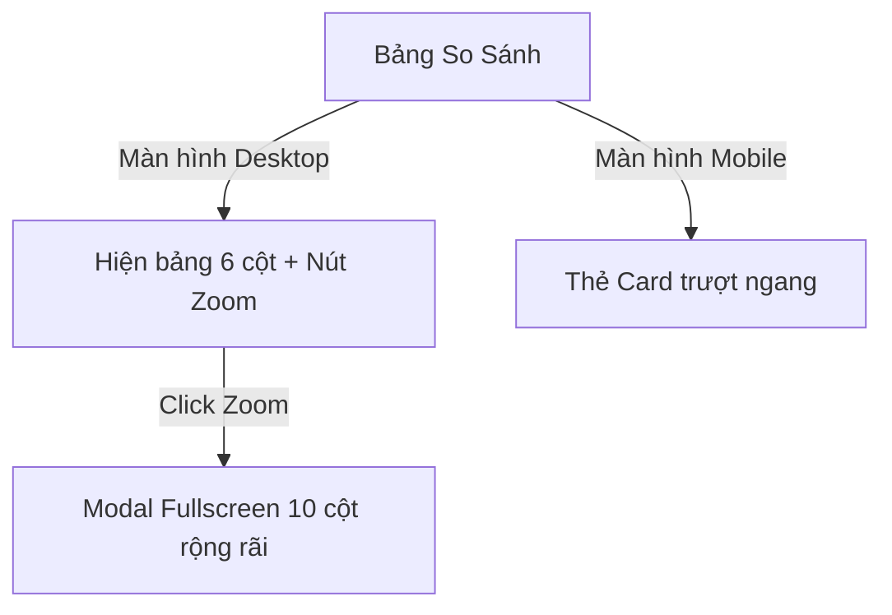

# BURGERAGENT FRONTEND & UI/UX SPECIFICATION (DESIGN SYSTEM)

Tài liệu này đặc tả chi tiết và thống nhất toàn bộ ngôn ngữ thiết kế, hệ thống Style Tokens, cấu trúc bố cục (Layout), chi tiết linh kiện (Components), các luồng trải nghiệm (UX Flows) và các cải tiến giao diện cho dự án **BurgerAgent AI (POD Catalog Assistant)**.

---

## 1. Triết Lý Thiết Kế & Định Vị Thương Hiệu

**BurgerAgent AI** định vị là một trợ lý thông minh cao cấp, tin cậy và cực kỳ nhanh chóng dành cho các nhà bán hàng Print-on-Demand (POD). Giao diện của hệ thống phải phản ánh tính chất hiện đại, công nghệ cao và tối ưu hóa hiệu suất làm việc của seller.

- **Phong cách chủ đạo:** **Glassmorphism** (kính mờ trên nền tối sâu) kết hợp với các điểm nhấn phát sáng màu neon (**Glow Accents**).
- **Trải nghiệm cốt lõi:** Thân thiện, mượt mà, loại bỏ cảm giác khô khan của chatbot truyền thống bằng cách tích hợp bảng so sánh thông minh và thanh công cụ đặt hàng trực quan (**Order HUD**).
- **Tính thích ứng:** Hoạt động nhất quán từ màn hình máy tính chuyên nghiệp đến các thiết bị di động và nền tảng trò chuyện Telegram.

---

## 2. Hệ Thống Design Tokens (Style Guide)

### 2.1. Bảng Màu Hệ Thống (Color System)
Hệ thống sử dụng các biến màu động dựa trên HSL nhằm đảm bảo độ tương phản cao (đạt tiêu chuẩn WCAG 2.1 AA với tỷ lệ >= 4.5:1) ở cả hai chế độ Light và Dark Mode (Dark Mode là mặc định).

| Vai Trò | Hệ màu HSL | Mã HEX | Trực Quan Hóa & Ứng Dụng |
| :--- | :--- | :--- | :--- |
| **Primary (Brand)** | `hsl(18, 92%, 54%)` | `#F26522` | Cam BurgerPrints chính thống. Dùng cho nút hành động chính (CTA), highlight quan trọng và border focus. |
| **Secondary (AI Accents)** | `hsl(216, 100%, 40%)` | `#0052CC` | Xanh Cobalt thương hiệu. Dùng cho chỉ báo AI, badge "RECOMMENDED" và tiêu điểm phụ. |
| **Alternative Glow** | `hsl(262, 83%, 58%)` | `#7C3AED` | Tím Neon. Dùng cho ký hiệu AI nâng cao, các viền tỏa sáng của option đề xuất tối ưu. |
| **App Background** | `hsl(224, 71%, 4%)` | `#020617` | Deep Midnight Navy. Nền tối sâu cho toàn bộ màn hình ứng dụng. |
| **Card Background** | `hsla(224, 71%, 8%, 0.65)` | `#0B1129` | Nền mờ kính (Glassmorphic Navy) cho các khối sidebar, khung chat, right panel. |
| **Success/Margin** | `hsl(142, 76%, 36%)` | `#16A34A` | Xanh Emerald. Dùng cho chỉ số biên lợi nhuận cao, trạng thái đơn hàng hoàn thành. |
| **Warning/SLA Risk** | `hsl(38, 92%, 50%)` | `#CA8A04` | Vàng Hổ Phách. Dùng cho rủi ro SLA cao, cảnh báo thiếu thông tin. |
| **Text Primary** | `hsl(210, 40%, 98%)` | `#F8FAFC` | Bright White. Dùng cho tiêu đề lớn, văn bản chính. |
| **Text Secondary** | `hsl(215, 20%, 65%)` | `#94A3B8` | Cool Grey. Dùng cho chú thích, nhãn trường nhập liệu, thông số phụ. |

### 2.2. Typography (Hệ Phông Chữ)
Để tối ưu hóa khả năng đọc bảng biểu số liệu và text chat nhỏ, hệ thống quy định 3 nhóm phông chữ:

- **Headings & UI Labels:** `Outfit` (Google Fonts) - mang lại cảm giác hiện đại, sắc nét và đậm chất công nghệ.
- **Body & Chat Text:** `Inter` (Google Fonts) - phông chữ không chân tối ưu hóa hiển thị ở kích cỡ nhỏ.
- **Code & Numeric Data:** `JetBrains Mono` - phông chữ monospaced giúp căn chỉnh các cột số liệu, mã SKU và mã đơn hàng thẳng hàng tuyệt đối.

### 2.3. Hiệu Ứng Trực Quan & Spacing
- **Kính mờ (Glassmorphism):** Áp dụng cho các card panel:
  ```css
  background: hsla(224, 71%, 8%, 0.65);
  backdrop-filter: blur(12px) saturate(180%);
  border: 1px solid rgba(255, 255, 255, 0.08);
  ```
- **Focus Glows:** Khi chọn input: `box-shadow: 0 0 15px rgba(242, 101, 34, 0.3); border-color: var(--primary);`
- **Hệ thống Spacing:** Tuân thủ hệ số 8 (8px, 16px, 24px, 32px, 48px) cho padding, margin và khoảng cách giữa các thành phần để tạo nhịp điệu thị giác thống nhất.

---

## 3. Kiến Trúc Bố Cục Giao Diện (Layout Grid Architecture)

### 3.1. Desktop Layout (Bố cục 3 cột toàn màn hình)
Bố cục có chiều cao cố định `100vh` để kiểm soát thanh cuộn riêng biệt cho từng vùng, tránh cuộn toàn trang. Tỷ lệ phân bổ: **20% : 50% : 30%**.

```
┌─────────────────┬──────────────────────────────────────┬──────────────────────┐
│  LEFT SIDEBAR   │            CENTER PANEL              │     RIGHT PANEL      │
│     (20%)       │               (50%)                  │        (30%)         │
│                 │                                      │                      │
│  [Logo & Theme] │  ┌────────────────────────────────┐  │  ┌────────────────┐  │
│                 │  │       Conversation Area        │  │  │   Tab Header   │  │
│  [+ New Chat]   │  │                                │  │  │(Checkout / Hist│  │
│                 │  │   [Welcome / Chat Bubbles]     │  │  └────────────────┘  │
│  [Sessions]     │  │                                │  │  ┌────────────────┐  │
│  - Today        │  │   ┌────────────────────────┐   │  │  │                │  │
│  - Yesterday    │  │   │     Candidate Table    │   │  │  │    Dynamic     │  │
│                 │  │   └────────────────────────┘   │  │  │   Content      │  │
│  [Profile]      │  └────────────────────────────────┘  │  │  │ (Order Form /  │  │
│  [Settings/Out] │  ┌────────────────────────────────┐  │  │  Mockup HUD /  │  │
│                 │  │ [ Prompt Input Field     ] [🚀]│  │  │  Order Info)   │  │
│                 │  └────────────────────────────────┘  │  │                │  │
└─────────────────┴──────────────────────────────────────┴──────────────────────┘
```

### 3.2. Responsive Breakpoints (Thiết Kế Thích Ứng)
Hệ thống tự động chuyển đổi bố cục khi kích thước màn hình thay đổi để bảo toàn trải nghiệm người dùng:

- **Desktop (>= 1200px):** Hiển thị đầy đủ 3 cột.
- **Tablet (768px - 1199px):**
  - Cột 1 (Left Sidebar) ẩn vào nút Hamburger Menu, trượt ra dưới dạng **Drawer Navigation** từ bên trái.
  - Cột 2 và Cột 3 chia đôi không gian màn hình (50% : 50%).
- **Mobile (< 768px):**
  - Giao diện chuyển thành **1 cột duy nhất** tập trung vào Center Panel (Chat Area).
  - Left Sidebar hoạt động dưới dạng Drawer.
  - Right Panel (Product & Order HUD) chuyển đổi thành **Bottom Sheet** trượt lên từ cạnh đáy màn hình khi seller nhấn nút "Chọn Xưởng" hoặc "Xem Đơn Hàng".

### 3.3. Quy Đổi Giao Diện Telegram (Telegram Bot UI/UX Adapter)
Để đồng bộ hóa trải nghiệm hội thoại, Telegram Bot API sẽ tự động chuyển đổi các thành phần visual phức tạp trên Web thành cấu trúc text/menu tương thích:

- **Candidate Table $\rightarrow$ Markdown Text & Inline Keyboards:**
  Bảng so sánh 10 cột được render thành khối text Markdown phân cấp, kèm theo các nút bấm Inline dưới chân tin nhắn để chọn xưởng (Ví dụ: `[Chọn Factory A - $11.50]`, `[Chọn Factory B - $13.20]`).
- **Product Mockup $\rightarrow$ Dynamic Image Overlay:**
  Khi seller gửi file thiết kế hoặc link ảnh, server backend sử dụng thư viện **Pillow** để ghép ảnh thiết kế đè lên ảnh phôi theo tọa độ thực, xuất ra file ảnh `.png` gửi trực tiếp cho user xem trước.
- **Checkout Form $\rightarrow$ Conversational Form Flow:**
  Bot sẽ tự động kích hoạt tiến trình hỏi đáp từng bước (Tên người nhận -> Địa chỉ -> Mã Zip -> Số lượng) hoặc gọi **Telegram Web App (TWA)** để mở form điền thông tin tối giản.

---

## 4. Đặc Tả Chi Tiết Thành Phần UI & Giao Diện (Components)

### 4.1. Cột 1: Left Sidebar (Quản lý Phiên & Cài đặt)
- **Header:** Chứa Logo **BurgerAgent** và nút tròn chuyển đổi Sáng/Tối (Theme Toggle) dạng icon Mặt trời/Mặt trăng.
- **Nút Hội thoại mới (New Chat):** Thiết kế bo góc lớn, phủ màu cam gradient. Hover sẽ có viền xanh dương sáng tỏa sáng (`--secondary`).
- **Danh sách phiên (Session History):**
  - Phân nhóm thời gian: *Hôm nay, Hôm qua, 7 ngày trước, Cũ hơn*.
  - Mục đang hoạt động (Active) có background Navy sáng (`hsla(224, 71%, 12%, 0.5)`) và thanh chỉ báo màu cam dọc mép trái.
  - Hover lên các mục khác hiển thị icon Thùng rác nhỏ ở lề phải để xóa nhanh phiên.
- **Footer Profile:** Hiển thị Avatar, Tên cửa hàng (Store Name) và Email của Seller. Bên dưới có 2 nút **"Cài Đặt"** (mở PreferencesModal) và **"Đăng Xuất"** (nhạt màu, chuyển đỏ khi hover).

### 4.2. Cột 2: Center Panel (Khung Chat & So Sánh)
- **Welcome Screen:** Xuất hiện khi hội thoại trống. Gồm logo lớn, lời chào và các nút gợi ý câu hỏi nhanh (**Suggestion Chips**) xếp gọn gàng ở đáy (Ví dụ: *"Hoodie gửi đi EU rẻ nhất"*, *"T-shirt đen margin > 40%"*).
- **Tin nhắn User:** Canh phải, bong bóng màu xám sẫm/xanh Navy nhạt (`hsl(224, 71%, 12%)`), bo tròn các góc trừ góc dưới bên phải.
- **Tin nhắn AI:** Canh trái, không nền hoặc nền kính siêu mờ, bo tròn trừ góc dưới bên trái. Có chứa icon avatar AI ở đầu dòng.
- **Bảng Candidate Table (Lồng trong tin nhắn AI):**
  - Để tránh cuộn ngang trên màn hình nhỏ, bảng có thể cuộn ngang độc lập trong khung tin nhắn (`overflow-x: auto`), có tiêu đề mô tả rõ ràng.
  - Các cột: *Nhà in, Base Cost, Print Cost, Shipping, Tax, Landed Cost (bold), Margin % (success), Ship SLA, Rủi ro SLA, Hành động*.
  - Hàng đề xuất số 1: Bo viền cam đậm (`--primary`), nền có ánh sáng cam mờ, nút chọn xưởng đổi sang cam gradient kèm nhãn **"RECOMMENDED"** phát sáng nhẹ.

### 4.3. Cột 3: Right Panel (Product Inspector & Order HUD)
Bao gồm thanh Tab Header gồm 2 tab: **Fulfillment Checkout** và **Lịch sử đơn**.

#### Tab 1: Fulfillment Checkout
- **Mockup Display:**
  - Khung hiển thị ảnh phôi sản phẩm. Nếu không có ảnh thực tế từ API, render đồ họa vector `SVG` (T-shirt/Hoodie/Mug) đổi màu động khớp với swatch màu đang chọn.
  - **Design Overlay:** Tải lên ảnh thiết kế (mặt trước/sau) thông qua file upload hoặc link URL. File upload cục bộ được chuyển đổi sang Base64 để hiển thị đè lên ngực/lưng mockup ngay lập tức theo đúng tỷ lệ vùng in.
  - **Mặt Trước/Sau Toggle:** Nút chuyển đổi góc nhìn trước/sau dưới mockup.
- **Color & Size Selector:** Swatch màu dạng các chấm tròn thực tế (có viền focus khi chọn). Size selector là các chip nút bấm vuông bo tròn.
- **Checkout Form:** Nhập thông tin khách hàng (Tên, địa chỉ dòng 1, dòng 2, thành phố, bang, mã zip, quốc gia).
- **Billing Summary (Bảng hóa đơn):**
  - Hiển thị chi tiết: `Base Cost + Print Cost (tính động $0 nếu chưa upload design, cộng dồn nếu in 2 mặt) + Shipping Fee + Tax (tính theo flat rate quốc gia) = Landed Cost`.
  - Giá tổng cộng Landed Cost in đậm màu xanh `--success`.
  - Nút lớn **"Confirm Fulfillment Order"** màu cam gradient chiếm 100% bề rộng. Khi bấm, nút bị disable và hiển thị loading spinner. Đặt đơn thành công kích hoạt hiệu ứng pháo hoa giấy (**Confetti Celebration**).

#### Tab 2: Lịch Sử Đơn
- **Danh sách đơn:** Các card đơn hàng nhỏ xếp dọc. Hiển thị: Mã đơn monospace, ngày đặt, SKU, số lượng, tổng tiền (màu xanh lá) và badge trạng thái (*Pending, Production, Shipped, Failed*).
- **Chi tiết đơn (khi click vào một đơn):** Hiển thị nút quay lại, thông tin chi tiết địa chỉ, ảnh mockup thiết kế đã in, hóa đơn chi tiết và khối thông tin tracking vận đơn thực tế lấy từ API (Carrier, Tracking Number, Trạng thái vận chuyển).

---

## 5. Đặc Tả Các Hộp Thoại (Modals)

### 5.1. AuthModal (Màn hình Đăng nhập / Đăng ký)
- Xuất hiện chặn giữa màn hình bằng backdrop overlay làm mờ 8px nền phía sau.
- **Tab Switch:** Thanh chuyển đổi mượt mà giữa Đăng Nhập và Đăng Ký ở đầu form.
- Form đăng ký yêu cầu nhập thêm trường *Tên cửa hàng POD*.
- Mật khẩu tích hợp icon con mắt để bật/tắt ẩn hiển thị mật khẩu.
- Nút CTA lớn **"Vào Dashboard"** màu cam gradient tỏa sáng nhẹ.

### 5.2. PreferencesModal (Cài đặt cấu hình Seller)
- Mở ra khi click nút "Cài Đặt" ở Sidebar.
- Các trường cấu hình:
  - **Thị trường ưu tiên:** Dropdown chọn US, EU, hoặc VN.
  - **Lợi nhuận mục tiêu (%):** Input số kèm ký hiệu `%` ở cuối.
  - **SLA tối đa (Ngày):** Input số kèm chữ `ngày` ở cuối.
  - **Tiêu chí ưu tiên:** Dropdown chọn *Ưu tiên Lợi nhuận (Margin)* hoặc *Ưu tiên Tốc độ ship (Speed)*.
- Mỗi mục có mô tả nhỏ bên dưới để seller hiểu rõ cách thuật toán AI tự động xếp hạng xưởng dựa trên các cấu hình này.

---

## 6. Thiết Kế Trải Nghiệm Tương Tác & Cải Tiến UX (Redesign Solutions)

Để giải quyết các rào cản UX trong phiên bản cũ, tài liệu này đặc tả chi tiết 5 cải tiến giao diện quan trọng:

### 6.1. Bảng So Sánh Candidate Table Tương Thích & Mở Rộng
> [!NOTE]
> **Vấn đề cũ:** Bảng so sánh quá nhiều cột gây chật chội và phải cuộn ngang trên màn hình laptop nhỏ hoặc di động.

- **Giải pháp cải tiến:**
  - Trên màn hình Desktop, mặc định hiển thị bảng so sánh tinh giản 6 cột chính. Thêm nút bấm **"Xem Chi Tiết Bảng"** ở góc phải bảng. Khi click, mở một **Modal Fullscreen** hiển thị đầy đủ 10 cột dữ liệu rộng rãi.
  - Trên màn hình Mobile, bảng so sánh tự động chuyển đổi thành cấu trúc **Horizontal Card Carousel** (Các thẻ xưởng in trượt ngang). Mỗi thẻ đại diện cho một phương án xưởng in, hiển thị đầy đủ các chỉ số được xếp dọc trực quan.



### 6.2. Hiệu Ứng Chuyển Cảnh "Fly to Mockup"
> [!NOTE]
> **Vấn đề cũ:** Khi bấm "Chọn Xưởng", Right Panel đổi trạng thái đột ngột không có hiệu ứng, làm mất tính liên kết không gian.

- **Giải pháp cải tiến:**
  - Khi seller nhấn nút "Chọn Xưởng" ở cột 2, hệ thống kích hoạt hiệu ứng **Fly Animation**: Ảnh thumbnail của phôi sản phẩm tại hàng được chọn sẽ bay mượt mà (sử dụng CSS transform và opacity) từ vị trí bảng so sánh xuyên qua ranh giới cột và đáp xuống khung Mockup Display của Right Panel.
  - Quá trình bay kéo dài **350ms** với timing function `cubic-bezier(0.16, 1, 0.3, 1)`. Đồng thời Right Panel thực hiện hiệu ứng fade-in mượt mà các trường chọn màu sắc và kích cỡ.

### 6.3. Khu Vực Kéo Thả Upload Thiết Kế (Drag & Drop Design HUD)
> [!NOTE]
> **Vấn đề cũ:** Nhập URL thiết kế thủ công gây bất tiện và chưa thân thiện.

- **Giải pháp cải tiến:**
  - Thay thế ô nhập URL thô bằng một khung kéo thả nét đứt lớn (`.drop-zone`) cho cả 2 mặt trước và sau.
  - Hỗ trợ seller kéo thả trực tiếp file hình ảnh (`.png`, `.jpg`, `.svg`) từ thư mục máy tính vào khu vực này. File được tự động đọc dưới dạng Base64 để hiển thị đè trực quan lên mockup tức thì.
  - Thêm tính năng kéo ảnh thiết kế trực tiếp thả lên trên hình Mockup lớn của sản phẩm để tự động gán ảnh vào mặt in tương ứng.

### 6.4. Trực Quan Hóa SLA Bằng Tiến Trình Gradient (SLA Risk Timeline)
> [!NOTE]
> **Vấn đề cũ:** SLA và điểm rủi ro hiển thị dạng chữ số tĩnh khó so sánh nhanh.

- **Giải pháp cải tiến:**
  - Thay thế số ngày tĩnh bằng một thanh tiến trình nằm ngang (**SLA Progress Bar**).
  - Thanh có chiều dài đại diện cho số ngày vận chuyển tối đa. Màu sắc của thanh chuyển từ Xanh lá (SLA an toàn) sang Vàng (SLA chạm ngưỡng) và Đỏ (Rủi ro trễ hẹn cao).
  - Có một vạch kẻ đứng (marker) đại diện cho mức SLA tối đa mà Seller đã thiết lập trong Preferences. Nếu thanh tiến trình của xưởng in vượt qua vạch marker này, hệ thống tự động cảnh báo đỏ rủi ro SLA.

```
Mức SLA của Seller thiết lập: | 7 ngày |
Factory A (5 ngày):   [██████░░░░] (Xanh - An toàn)
Factory B (9 ngày):   [█████████⚡] (Đỏ - Vượt SLA 2 ngày - RỦI RO)
```

### 6.5. Bottom Sheet Linh Hoạt Cho Giao Diện Di Động
> [!NOTE]
> **Vấn đề cũ:** Giao diện 3 cột bị vỡ hoàn toàn trên màn hình nhỏ.

- **Giải pháp cải tiến:**
  - Trên các thiết bị di động, Right Panel (Mockup & Order HUD) được ẩn hoàn toàn để nhường chỗ cho khung chat.
  - Khi seller nhấn nút "Chọn Xưởng" ở cột chat, một **Bottom Sheet** (Thẻ vuốt từ đáy) sẽ trượt lên chiếm 85% chiều cao màn hình di động.
  - Bottom Sheet chứa toàn bộ giao diện Product Inspector, Order Form và Billing Summary giúp seller hoàn tất việc cấu hình và đặt hàng chỉ bằng các thao tác vuốt chạm một tay dễ dàng.

---

## 7. Quy Trình Trạng Trái Tương Tác & Thời Gian Phản Hồi (Interaction States)

Mọi tương tác trên hệ thống phải tuân thủ nghiêm ngặt các tham số thời gian để đảm bảo cảm giác phản hồi tự nhiên, nhanh chóng:

- **Thời gian phản hồi nút bấm (Tap Feedback):** Cụm hiệu ứng scale (nhỏ lại 0.97 và khôi phục) hoặc đổi màu nền phải xảy ra trong vòng **100ms** kể từ khi click/tap.
- **Thời gian hiệu ứng Micro-interactions:** Các hiệu ứng chuyển đổi trạng thái nhỏ (hover card, show tooltip) kéo dài **150ms - 200ms**.
- **Thời gian chuyển cảnh lớn (Transitions):** Hiệu ứng slide-in của Bottom Sheet, fly animation kéo dài từ **300ms - 400ms** sử dụng cubic-bezier đàn hồi nhẹ.
- **Trạng thái chờ tải dữ liệu (Loading State):**
  - Đối với các tiến trình kéo dài dưới 1s: Sử dụng hiệu ứng Shimmer chạy quét qua các phần tử khung xương (Skeleton Screen).
  - Đối với các tiến trình tạo đơn hàng sandbox API kéo dài trên 1s: Sử dụng loading spinner tích hợp trực tiếp trên nút CTA và khóa tương tác màn hình (disable buttons).

---

## 8. Danh Sách Kiểm Tra Chất Lượng UI/UX & Khả Năng Tiếp Cận (WCAG 2.1 AA Checklist)

Trước khi đóng gói triển khai frontend, đội ngũ phát triển bắt buộc kiểm tra và hoàn thành các tiêu chí sau:

- [ ] **Độ Tương Phản:** Tất cả văn bản (bao gồm cả trạng thái hover, disabled) đạt độ tương phản tối thiểu 4.5:1 so với nền (hoặc 3:1 đối với văn bản lớn > 18px bold).
- [ ] **Kích Thước Vùng Chạm:** Mọi nút bấm, hạt màu, size chip trên di động đều có kích thước vùng chạm tối thiểu **44x44px** (hoặc sử dụng padding ẩn để mở rộng vùng click).
- [ ] **Không Dùng Màu Đơn Độc:** Các trạng thái lỗi (Error), thành công (Success) hay cảnh báo rủi ro SLA bắt buộc đi kèm biểu tượng (icon) hoặc văn bản mô tả cụ thể, không chỉ dùng màu sắc đơn độc để hiển thị thông tin.
- [ ] **Tránh Layout Shift (CLS):** Khung chứa Mockup và Billing Summary phải được khai báo kích thước cố định hoặc sử dụng aspect-ratio để tránh hiện tượng giao diện bị giật nhảy khi hình ảnh hoặc giá cả load bất đồng bộ.
- [ ] **Hỗ Trợ Bàn Phím:** Người dùng có thể nhấn Tab để điều hướng tuần tự qua các trường nhập liệu trong AuthModal, PreferencesModal và Order Form theo đúng thứ tự logic hiển thị trực quan.
- [ ] **Reduced Motion:** Hỗ trợ lắng nghe cấu hình hệ điều hành `prefers-reduced-motion` để tự động tắt hiệu ứng pháo hoa Confetti và hiệu ứng bay Mockup khi người dùng yêu cầu tắt chuyển động.

---

Tài liệu thiết kế giao diện này là chuẩn mực bắt buộc cho quá trình phát triển mã nguồn Frontend Next.js và giao tiếp Telegram Bot của dự án BurgerAgent AI. Mọi thay đổi về Style Tokens hoặc luồng tương tác phải được cập nhật đồng bộ vào tài liệu này.
