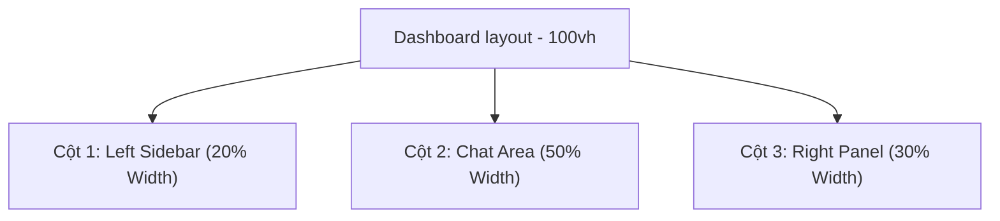

# Burger Agent — Current UX/UI Specification & Layout Structure

> [!NOTE]
> Tài liệu này mô tả chi tiết, trực quan cấu trúc giao diện (Layout), các thành phần UI (Components), luồng trải nghiệm (UX Flows), hệ màu sắc (Design Tokens) và các hành vi tương tác (Interactive States) hiện có trong dự án **Burger Agent (POD Catalog Assistant)**.
>
> **Mục tiêu:** Giúp nhóm Thiết kế (Designer) nắm bắt chính xác hiện trạng hệ thống để xây dựng và phát triển một phiên bản giao diện cao cấp, chuyên nghiệp và có tính tương tác đột phá hơn (Redesign).

---

## 1. Hệ Thống Design Tokens & Visual Styles Hiện Tại

Giao diện hiện tại được thiết kế theo phong cách hiện đại với hiệu ứng **Glassmorphism** (kính mờ phủ trên nền tối) và hỗ trợ cả 2 chế độ sáng/tối (Dark Mode là mặc định).

### 1.1. Bảng Màu Thương Hiệu (Brand Color Palette)

Các biến CSS màu sắc được cấu hình động dựa trên HSL để tạo độ phản hồi màu tốt ở cả hai chế độ:

| Token              | Tên Màu               | Mã Màu (Dark Mode)              | Mã Màu (Light Mode)        | Vai Trò                                                                                             |
| :----------------- | :-------------------- | :------------------------------ | :------------------------- | :-------------------------------------------------------------------------------------------------- |
| `--primary`        | Orange Primary        | `hsl(18, 92%, 54%)` (#f26522)   | `hsl(18, 92%, 54%)`        | Màu cam BurgerPrints chính thống, dùng cho các nút CTA, highlight quan trọng và border focus.       |
| `--secondary`      | Cobalt Blue Secondary | `hsl(216, 100%, 40%)` (#0052CC) | `hsl(216, 100%, 40%)`      | Màu xanh thương hiệu, dùng cho các chỉ báo AI, badge "RECOMMENDED", icon lấp lánh và tiêu điểm phụ. |
| `--bg-dark`        | App Background        | `hsl(224, 71%, 4%)`             | `hsl(210, 20%, 96%)`       | Nền slate sẫm cực tối (Dark) / Nền xám slate nhạt (Light).                                          |
| `--card-bg`        | Card Background       | `hsla(224, 71%, 8%, 0.65)`      | `rgba(255, 255, 255, 0.7)` | Nền bán trong suốt cho các khối thẻ (Glass effect).                                                 |
| `--text-primary`   | Text Primary          | `#F8FAFC`                       | `hsl(220, 40%, 10%)`       | Màu chữ tiêu đề và văn bản chính.                                                                   |
| `--text-secondary` | Text Secondary        | `#94A3B8`                       | `hsl(215, 20%, 35%)`       | Màu chữ phụ, mô tả và nhãn trường nhập dữ liệu.                                                     |
| `--success`        | Green Success         | `hsl(142, 76%, 36%)`            | `hsl(142, 76%, 28%)`       | Màu xanh lá cho chỉ báo margin tốt, đơn đặt thành công.                                             |
| `--warning`        | Yellow Warning        | `hsl(38, 92%, 50%)`             | `hsl(38, 92%, 40%)`        | Màu vàng cho rủi ro SLA cao, cảnh báo.                                                              |

### 1.2. Typography (Hệ Phông Chữ)

- **Tiêu đề (Headers):** `--font-heading`: `'Be Vietnam Pro'`, `'Outfit'`, `'Inter'`, sans-serif. Thiết kế dày, hiện đại, `letter-spacing: -0.02em`.
- **Nội dung (Body):** `--font-body`: `'Inter'`, sans-serif. Rõ ràng, dễ đọc ở kích thước nhỏ.
- **Mã nguồn (Monospace):** `--font-code`: `'JetBrains Mono'`, `'Fira Code'`, monospace. Dùng cho SKU, Order ID, và thông tin tracking.

### 1.3. Các Hiệu Ứng Visual Đặc Trưng (Key Interactions & Animations)

- **Glassmorphic Cards (`.glass-card`):** Sử dụng `backdrop-filter: blur(8px) saturate(180%)` kết hợp viền mỏng bán trong suốt `border: 1px solid rgba(255, 255, 255, 0.08)` để tạo chiều sâu lớp giao diện.
- **Focus Glows:** Khi một input hoặc container được chọn (focus), đường viền chuyển màu và tạo bóng tỏa sáng nhẹ (`box-shadow: 0 0 15px var(--primary-glow)`).
- **Shimmer Loading:** Hiệu ứng quét sáng tuyến tính chạy vô tận dùng khi các dữ liệu đang tải.
- **Pulse Indicators (`.pulse-indicator`):** Hiệu ứng nhấp nháy tỏa vòng tròn đồng tâm cho các phần tử hoạt động thời gian thực (như badge AI đề xuất hoặc biểu tượng trạng thái đơn hàng thành công).
- **Confetti Celebration:** Pháo hoa giấy bùng nổ toàn màn hình (sử dụng thư viện `canvas-confetti`) ngay khi đặt đơn fulfillment thành công.

---

## 2. Bố Cục Không Gian Giao Diện (Layout Hierarchy)

Ứng dụng chia làm cấu trúc **3 cột toàn màn hình (Dashboard Layout)** cố định chiều cao `100vh` để tránh tràn cuộn trang không mong muốn:



---

## 3. Chi Tiết Từng Thành Phần UI & Giao Diện (Component Breakdown)

### 3.1. Cột 1: Left Sidebar (Quản lý Phiên làm việc & Cài đặt)

Bố cục dọc gồm 4 phần chính:

```
+------------------------------------+
| [Logo: Burger Agent]   (Sun/Moon)  |  <- Sidebar Header
+------------------------------------+
|  [+ Hội Thoại Mới]                 |  <- Sidebar Action (Nút lớn)
+------------------------------------+
|  Hôm nay                           |
|  - [Icon] T-shirt US order...  (x) |
|  - [Icon] EU Hoodie quote...   (x) |  <- Lịch sử hội thoại
|  7 ngày trước                      |     (Phân nhóm theo ngày,
|  - [Icon] VN Ceramic Mug...    (x) |      hover có nút xóa [x])
+------------------------------------+
|  [Icon] Store Name                 |  <- User Profile (Thông tin Seller)
|  seller_email@example.com          |
|  [ Cài Đặt ]       [ Đăng Xuất ]   |  <- Footer Actions
+------------------------------------+
```

- **Sidebar Header:** Chứa logo chữ **"Burger Agent"** tô màu gradient cam-xanh (`--btn-gradient`) và một nút tròn chuyển đổi Sáng/Tối (Theme Toggle Button) có icon Moon/Sun tương ứng.
- **Sidebar Action:** Nút **"Hội Thoại Mới"** dạng dẹt, bo góc lớn, hover có viền xanh dương sáng tỏa sáng (`--secondary-glow`).
- **Conversation List:** Danh sách hội thoại cuộn dọc.
  - Tự động phân nhóm thời gian: _Hôm nay, Hôm qua, 7 ngày trước, Cũ hơn_.
  - Mỗi mục có biểu tượng tin nhắn, tiêu đề cuộc hội thoại tự động rút gọn bằng dấu ba chấm, và một nút xóa cuộc hội thoại hình thùng rác đỏ hiện lên khi hover chuột.
  - Mục đang chọn (Active) sẽ có nền sáng hơn và có một thanh dọc màu cam thương hiệu (`--primary`) ở mép bên trái.
- **Sidebar Footer:**
  - Hiển thị Avatar tài khoản Seller, Tên cửa hàng (Store Name) và Email.
  - Bên dưới là 2 nút chức năng chia đôi chiều ngang: **"Cài Đặt"** (mở Preferences Modal) và **"Đăng Xuất"** (chuyển sang màu đỏ nhạt khi hover).

---

### 3.2. Cột 2: Center Panel - Chat Area (Không gian trò chuyện & So sánh)

Khu vực chat chính, chiếm 50% bề ngang, chịu trách nhiệm chính trong việc hiển thị luồng tư vấn và bảng so sánh các xưởng in.

```
+------------------------------------+
| Trợ Lý Tư Vấn Fulfillment          |  <- Chat Header (Tên & Phụ đề trạng thái)
| Phân tích & Tối ưu hóa đơn hàng... |
+------------------------------------+
|                                    |
| [Welcome Screen / Chat Log]        |
| - Tin nhắn User (Góc phải, nền cam)|  <- Chat Log: Bong bóng tin nhắn cuộn dọc
| - Tin nhắn Assistant (Trái, nền tối)
|                                    |
| +--------------------------------+ |
| | Bảng So Sánh Tối Ưu (Options)  | |  <- Bảng Candidate Table lồng trong tin nhắn AI
| | [Xưởng] [Landed] [SLA] [Chọn]  | |
| +--------------------------------+ |
|                                    |
+------------------------------------+
| [Gợi ý: Tìm T-shirt...] [Hoodie...] |  <- Suggestion Chips (Dính phía trên ô nhập)
+------------------------------------+
| [ Nhập câu hỏi của bạn...      [@] |  <- Chat Input Bar (Nút gửi hình máy bay cam)
+------------------------------------+
```

#### A. Trạng thái Trống (Welcome Screen)

Khi chưa có cuộc hội thoại nào hoặc hội thoại rỗng, phần giữa sẽ hiển thị:

- Một tiêu đề chào mừng lớn với chữ gradient Burger Agent.
- Lời giới thiệu ngắn gọn về tính năng hỗ trợ lọc catalog, landed cost và API sandbox.
- Khối các nút gợi ý câu hỏi (Suggestion Chips) xếp hàng ngang/dọc bên dưới (Ví dụ: _"Tìm T-shirt đen gửi đi US"_, _"So sánh Hoodie các xưởng ship EU rẻ nhất"_,...).

#### B. Bong bóng Chat (Chat Bubbles)

- **Bong bóng User:** Canh lề phải, nền cam nhạt ở light mode (`--chat-bubble-user-bg`) và xám sẫm ở dark mode, bo góc tròn trừ góc dưới bên phải.
- **Bong bóng Trợ lý (AI):** Canh lề trái, nền card sẫm hơn, viền xám nhạt, bo góc tròn trừ góc dưới bên trái.
  - Hỗ trợ parser markdown tích hợp hiển thị: Bold (`**`), Inline Code (nhãn màu đỏ nhạt trên nền tối `inline-code`), Bullet lists (`-`), và danh sách đánh số.
  - Bong bóng có chứa Bảng so sánh sẽ tự động giãn rộng ra tối đa bề ngang cột chat (`max-width: 100%`) để chống tràn bảng.

#### C. Bảng So Sánh Candidate Table (Trái tim của cột chat)

Được lồng trực tiếp bên dưới nội dung tin nhắn phản hồi của AI khi có kết quả truy vấn catalog và quote xưởng.

- **Header mô tả:** Khối tiêu đề phụ có màu nền xám mờ và icon Sparkles xanh dương chỉ rõ sản phẩm và quốc gia mục tiêu (Ví dụ: `Bảng so sánh tối ưu cho Comfort Colors 1717 (US)`).
- **Thân bảng (Table):** Gồm 10 cột dữ liệu:
  1. _Nhà in / Xưởng:_ Tên xưởng và quốc gia viết tắt (Ví dụ: `Factory A (VN)`). Hàng đề xuất số 1 sẽ có một chiếc badge **"RECOMMENDED"** nhấp nháy phát sáng.
  2. _Base Cost:_ Giá phôi áo.
  3. _Print Cost:_ Giá in.
  4. _Shipping:_ Phí ship.
  5. _Tax:_ Thuế.
  6. _Landed Cost:_ Tổng giá cập kho (in đậm nổi bật).
  7. _Margin:_ Phần trăm lợi nhuận biên tính toán động theo giá bán gợi ý (màu xanh lá `--success`).
  8. _Ship SLA:_ Khoảng ngày vận chuyển (Ví dụ: `5-8 ngày`).
  9. _Rủi ro SLA:_ Badge rủi ro dựa trên lịch sử vận đơn (Ví dụ: `12 (Thấp)` màu xanh lá, hoặc `35 (Cao)` màu vàng).
  10. _Hành động:_ Nút **"Chọn Xưởng"**.
- **Visual Highlight:** Hàng đầu tiên (Option tối ưu nhất được AI xếp hạng) được tô màu nền cam nhạt (`--table-best-bg`), có viền cam đậm (`--primary`) bo xung quanh hàng và nút hành động của nó được đổi sang phong cách nút cam gradient nổi bật thay vì các nút xám thông thường.

#### D. Input Area

- Chứa các suggestion chips dính (sticky) ở ngay phía trên thanh nhập liệu.
- Thanh nhập liệu dạng dẹt bo tròn lớn (`--radius-md`) hiệu ứng glassmorphism. Input không viền, nút gửi nằm ở góc phải hình tròn nhỏ màu cam gradient, chứa icon máy bay giấy gửi tin nhắn (`Send`).

---

### 3.3. Cột 3: Right Panel (Mockup Sản Phẩm, Tùy Biến Thiết Kế & Order HUD)

Chiếm 30% bề ngang, cột này có 2 thẻ Tab điều hướng: **Fulfillment Checkout** (Đặt hàng) và **Lịch sử đơn** (Lịch sử & Theo dõi vận đơn).

#### A. Tab 1: Fulfillment Checkout

##### 1. Trạng thái Trống (Empty State)

Khi chưa chọn xưởng in nào từ bảng so sánh bên cột Chat, panel hiển thị hình giỏ hàng trống cùng lời nhắc nhở Seller hãy click nút **"Chọn Xưởng"** để lấy dữ liệu sản phẩm.

##### 2. Product Inspector (Trình xem & cấu hình phôi sản phẩm)

```
+------------------------------------+
|         [ Mockup Image / SVG ]     |  <- Mockup Display
|        [Mặt trước]  [Mặt sau]      |  <- Preview toggles (Mặt trước/sau)
+------------------------------------+
|  Comfort Colors 1717 T-Shirt       |  <- Tên sản phẩm
|  SKU nháp: USMCC1717UL-Black-L     |  <- SKU preview động
+------------------------------------+
|  Màu sắc:                          |
|  (O) Black  ( ) White  ( ) Navy    |  <- Color swatches (Có vòng tròn màu)
|  Kích thước:                       |
|  [ S ]  [ M ]  *[ L ]*  [ XL ]      |  <- Size chips selector
+------------------------------------+
```

- **Mockup Display:** Một khung xám sẫm bo góc lớn chứa hình ảnh phôi sản phẩm.
  - Nếu có hình ảnh catalog thực tế, render thẻ ``. Nếu không, tự động sinh đồ họa Vector `SVG` tương ứng (Ví dụ: hình áo phông cổ tròn, áo Hoodie, cốc sứ) tô màu động khớp chính xác với swatch màu Seller đang chọn.
  - **Design Preview Overlay:** Nếu Seller nhập hoặc tải lên hình thiết kế in ấn (Design Url), hình đó sẽ được tự động lồng ghép đè lên ngực/lưng áo mockup theo đúng tỷ lệ thực để hiển thị bản xem trước.
  - **Mặt Trước/Sau Toggle:** Dưới mockup có cụm nút bấm chuyển mặt in mặt trước/mặt sau để xem trước thiết kế in tương ứng.
- **Metadata:** Tên dòng sản phẩm và mã SKU cập nhật thời gian thực dựa trên cấu trúc: `[Mã phôi]-[Màu sắc]-[Kích thước]` (Ví dụ: `USTCC1717UL-Black-XL`).
- **Color Selector:** Danh sách các hạt màu (Color swatches) có hình chấm màu tròn thực tế bên cạnh nhãn chữ. Hỗ trợ ô lọc tìm kiếm màu nếu bảng màu quá dài.
- **Size Selector:** Hàng nút bấm chọn size (S, M, L, XL, 2XL...) viền trắng, đổi sang nền cam viền cam khi chọn.

##### 3. Checkout Form (Order HUD - Thông tin giao hàng & Số lượng)

- Các trường nhập thông tin địa chỉ: _Tên người nhận (Full Name), Địa chỉ dòng 1, Thành phố, Bang/Tỉnh, Mã Zip, Quốc gia_ (được khóa cứng dựa trên thị trường đã tối ưu hóa, ví dụ: US, EU hoặc VN).
- **Bộ tăng giảm số lượng:** Ô số lượng với 2 nút bấm `-` và `+` hai bên thiết kế bo góc liền khối.

##### 4. Upload Design HUD (Thiết kế in ấn)

- Cung cấp 2 khu vực tải thiết kế riêng biệt cho **Mặt trước** và **Mặt sau**.
- Mỗi phần có:
  - Một ô vuông nhỏ hiển thị ảnh thu nhỏ thiết kế (Thumbnail preview).
  - Thanh nhập trực tiếp đường link ảnh (URL).
  - Nút bấm **"File"** (kèm icon Upload) ẩn input file thực tế để mở hộp thoại tải ảnh trực tiếp từ máy tính lên (tự động chuyển thành mã hóa Base64 để hiển thị mockup tức thì).
  - Nút xóa thiết kế nhanh `[X]` ở góc phải.

##### 5. Billing Summary (Bảng hóa đơn chi tiết & Nút CTA)

- Liệt kê chi phí nhân với số lượng:
  - _Base Cost:_ Giá phôi gốc.
  - _Print Cost:_ Tính toán động! Tự động bằng `$0` nếu không tải lên ảnh in, tính giá in mặt trước, mặt sau hoặc cộng dồn nếu in cả hai mặt áo phông.
  - _Vận chuyển (Shipping):_ Phí ship.
  - _Thuế (Tax):_ Tính theo phần trăm tương ứng với thị trường đích (Ví dụ: `19%` cho EU, `10%` cho VN, `8.25%` cho US) nhân với tổng phôi, in và ship.
  - _Tổng Landed Cost:_ In đậm sắc nét màu xanh lá thành công (`--success`).
- **Nút Xác Nhận:** Nút lớn **"Confirm Fulfillment Order"** màu cam gradient dài hết chiều ngang. Khi bấm, hiển thị loading spinner, đặt đơn thành công sẽ phát nổ pháo hoa giấy và chuyển sang màn hình thành công.

##### 6. Checkout Success Screen (Trạng thái đặt đơn thành công)

Gồm icon dấu tích xanh lớn (`CheckCircle`) nhấp nháy phát sáng, dòng chữ thông báo đặt thành công và một thẻ thông tin bo góc (`glass-card`) liệt kê các thông tin: _Order ID sandbox, SKU, Số lượng, Tổng chi phí, Tracking Number_ (màu xanh dương sáng nổi bật), và nhãn trạng thái đơn hàng. Có nút bấm phụ điều hướng nhanh sang xem tab Lịch sử đơn.

---

#### B. Tab 2: Lịch sử đơn

```
+------------------------------------+
|  Đơn hàng đã đặt                   |  <- Danh sách đơn hàng
|  +------------------------------+  |     (Bao gồm mã đơn, trạng thái,
|  | #BP-ORDER-9912   [PENDING]   |  |      ngày đặt, SKU, số lượng,
|  | SKU: US-BLK-L    SL: 2       |  |      và tổng tiền màu xanh lá)
|  | 16/06/2026           $32.50  |  |
|  +------------------------------+  |
+------------------------------------+
```

- **Danh sách đơn hàng (List View):** Các thẻ đơn hàng nhỏ xếp dọc. Hover thẻ sẽ bo viền cam mờ, click thẻ sẽ chuyển sang màn hình chi tiết. Mỗi thẻ hiển thị:
  - Mã đơn hàng dạng monospace đậm.
  - Badge trạng thái đơn hàng: _Pending / In Production_ (màu vàng nhạt), _Completed / Shipped_ (màu xanh lá nhạt), _Failed / Cancelled_ (màu đỏ nhạt).
  - Chi tiết SKU, số lượng, ngày đặt và tổng chi phí màu xanh lá in đậm.
- **Xem Chi Tiết Đơn Hàng (Detail View):** Khi click vào một đơn hàng bất kỳ:
  - Nút **"← Quay lại danh sách"** nằm góc trên trái.
  - Hiển thị đầy đủ thông tin chi tiết đơn hàng: Mã đơn, ngày giờ đặt, trạng thái đơn.
  - Khối xem lại thiết kế đã in: Hai ô ảnh thu nhỏ (mặt trước/sau) của thiết kế đã đặt đơn.
  - Chi tiết địa chỉ giao nhận của khách hàng.
  - Chi tiết báo giá từng thành phần (Base cost, Print cost, Ship cost, Tax, Tổng Landed Cost).
  - Khối tracking vận đơn thực tế: Hiển thị Đơn vị vận chuyển (Carrier), Mã vận đơn (Tracking number), Ngày giao dự kiến (Estimated Delivery) và Tên xưởng thực tế xử lý đơn (Fulfillment Factory).

---

### 3.4. Các Hộp Thoại Tiện Ích (Modals)

#### 3.4.1. AuthModal (Màn hình Đăng nhập / Đăng ký)

Tự động chặn màn hình chính nếu Seller chưa đăng nhập.

- Thiết kế dạng thẻ box bo góc lớn đặt giữa màn hình phủ lớp mờ nền tối (`--overlay-bg`).
- Thanh tab chuyển đổi giữa hai chế độ **Đăng Nhập** và **Đăng Ký** ở trên đầu form.
- Form nhập gồm các trường:
  - Địa chỉ Email (có icon Mail ở đầu).
  - Tên Cửa Hàng POD (chỉ hiện khi Đăng Ký, có icon ShoppingBag ở đầu).
  - Mật khẩu (có icon Lock ở đầu và nút bật/tắt hiển thị mật khẩu hình con mắt ở cuối).
- Nút CTA **"Vào Dashboard"** / **"Tạo Tài Khoản"** màu cam lấp lánh icon Sparkles.

#### 3.4.2. PreferencesModal (Cài đặt cấu hình Seller)

Mở ra khi bấm nút "Cài Đặt" ở góc dưới Sidebar.

- Tiêu đề modal có icon Bánh răng cài đặt quay chậm (`spin-slow`).
- Form cấu hình gồm 4 nhóm:
  1. _Thị trường ưu tiên (Preferred Market):_ Thẻ chọn dropdown (Mỹ - US, Châu Âu - EU, Việt Nam - VN).
  2. _Lợi nhuận mục tiêu (Target Margin %):_ Input số, đi kèm đơn vị `%` ở cuối.
  3. _Thời gian ship tối đa (SLA):_ Input số, đi kèm đơn vị `ngày` ở cuối.
  4. _Tiêu chí ưu tiên:_ Thẻ chọn dropdown (Ưu tiên Lợi nhuận - Margin, hoặc Ưu tiên Tốc độ ship - Speed).
- Mỗi nhóm cài đặt đều có nhãn mô tả chi tiết bằng chữ nhỏ bên dưới để giải thích tác động của nó tới thuật toán AI.
- Nút footer: **"Hủy"** và **"Lưu Thay Đổi"** (chuyển sang trạng thái "Đang Lưu..." khi bấm).

---

## 4. Các Luồng Trải Nghiệm Người Dùng Điển Hình (Core UX Flows)

### Luồng 1: Đăng nhập & Thiết lập cấu hình ban đầu

```
[AuthModal] Đăng nhập -> [Dashboard] Click "Cài Đặt" -> [PreferencesModal] Cấu hình Target Margin (ví dụ: 45%) & Market -> Lưu
```

- Thuật toán AI trên backend sẽ lưu cấu hình này vào cơ sở dữ liệu SQLite để tự động áp dụng khi xếp hạng xưởng.

### Luồng 2: Tìm kiếm & Đề xuất tối ưu hóa (Chat-to-Select)

```
[Input Area] Nhập prompt (e.g. "Tìm Hoodie đi EU rẻ nhất") -> [Chat Log] AI hiển thị bong bóng phân tích ->
AI render Bảng So Sánh với hàng đề xuất màu cam hàng đầu -> Seller xem và click "Chọn Xưởng" ->
[Right Panel] Tự động hiển thị thẻ Checkout của phôi Hoodie, đồng bộ màu sắc/kích cỡ và khóa Quốc gia giao hàng là EU
```

### Luồng 3: Tùy biến sản phẩm & Đặt đơn (Customize-to-Checkout)

```
[Product Inspector] Chọn màu (e.g. Navy) -> Mockup SVG áo tự động đổi sang màu Navy ->
Tải lên/Nhập URL ảnh in mặt trước -> Mockup lồng ảnh in xem trước -> Landed Cost tự động cập nhật thêm tiền in ->
Nhập thông tin người nhận -> Bấm "Confirm Fulfillment Order" -> Confetti chúc mừng -> Order ID sinh ra
```

### Luồng 4: Tra cứu & Theo dõi đơn hàng thực tế

```
[Right Panel] Chuyển Tab "Lịch Sử Đơn" -> Click thẻ đơn hàng vừa tạo ->
Xem lại hóa đơn & ảnh in đã đặt -> Khung tracking hiển thị mã vận đơn thực tế tra cứu từ sandbox API
```

---

## 5. Các Cơ Hội Cải Tiến Giao Diện & Trải Nghiệm (Redesign Opportunities)

Dưới đây là một số điểm hạn chế về UX/UI ở phiên bản hiện tại mà nhóm thiết kế có thể nâng cấp để tạo ra một giao diện đột phá:

> [!TIP]
> **1. Bảng So Sánh Trong Chat (Candidate Table):**
> Do nằm lồng trong cột chat chiếm 50% màn hình, bảng so sánh có tới 10 cột dữ liệu nên nhìn khá chật chội và phải cuộn ngang trên màn hình laptop nhỏ.
> _Ý tưởng cải tiến:_ Chuyển bảng so sánh thành giao diện thẻ (Card view) trượt ngang trực quan hơn, hoặc thiết kế một nút bấm "Mở rộng bảng so sánh" toàn màn hình (Modal/Fullscreen view) khi cần xem chi tiết sâu.
>
> **2. Tương Tác Giữa Chat & Right Panel:**
> Khi Seller bấm "Chọn Xưởng", cột Right Panel đổi trạng thái đột ngột mà không có hiệu ứng chuyển cảnh (transition).
> _Ý tưởng cải tiến:_ Thêm hiệu ứng trượt bay phôi sản phẩm từ bảng so sánh bên cột Chat sang khung Mockup Display bên Right Panel để tạo sự liên kết không gian (spatial metaphor).
>
> **3. Upload Thiết Kế In Ấn (Design Upload):**
> Giao diện upload thiết kế mặt trước/sau dạng form nhập URL khá thô và chưa hỗ trợ thao tác kéo thả ảnh trực tiếp (Drag & Drop).
> _Ý tưởng cải tiến:_ Thiết kế một khu vực kéo thả (Drag & Drop) lớn hoặc hỗ trợ kéo thả ảnh thiết kế in trực tiếp lên phôi áo mockup để tối giản hóa bước nhập.
>
> **4. Trực Quan Hóa SLA & Rủi Ro Vận Chuyển:**
> Các con số ngày vận chuyển và điểm rủi ro SLA đang hiển thị dưới dạng chữ/badge tĩnh đơn giản.
> _Ý tưởng cải tiến:_ Sử dụng biểu đồ thanh ngang màu sắc (Progress bar gradient từ xanh sang đỏ) để trực quan hóa thời gian vận chuyển so với thời gian cam kết của Seller, giúp nhận biết mức độ rủi ro SLA trong 1 giây.
>
> **5. Đồng Bộ Hóa Đa Thiết Bị (Responsive Layout):**
> Bố cục 3 cột hiện tại chỉ hoạt động tốt ở màn hình Desktop rộng (>1200px) và bị vỡ khung hoặc ẩn đi trên máy tính bảng/điện thoại di động.
> _Ý tưởng cải tiến:_ Thiết kế cơ chế Responsive với sidebar trượt ẩn (Drawer) và Right Panel dạng Bottom Sheet trượt lên từ cạnh đáy đối với thiết bị màn hình nhỏ.
